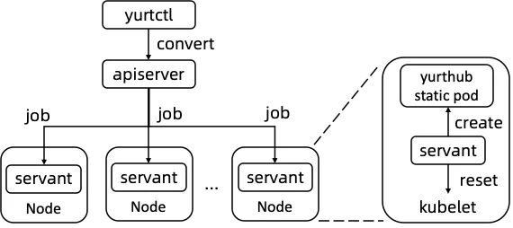

随着物联网技术以及 5G 技术的高速发展，将云计算的能力延伸至边缘设备端，并通过中心进行统一交付、管控，已成为云计算的重要发展趋势。为服务更多开发者把握这一趋势，5月29日，阿里巴巴正式对外开源了基于 ACK@Edge（边缘集群托管服务）的云原生边缘计算框架 ——
[OpenYurt](https://github.com/openyurtio/openyurt)

自 OpenYurt 开源以来受到了开发者的关注，今天这篇文章将带大家快速上手 OpenYurt ，介绍如何使用 OpenYurt 提供的命令行管理工具 Yurtctl， 高效快速地部署 OpenYurt 集群。


## OpenYurt介绍
OpenYurt 主打“云边一体化”概念，依托 Kubernetes 强大的容器应用编排能力，满足了云边一体化的应用分发、交付、和管控的诉求。相较于其他基于 Kubernetes 的边缘计算框架，OpenYurt 秉持着“最小修改”原则，通过在边缘节点安装 Yurthub 组件，和在云端部署 Yurt-controller-manager，保证了在对 Kubernetes 零侵入的情况下，提供管理边缘计算应用所需的相关能力。


OpenYurt 能帮用户解决在海量边、端资源上完成大规模应用交付、运维、管控的问题，并提供中心服务下沉通道，实现和边缘计算应用的无缝对接。在设计 OpenYurt 之初，我们就非常强调保持用户体验的一致性，不增加用户运维负担，让用户真正方便地 “Extending your native kubernetes to edge”。


## Yurtctl：一键让原生k8s集群具备边缘计算能力

为了让原生 K8s 集群具备边缘计算能力，OpenYurt 以 addon 为载体，非侵入式给原生 K8s 增强了如下能力：
- 边缘自治能力（YurtHub：已开源），保证在弱网或者重启节点的情况下，部署在边缘节点上的应用也能正常运行；
- 云边协同能力（待开源），通过云边运维通道解决边缘的运维需求，同时提供云边协同能力；
- 单元化管理能力（待开源），为分散的边缘节点，边缘应用，应用间流量提供单元化闭环管理能力；

基于过往ACK@Edge的线上运维经验，我们开源了Yurtctl命令行工具，帮助实现了原生Kubernetes和OpenYurt之间的无缝转换以及对OpenYurt相关组件的高效运维。


### Yurtctl的工作原理



Yurtctl是一个中心化的管控工具。在 OpenYurt云边一体的架构里，Yurtctl 将直接与 APIServer 进行交互。它借助原生 Kubernetes的Job workload对每个node进行运维操作。如上图所示，在执行转换（convert）操作时，Yurtctl 会通过 Job 将一个 servant Pod 部署到用户指定的边缘节点上。

servant Pod 里的容器执行的具体操作请参考：（OpenYurt:release-v0.1-beta.1～v0.3）
https://github.com/openyurtio/openyurt/blob/release-v0.1-beta.1/config/yurtctl-servant/setup_edgenode


由于 servant Pod 需要直接操作节点 root 用户的文件系统（例如将 yurthub 配置文件放置于 /etc/kubernetes/manifests 目录下），并且需要重置系统管理程序（kubelet.service），servant Pod 中的 container 将被赋予 privileged 权限，允许其与节点共享 pid namespace，并将借由 nsenter 命令进入节点主命名空间完成相关操作。当 servant Job 成功执行后，Job 会自动删除。如果失败，Job 则会被保留，方便运维人员排查错误原因。借由该机制，Yurtctl 还可对 Yurthub 进行更新或者删除。


## 案例：一键转换OpenYurt集群
###1）获取yurtctl
OpenYurt github 仓库包括了 yurtctl 的源码，下载 OpenYurt 仓库之后，即可通过编译获得 yurtctl，具体命令如下：

```
$ make build WHAT=cmd/yurtctl
hack/make-rules/build.sh cmd/yurtctl
Building cmd/yurtctl
```
编译成功之后，yurtctl 可执行文件就可以在 _output/bin/ 目录下找到。 

###2）将Kubernetes转换为OpenYurt
如果我们想将一个双节点（node1 和 node2）的 Kubernetes 集群转换成 OpenYurt 集群，并且只想让 node2 成为自治边缘节点，那么可以通过执行 yurtctl convert 来实现，具体命令如下：
```
$ yurtctl convert --cloud-nodes node1 --provider ack
I0603 14:34:33.714304   40825 convert.go:164] mark node1 as the cloud-node
I0603 14:34:33.719816   40825 convert.go:172] mark node2 as the edge-node
I0603 14:34:33.736609   40825 convert.go:198] deploy the yurt controller manager
I0603 14:34:33.742272   40825 convert.go:210] deploying the yurt-hub and resetting the kubelet service...
I0603 14:34:53.810165   40825 util.go:168] servant job(yurtctl-servant-convert-node2) has succeeded
```
成功配置节点之后，我们需要将边缘节点标记为自治状态，具体命令如下：
``` 
$ yurtctl markautonomous # 如果用户只想标记部分边缘节点，则可以使用 --autonomous-nodes 选项指定
I0602 11:22:05.610222   89160 markautonomous.go:149] mark node2 as autonomous
```

接着我们就可以测试 node2 在断网环境下是否能实现节点自治。首先，在 node2 上部署一个测试 pod：
```
$ kubectl apply -f-<<EOF
apiVersion: v1
kind: Pod
metadata:
  name: bbox
spec:
  nodeName: node2
  containers:
  - image: busybox
    command:
    - top
    name: bbox
EOF
pod/bbox created
```
登陆到 node2 上，将 Yurthub 的 --server-addr 参数设置为一个不可访问的地址：
``` 
sudo sed -i 's|--server-addr=.*|--server-addr=https://1.1.1.1:1111|' /etc/kubernetes/manifests/yurt-hub.yaml
```
耐心等待 40 秒，我们将观察到，即使 node2 已经处于 NotReady 状态，pod1 仍然处于 Running 状态。这说明当边缘节点处于自治状态时，即使 node 不在线，Pod 也不会被云端 node controller 驱逐。

``` 
$ kubectl get node 
NAME           STATUS     ROLES    AGE   VERSION
node1          Ready      master   14m   v1.14.8
node2          NotReady   <none>   12m   v1.14.8
$ kubectl get pod
NAME   READY   STATUS    RESTARTS   AGE
bbox   1/1     Running   0          5m12s
```
这时如果将 node2 重启，我们可以用 docker ps （假设节点使用 docker 作为 container runtime）命令来验证 bbox Pod 会被重新拉起。
``` 
$ docker ps --format 'table {{.ID}}\t{{.Image}}\t{{.RunningFor}}' | grep busybox
d0c8134fddc1        busybox          About a minutes ago
```
这是因为 Kubelet 会从 Yurthub 读取缓存的数据，恢复重启前的Pod状态。这部分技术细节我们会在后续的文章里详细介绍。


###3）将OpenYurt转换回Kubernetes
相对的，通过运行 yurtctl revert 命令，用户可以将一个 OpenYurt 集群转换回 Kubernetes 集群。假设我们想将上述双节点 Kubernetes 集群转换回 Kubernetes 模式，那么只需运行以下命令即可（运行该命令前，请先将 node2 上的 yurthub 重新连上 apiserver）：
``` 
$ yurtctl revert
I0603 14:38:55.522376   41016 revert.go:106] label alibabacloud.com/is-edge-worker is removed
I0603 14:38:55.527998   41016 revert.go:116] yurt controller manager is removed
I0603 14:38:55.548354   41016 revert.go:130] ServiceAccount node-controller is created
I0603 14:39:05.572686   41016 util.go:168] servant job(yurtctl-servant-revert-node2) has succeeded
I0603 14:39:05.572718   41016 revert.go:142] yurt-hub is removed, kubelet service is reset
```

如果还想了解更多 yurtctl 的使用方法，请参考 OpenYurt github 仓库下的yurtctl的教程：https://github.com/alibaba/openyurt/tree/master/docs/tutorial。

## what's Next
Yurtctl 目标是成为运维人员管理 OpenYurt 集群的有力工具。因此我们会持续演进 Yurtctl 以支持 OpenYurt 的新功能和新增的运维流程或场景。例如，不久之后 OpenYurt 还将开源 Yurttunnel，Yurtunit 等组件，Yurtctl 也将对这些组件提供支持。我们同时欢迎大家提出对 Yurtctl 的需求，一起努力使其更加完善。

## 社区建设
OpenYurt 社区欢迎新用户加入和参与共建。用户可以通过 Github issue 获取技术支持、报告 bug、提出需求意见等，或者通过 OpenYurt 用户钉钉群直接和 core 开发人员取得联系。
[原文链接](https://mp.weixin.qq.com/s/tQIIfwClRRmEYO9dE3znhw)


