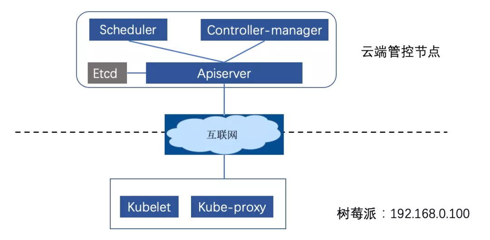
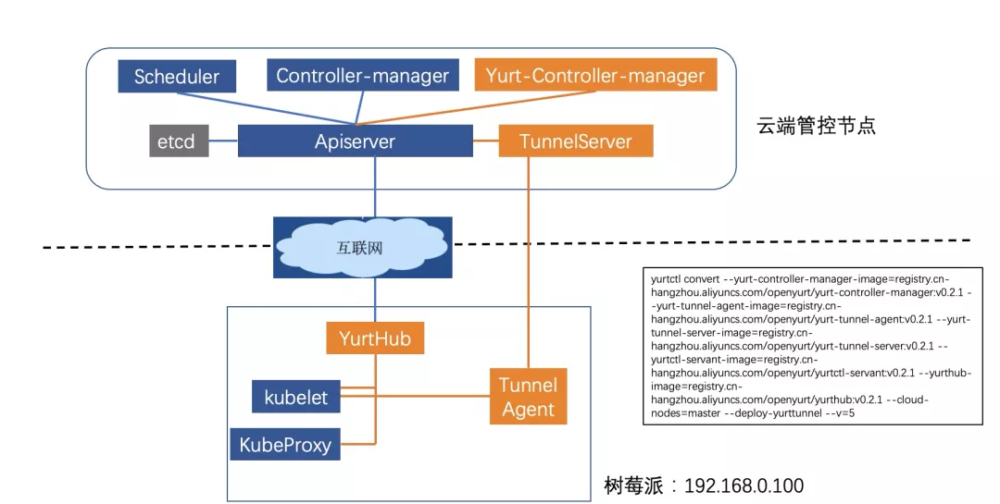

随着边缘计算的快速发展，越来越多的数据需要到网络的边缘侧进行存储、处理和分析，边缘的设备和应用呈爆发式增长。如何高效的管理边缘侧的资源和应用是业界面临的一个主要问题。当前，采用云原生的方法，将云计算的能力下沉到边缘并在云端做统一调度、管控的云边端一体化架构得到了业界的广泛认可。


2020 年 5 月，阿里巴巴开源首个 Kubernetes 无侵入的边缘计算云原生项目 OpenYurt，并于同年 9 月份进入 CNCF SandBox。OpenYurt 针对边缘场景中网络不稳定、云边运维困难等问题，对原生 Kubernetes 无侵入地增强，重点提供了边缘节点自治、云边运维通道、边缘单元化的能力。


如图下所示，



本文通过在云端部署 Kubernetes 集群的控制面，并将树莓派接入集群来搭建云管边场景。基于这个环境演示 OpenYurt 的核心能力，带大家快速上手 OpenYurt。


## 环境准备

### 1）基础环境介绍

在云端，购买 ENS 节点（ENS 节点具有公网 IP，方便通过公网对外暴露服务）来部署原生 K8s 集群的管控组件。其中系统采用 ubuntu18.04、hostname 为 master-node、docker 版本为 19.03.5。

在边缘，将树莓派 4 与本地的路由器连接，组成边缘私网环境，路由器通过 4G 网卡访问互联网。其中树莓派 4 预装系统为 ubuntu18.04、hostname为 edge-node、docker 版本为 19.03.5。


### 2)原生K8s集群搭建
本文演示环境基于社区1.16.6版本的K8s集群，并采用社区提供的kubeadm工具来搭建集群，具体操作如下：

- 在云端节点和树莓派上分别执行如下命令安装 Kubernetes 组件。

```
curl -s https://mirrors.aliyun.com/kubernetes/apt/doc/apt-key.gpg | sudo apt-key add -
echo "deb https://mirrors.aliyun.com/kubernetes/apt/ kubernetes-xenial main" > /etc/apt/sources.list.d/kubernetes.list
sudo apt-get update
sudo apt install -y kubelet=1.16.6-00 kubeadm=1.16.6-00 kubectl=1.16.6-00
```

- 使用kubeadm 初始化云端节点（在云端节点上执行如下命令），部署过程中采用阿里云的镜像仓库，为了支持树莓派的接入，该仓库的镜像做了 manifest 列表，能够支持 amd64/arm64 两种不同的 CPU 架构。

```
# master-node
kubeadm init --image-repository=registry.cn-hangzhou.aliyuncs.com/edge-kubernetes --kubernetes-version=v1.16.6 --pod-network-cidr=10.244.0.0/16
```

- 依据初始化完成之后的提示，拷贝 config 文件到 $HOME/.kube 中：

```
mkdir -p $HOME/.kube
 sudo cp -i /etc/kubernetes/admin.conf $HOME/.kube/config
```

- 树莓派接入云端集群依据第二步中初始化完成以后输出的节点接入信息，在树莓派上执行接入命令。

```
kubeadm join 183.195.233.42:6443 --token XXXX \
 --discovery-token-ca-cert-hash XXXX
```

- 添加 cni 配置（云端管控节点和树莓派都需要配置），本文搭建的集群使用主机网络。创建 cni 配置文件 /etc/cni/net.d/0-loopback.conf，并将如下内容拷贝到该文件中。
```
{
 "cniVersion": "0.3.0",
 "name": "lo",
 "type": "loopback"
}
```

- 在 master 节点上查看部署效果。
```
NAME STATUS ROLES AGE VERSION INTERNAL-IP EXTERNAL-IP OS-IMAGE KERNEL-VERSION CONTAINER-RUNTIME
edge-node Ready <none>   74s    v1.16.6   192.168.0.100    <none>        Ubuntu 18.04.4 LTS   4.19.105-v8-28      docker://19.3.5
master-node   Ready    master   2m5s   v1.16.6   183.195.233.42   <none>        Ubuntu 18.04.2 LTS   4.15.0-52-generic   docker://19.3.5
```

- 删除 CoreDNS（本文 Demo 中 CoreDNS 不需要使用），并将 master 节点的 taints 去掉（方便后续部署 OpenYurt 组件）。
```
kubectl delete deployment coredns -n kube-system
kubectl taint node master-node node-role.kubernetes.io/master-
```


## 原生 K8s 集群在边缘场景中的问题


基于上述环境，我们来测试一下原生 K8s 在云管边架构中对云边运维的支持和对云边网络断开时的反应。首先，我们从云端部署一个测试应用 nginx，在 master 节点上执行 kubectl apply -f nginx.yaml，具体的部署 yaml 如下。

注意：nodeSelector 选择 edge-node 节点，主机网络配置为 true，并配置 pod 的容忍时间为 5s（默认 5min, 此处配置便于演示 pod 驱逐）。

```
apiVersion: v1
kind: Pod
metadata:
 name: nginx
spec:
 tolerations:
 - key: "node.kubernetes.io/unreachable"
 operator: "Exists"
 effect: "NoExecute"
 tolerationSeconds: 5
 - key: "node.kubernetes.io/not-ready"
 operator: "Exists"
 effect: "NoExecute"
 tolerationSeconds: 5
 nodeSelector:
 kubernetes.io/hostname: edge-node
 containers:
 - name: nginx
 image: nginx
 hostNetwork: true
```


查看部署结果：
```

root@master-node:~# kubectl get pods -owide
NAME READY STATUS RESTARTS AGE IP NODE NOMINATED NODE READINESS GATES
nginx 1/1 Running 0 11s 192.168.0.100 edge-node <none> 
```

### 1）测试常用的集群运维指令，包括 logs、exec、port-forward

在 master 节点上运维边缘节点应用，执行 logs/exec/port-forward 等指令，查看结果。


```
root@master-node:~# kubectl logs nginx
Error from server: Get https://192.168.0.100:10250/containerLogs/default/nginx/nginx: dial tcp 192.168.0.100:10250: connect: connection refused

root@master-node:~# kubectl exec -it nginx sh
kubectl exec [POD] [COMMAND] is DEPRECATED and will be removed in a future version. Use kubectl exec [POD] -- [COMMAND] instead.
Error from server: error dialing backend: dial tcp 192.168.0.100:10250: connect: connection refused

root@master-node:~# kubectl port-forward pod/nginx 8888:80
error: error upgrading connection: error dialing backend: dial tcp 192.168.0.100:10250: connect: connection refused
```
从执行结果看，原生的k8s在云管边的场景中，无法提供从云端运维边缘应用的能力。这是因为边缘节点部署在用户的私网环境，从云端无法通过边缘节点的 IP 地址直接访问边缘节点。


### 2）测试边缘断网时对业务的影响

边缘节点与云端管控通过公网连接，经常会出现网络不稳定，云端断连的情况。这里我们将做两个断网相关的测试：

- 断网 1 分钟->恢复网络

- 断网 1 分钟->重启边缘节点->恢复网络


观察两个测试过程中节点和 Pod 的状态变化。本文 Demo 中的断网方式是将路由器的公网连接断开。

#### 1.断网1分钟->恢复网络
断开网络，大约 40s 后，节点变成 NotReady（正常节点 10s 钟上报一次心跳，当 4 次没有上报心跳时，管控组件认为节点异常）。

```

root@master-node:~# kubectl get nodes
NAME STATUS ROLES AGE VERSION
edge-node NotReady <none>   5m13s   v1.16.6
master-node   Ready      master   6m4s    v1.16.6
```

继续等待 5s 之后（正常节点变为 NotReady 之后，5m 才开始驱逐 pod，此处为了测试效果，将 pod 的容忍时间配成了 5s），应用 pod 被驱逐，状态变为 Terminating。

```
root@master-node:~# kubectl get pods
NAME READY STATUS RESTARTS AGE
nginx 1/1 Terminating 0 3m45s
```


将网络恢复，观察节点及 pod 变化。
```
root@master-node:~# kubectl get pods
No resources found in default namespace.
```

网络恢复后，节点状态变成 ready，业务 pod 被清除，这是因为边缘节点的 Kubelet 获取到业务 Pod 的 Terminating 状态，对业务 Pod 做删除操作，并返回删除成功，云端也做了相应的清理。至此，业务 Pod 由于云边网络的不稳定而被驱逐，然而在断网期间，边缘节点其实是可以正常工作的。

重新创建应用 nginx，用于下面测试。

```
root@master-node:~# kubectl get pods -owide
NAME READY STATUS RESTARTS AGE IP NODE NOMINATED NODE READINESS GATES
nginx 1/1 Running 0 4s 192.168.0.100 edge-node <none>           <none>
```
#### 2.断网1分钟->重启边缘节点->恢复网络


接下来，我们测试在断网的情况下，边缘节点的重启对业务的影响。断网 1 分钟之后，Node 和 Pod 状态同上面测试结果，Node 变为 NotReady，Pod 的状态变为 Terminating。此时，切换到私有网络环境，登录到树莓派上，将树莓派重启，重启完成后等待大约 1 分钟，观察重启前后节点上的容器列表。

重启前边缘节点容器列表（此时云边端开，虽然在云端获取的 pod 是 Terminating 状态，但是边缘并未 Watch 到 Terminating 的操作，所以边缘的应用还正常运行）。


```
root@edge-node:~# docker ps
CONTAINER ID IMAGE COMMAND CREATED STATUS PORTS NAMES
9671cbf28ca6 e86f991e5d10 "/docker-entrypoint.…" About a minute ago Up About a minute k8s_nginx_nginx_default_efdf11c6-a41c-4b95-8ac8-45e02c9e1f4d_0
6272a46f93ef registry.cn-hangzhou.aliyuncs.com/edge-kubernetes/pause:3.1 "/pause" 2 minutes ago Up About a minute k8s_POD_nginx_default_efdf11c6-a41c-4b95-8ac8-45e02c9e1f4d_0
698bb024c3db f9ea384ddb34 "/usr/local/bin/kube…" 8 minutes ago Up 8 minutes k8s_kube-proxy_kube-proxy-rjws7_kube-system_51576be4-2b6d-434d-b50b-b88e2d436fef_0
31952700c95b registry.cn-hangzhou.aliyuncs.com/edge-kubernetes/pause:3.1 "/pause" 8 minutes ago Up 8 minutes k8s_POD_kube-proxy-rjws7_kube-system_51576be4-2b6d-434d-b50b-b88e2d436fef_0
```


重启后节点容器列表，断网重启后，kubelet 无法从云端获取 Pod 信息，不会重建 Pod。


```
root@edge-node:~# docker ps
CONTAINER ID IMAGE COMMAND CREATED STATUS PORTS NAMES
root@edge-node:~#
```
从重启前后的对比看，边缘节点在断网重启之后，节点上的 Pod 全部无法恢复。这就会导致在云边断网时，一旦节点重启，应用将无法工作。

将网络恢复，观察节点及 pod 变化，同上面测试结果，网络恢复后，节点变为 Ready，业务 Pod 被清除。

```
root@master-node:~# kubectl get nodes
NAME STATUS ROLES AGE VERSION
edge-node Ready <none>   11m   v1.16.6
master-node   Ready    master   12m   v1.16.6
root@master-node:~# kubectl get pods
No resources found in default namespace.
```

接下来，再次部署业务 nginx，测试 OpenYurt 集群对云边运维的支持和对云边断网时的反应。

```

root@master-node:~# kubectl get pods -owide
NAME READY STATUS RESTARTS AGE IP NODE NOMINATED NODE READINESS GATES
nginx 1/1 Running 0 12s 192.168.0.100 edge-node <none>           <none>
```

## 原生 K8s 集群一键转换为 OpenYurt 集群

探究了原生 Kubernetes 在云边一体化架构中的不足之后，我们来看下 OpenYurt 集群是否能满足这种场景。现在，我们利用 OpenYurt 社区提供的集群转换工具 yurtctl，来将原生 K8s 集群转换成 OpenYurt 集群。在 master 节点上执行如下命令， 该命令指定了组件的镜像以及云端节点，并指定安装云边运维通道 yurt-tunnel。


```
yurtctl convert --yurt-controller-manager-image=registry.cn-hangzhou.aliyuncs.com/openyurt/yurt-controller-manager:v0.2.1 --yurt-tunnel-agent-image=registry.cn-hangzhou.aliyuncs.com/openyurt/yurt-tunnel-agent:v0.2.1 --yurt-tunnel-server-image=registry.cn-hangzhou.aliyuncs.com/openyurt/yurt-tunnel-server:v0.2.1 --yurtctl-servant-image=registry.cn-hangzhou.aliyuncs.com/openyurt/yurtctl-servant:v0.2.1 --yurthub-image=registry.cn-hangzhou.aliyuncs.com/openyurt/yurthub:v0.2.1 --cloud-nodes=master-node --deploy-yurttunnel
```

转换大概需要 2min，转换完成之后，观察业务 pod 的状态，可以看到转换过程中对业务 pod 无影响（也可以在转换过程中在新的终端使用 kubectl get pod -w 观察业务 pod 的状态）。


```
root@master-node:~# kubectl get pods -owide
NAME READY STATUS RESTARTS AGE IP NODE NOMINATED NODE READINESS GATES
nginx 1/1 Running 0 2m4s 192.168.0.100 edge-node <none>           <none>
```

执行完成之后的组件分布如下图 所示，其中橙色部分是 OpenYurt 相关的组件，蓝色部分是原生 K8s 组件。相应地，我们观察云端节点和边缘节点的 pod。




云端节点 yurt 相关的 pod：yurt-controller-manager 和 yurt-tunnel-server。

```
root@master-node:~# kubectl get pods --all-namespaces -owide | grep master | grep yurt
kube-system yurt-controller-manager-7d9db5bf85-6542h 1/1 Running 0 103s 183.195.233.42 master-node <none>           <none>
kube-system   yurt-tunnel-server-65784dfdf-pl5bn         1/1     Running   0          103s    183.195.233.42   master-node   <none>           <none>
```


边缘节点新增 yurt 相关的 pod: yurt-hub（static pod）和 yurt-tunnel-agent。

```
root@master-node:~# kubectl get pods --all-namespaces -owide | grep edge | grep yurt
kube-system yurt-hub-edge-node 1/1 Running 0 117s 192.168.0.100 edge-node <none>           <none>
kube-system   yurt-tunnel-agent-7l8nv                    1/1     Running   0          2m      192.168.0.100    edge-node     <none>           <none>
```

## 测试 OpenYurt 集群在边缘场景中的能力

### 1. 测试 logs/exec/port-forward 等运维指令，查看结果
```
root@master-node:~# kubectl logs nginx
/docker-entrypoint.sh: /docker-entrypoint.d/ is not empty, will attempt to perform configuration
/docker-entrypoint.sh: Looking for shell scripts in /docker-entrypoint.d/
/docker-entrypoint.sh: Launching /docker-entrypoint.d/10-listen-on-ipv6-by-default.sh
10-listen-on-ipv6-by-default.sh: info: Getting the checksum of /etc/nginx/conf.d/default.conf
10-listen-on-ipv6-by-default.sh: info: Enabled listen on IPv6 in /etc/nginx/conf.d/default.conf
/docker-entrypoint.sh: Launching /docker-entrypoint.d/20-envsubst-on-templates.sh
/docker-entrypoint.sh: Configuration complete; ready for start up


root@master-node:~# kubectl exec -it nginx sh
kubectl exec [POD] [COMMAND] is DEPRECATED and will be removed in a future version. Use kubectl exec [POD] -- [COMMAND] instead.
# ls
bin dev docker-entrypoint.sh home media opt root sbin sys usr
boot docker-entrypoint.d etc lib mnt proc run srv tmp var
# exit


root@master-node:~# kubectl port-forward pod/nginx 8888:80
Forwarding from 127.0.0.1:8888 -> 80
Handling connection for 8888
```


测试 port-forward 时，在 master 节点上执行 curl 127.0.0.1:8888，可以访问 nginx 服务。

从演示结果看，OpenYurt 能够很好地支持常用的云边运维指令。


### 2. 测试边缘断网时对业务的影响

同样我们重复原生 K8s 中断网的两个测试，在测试之前我们先为边缘节点 edge-node 开启自治。在 OpenYurt 集群中，边缘节点的自治是通过一个 annotation 来标识的。

```
root@master-node:~# kubectl annotate node edge-node node.beta.alibabacloud.com/autonomy=true
node/edge-node annotated
```

####  1）断网 1 分钟->网络恢复
同样，将路由器公网断开，观察 Node 和 Pod 的状态。大约过了 40s，节点的状态变成 NotReady，而大约过 1min 以后，Pod 的状态一直是 Running，并不会被驱逐。

```
root@master-node:~# kubectl get nodes
NAME STATUS ROLES AGE VERSION
edge-node NotReady <none>   24m   v1.16.6
master-node   Ready      master   25m   v1.16.6
root@master-node:~# kubectl get pods
NAME    READY   STATUS    RESTARTS   AGE
nginx   1/1     Running   0          5m7s
```

恢复网络，观察 Node 和 Pod 的状态，Node 状态变为 Ready，Pod 保持 Running。可见云边网络不稳定时，对边缘节点的业务 Pod 无影响。

```
root@master-node:~# kubectl get nodes
NAME STATUS ROLES AGE VERSION
edge-node Ready <none>   25m   v1.16.6
master-node   Ready    master   26m   v1.16.6
root@master-node:~# kubectl get pods
NAME    READY   STATUS    RESTARTS   AGE
nginx   1/1     Running   0          6m30s
```

#### 2）断网 1 分钟->重启边缘节点->恢复网络
接下来，我们测试在断网的情况下，边缘节点的重启对业务的影响。断网 1 分钟之后，Node 和 Pod 状态同上面测试结果，Node 变为 NotReady，Pod 保持 Running。同样，我们登录到树莓派上，将树莓派重启，观察重启前后节点上的容器列表。

重启前边缘节点容器列表：
```
root@edge-node:~# docker ps
CONTAINER ID IMAGE COMMAND CREATED STATUS PORTS NAMES
38727ec9270c 70bf6668c7eb "yurthub --v=2 --ser…" 7 minutes ago Up 7 minutes k8s_yurt-hub_yurt-hub-edge-node_kube-system_d75d122e752b90d436a71af44c0a53be_0
c403ace1d4ff registry.cn-hangzhou.aliyuncs.com/edge-kubernetes/pause:3.1 "/pause" 7 minutes ago Up 7 minutes k8s_POD_yurt-hub-edge-node_kube-system_d75d122e752b90d436a71af44c0a53be_0
de0d693e9e74 473ae979be68 "yurt-tunnel-agent -…" 7 minutes ago Up 7 minutes k8s_yurt-tunnel-agent_yurt-tunnel-agent-7l8nv_kube-system_75d28494-f577-43fa-9cac-6681a1215498_0
a0763f143f74 registry.cn-hangzhou.aliyuncs.com/edge-kubernetes/pause:3.1 "/pause" 7 minutes ago Up 7 minutes k8s_POD_yurt-tunnel-agent-7l8nv_kube-system_75d28494-f577-43fa-9cac-6681a1215498_0
80c247714402 e86f991e5d10 "/docker-entrypoint.…" 7 minutes ago Up 7 minutes k8s_nginx_nginx_default_b45baaac-eebc-466b-9199-2ca5c1ede9fd_0
01f7770cb0f7 registry.cn-hangzhou.aliyuncs.com/edge-kubernetes/pause:3.1 "/pause" 7 minutes ago Up 7 minutes k8s_POD_nginx_default_b45baaac-eebc-466b-9199-2ca5c1ede9fd_0
7e65f83090f6 f9ea384ddb34 "/usr/local/bin/kube…" 17 minutes ago Up 17 minutes k8s_kube-proxy_kube-proxy-rjws7_kube-system_51576be4-2b6d-434d-b50b-b88e2d436fef_1
c1ed142fc75b registry.cn-hangzhou.aliyuncs.com/edge-kubernetes/pause:3.1 "/pause" 17 minutes ago Up 17 minutes k8s_POD_kube-proxy-rjws7_kube-system_51576be4-2b6d-434d-b50b-b88e2d436fef_1
```


重启后边缘节点容器列表：
```
root@edge-node:~# docker ps
CONTAINER ID IMAGE COMMAND CREATED STATUS PORTS NAMES
0c66b87066a0 473ae979be68 "yurt-tunnel-agent -…" 12 seconds ago Up 11 seconds k8s_yurt-tunnel-agent_yurt-tunnel-agent-7l8nv_kube-system_75d28494-f577-43fa-9cac-6681a1215498_2
a4fb3e4e8c8f e86f991e5d10 "/docker-entrypoint.…" 58 seconds ago Up 56 seconds k8s_nginx_nginx_default_b45baaac-eebc-466b-9199-2ca5c1ede9fd_1
fce730d64b32 f9ea384ddb34 "/usr/local/bin/kube…" 58 seconds ago Up 57 seconds k8s_kube-proxy_kube-proxy-rjws7_kube-system_51576be4-2b6d-434d-b50b-b88e2d436fef_2
c78166ea563f registry.cn-hangzhou.aliyuncs.com/edge-kubernetes/pause:3.1 "/pause" 59 seconds ago Up 57 seconds k8s_POD_yurt-tunnel-agent-7l8nv_kube-system_75d28494-f577-43fa-9cac-6681a1215498_1
799ad14bcd3b registry.cn-hangzhou.aliyuncs.com/edge-kubernetes/pause:3.1 "/pause" 59 seconds ago Up 57 seconds k8s_POD_nginx_default_b45baaac-eebc-466b-9199-2ca5c1ede9fd_1
627673da6a85 registry.cn-hangzhou.aliyuncs.com/edge-kubernetes/pause:3.1 "/pause" 59 seconds ago Up 58 seconds k8s_POD_kube-proxy-rjws7_kube-system_51576be4-2b6d-434d-b50b-b88e2d436fef_2
04da705e4120 70bf6668c7eb "yurthub --v=2 --ser…" About a minute ago Up About a minute k8s_yurt-hub_yurt-hub-edge-node_kube-system_d75d122e752b90d436a71af44c0a53be_1
260057d935ee registry.cn-hangzhou.aliyuncs.com/edge-kubernetes/pause:3.1 "/pause" About a minute ago Up About a minute k8s_POD_yurt-hub-edge-node_kube-system_d75d122e752b90d436a71af44c0a53be_1
```


从重启前后的对比看，边缘节点在断网重启之后，节点上的 pod 能正常拉起，OpenYurt 的节点自治能力可以在断网下保证业务的稳定运行。

恢复网络，节点 Ready，观察业务 pod 的状态，网络恢复后，业务 pod 状态保持 running，有一次重启记录，符合预期。


```
root@master-node:~# kubectl get pods -owide
NAME READY STATUS RESTARTS AGE IP NODE NOMINATED NODE READINESS GATES
nginx 1/1 Running 1 11m 192.168.0.100 edge-node <none>           <none>
```

最后，我们从yurtctl的能力将OpenYurt集群，转换为原生K8s集群。同样，可以观察转换过程中对现有业务不会有影响。

```
yurtctl revert --yurtctl-servant-image=registry.cn-hangzhou.aliyuncs.com/openyurt/yurtctl-servant:v0.2.1
```

OpenYurt 作为阿里首个边缘云原生开源项目，基于商业化产品 ACK@Edge，在集团内部经历了长时间的打磨。已经应用在 CDN、IoT、盒马、ENS、菜鸟物流等众多场景。针对边缘场景，该项目坚持保持原生 K8s 的特性，以 Addon 的形式提供了边缘节点自治、云边端一体化运维通道等能力。最近在社区同学的一起努力下又开源了边缘单元化管理能力，同时后续还会继续开源更多的边缘管理能力，欢迎大家积极参与贡献。

[原文链接](https://mp.weixin.qq.com/s/Anr8UhTaNe3FCnKKfKoXNQ)
