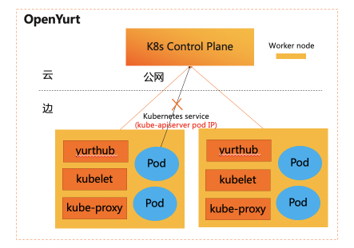

### 1.背景介绍

OpenYurt是业界首个非侵入的边缘计算云原生开源项目，通过边缘自治，云边协同，边缘单元化，边缘流量闭环等能力为用户提供云边一体化的使用体验。不少用户在使用OpenYurt的时候，经常需要把存量的使用InClusterConfig访问kube-apiserver的Pod通过OpenYurt迁移到边缘环境中。如下图所示：


在OpenYurt集群中，提供了使用InClusterConfig的业务Pod零修改就可以运行在边缘环境的能力。

<!--truncate-->

### 2.面临挑战

使用InClusterConfig的业务Pod在边缘环境中运行，需要解决如下问题：

- 问题一：Pod通过InClusterConfig地址访问kube-apiserver，节点上默认网络规则（iptables/ipvs）将会把请求转发到kube-apiserver的PodIP，同时云端与边缘位于不同网络平面，边缘是无法访问到云端的PodIP。所以边缘业务Pod无法通过InClusterConfig访问到kube-apiserver。

  

- 问题二：在解决问题一后，如果云边网络断开时业务Pod容器出现重启等状况，边缘Pod将无法从kube-apiserver获取到业务配置，这会影响到业务Pod的重启运行。


### 3.解决方案

从上述问题可以看出，我们需要无感知的调整边缘pod的访问地址，同时需要在边缘环境中缓存业务配置，保证云边断网时也可以利用边缘缓存业务配置，保证云边断网时也可以利用边缘缓存来获取业务Pod的配置信息。具体解决方案如下；

##### 3.1边缘Pod访问的云端endpoint优化

- Pod通过InClusterConfig访问kube-apiserver，源码如下：

  ```go
  func InClusterConfig() (*Config, error) {
  const (
      tokenFile  = "/var/run/secrets/kubernetes.io/serviceaccount/token"
      rootCAFile = "/var/run/secrets/kubernetes.io/serviceaccount/ca.crt"
  // 通过Kuberentes service对应的环境变量来获取访问地址
  host, port := os.Getenv("KUBERNETES_SERVICE_HOST"), os.Getenv("KUBERNETES_SERVICE_PORT")
  if len(host) == 0 || len(port) == 0 {
      return nil, ErrNotInCluster
  }
  
  // skip some code...
  
  return &Config{
      Host:            "https://" + net.JoinHostPort(host, port),
      TLSClientConfig: tlsClientConfig,
      BearerToken:     string(token),
      BearerTokenFile: tokenFile,
  }, nil
  }
  ```
  
  

- 因此想无感知调整边缘Pod访问的云端endpoint，只需要无侵入修改Pod的KUBERNETES_SERVICE_HOST和KUBERNETE_SERVICE_PORT两个环境变量或者修改kubernetes service地址。解决方案如下：

  - 解决方案一：增加一个admission controller在边缘Pod创建时把kube-apiserver的公网地址自动注入到Pod的环境变量KUBERNETES_SERVICE_HOST和KUBERNETE_SERVICE_PORT

  - 解决方案二：边缘数据过滤框架中增加一个fillter yurthub的边缘数据过滤框架类似于admission controller ,专门用于边缘场景下在边缘应用无感知的状态下，无侵入的修改或者过滤云端返回的数据。目前支持的过滤器有：Masterservice，servicetopology，discardcloudservice等

  - 解决方案对比：

    |              |             解决方案一              |            解决方案二            |
    | :----------: | :---------------------------------: | :------------------------------: |
    |   实现方案   |    增加一个admission controller     | 边缘数据过滤框架中增加一个filter |
    |    复杂度    | 高（需要区别Pod运行在边缘还是云端） |                低                |
    | 显示修改数据 |        Pod中增加环境变量配置        |                无                |

综合实现复杂度，非侵入等设计理念，在OpenYurt中我们选择了解决方案二。如下图所示：


##### 3.2业务Pod的边缘自治

在云边网络断开状态下，业务Pod重启时，将无法从云端kube-apiserver获取到业务配置信息，因此需要在边缘本地缓存Pod的业务数据。


说明1：业务Pod通过yurthub访问kube-apiserver，也意味着[3.1 边缘Pod访问的云端endpoint优化]章节中提到的KUBERNETES_SERVICE_HOST和KUBERNETE_SERVICE_PORT环境变量被修改为yurthub https endpoint(169.254.2.1:10268)。

说明2：如果业务Pod的大量list/watch操作导致大量本地cache，可能会造成本地磁盘压力，因此yurthub对业务Pod的缓存能力默认是关闭的，用户可以通过yurt-hub-cfg configmap的cache_agents字段中增加User-Agent信息来打开对应Pod的数据缓存。例如：

```go
apiVersion: v1
kind: ConfigMap
metadata:
  name: yurt-hub-cfg
  namespace: kube-system
data:
  # 缓存边缘ingress-controller pod访问kube-apiserver的数据
  cache_agents: "ingress-controller"
```


### 4.总结

- 如果存量Pod无需访问kube-apiserver或者InClusterConfig访问kube-apiserver，这些类型Pod可以零修改运行到OpenYurt集群的边缘环境上。通过其他方式访问kube-apiserver的业务Pod目前无法保证零修改运行到边缘环境。

- 边缘业务Pod是否正常访问kube-apiserver，首先可以查看业务pod的环境变量是否正常：

  KUBERNETES_SERVICE_HOST=127.0.0.1或者169.254.2.1，KUBERNETES_SERVICE_PORT=10268。然后可以查看yurthub组件的日志是否有业务Pod相关的请求日志。当然也可以查询业务Pod的日志是否正常。最后可以确认/etc/kubernetes/cache目录是否有相关组件的缓存数据，如果没有可以再确认kube-system/yurt-hub-cfg configmap是否已经配置。

- 使用InClusterConfig的Pod零修改运行到边缘环境的能力，整体实现由yurthub组件承载，没有给OpenYurt架构增加额外的负担，同时用户在使用过程中对该能力也基本无感知，对原生业务Pod无侵入。


### 参考链接：

1.[Accessing the API from a Pod](https://kubernetes.io/docs/tasks/access-application-cluster/access-cluster/#accessing-the-api-from-a-pod)

2.[data filtering framework on the edge](https://github.com/openyurtio/openyurt/blob/master/docs/proposals/20210720-data-filtering-framework.md)

3.[深度解读OpenYurt：边缘自治能力设计解析](https://mp.weixin.qq.com/s/4BLfvMJJA623ZwRSgUE69A)