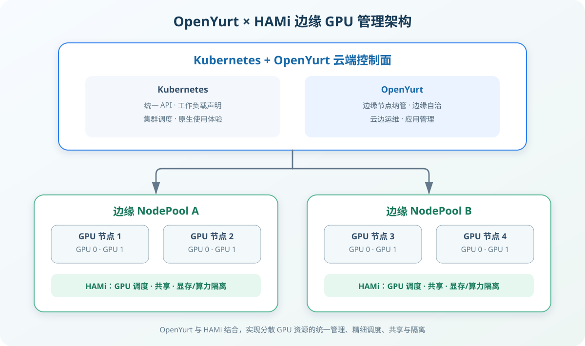
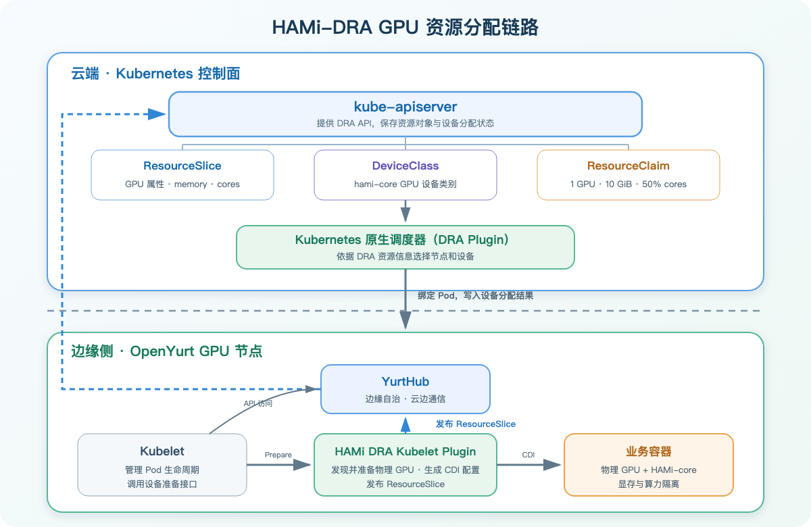
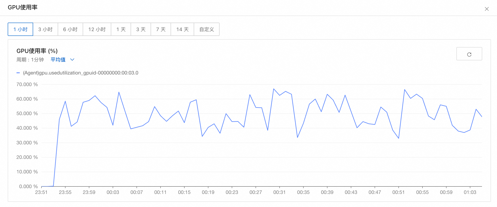

随着 AI 应用对算力需求的不断提升，越来越多的 AI 推理任务运行在边缘节点上，这些节点既可能是靠近业务现场的边缘设备，也可能是分散在各地的 IDC 机房。平台既要统一管理这些 GPU 节点，也要解决边缘侧整卡分配粒度较粗、轻量任务资源利用率不高，以及远程运维不便等问题。

OpenYurt 将分散的 GPU 节点纳入统一的 Kubernetes 集群，通过 NodePool、边缘自治和云边运维等能力，把 Kubernetes 的资源与应用管理方式延伸到边缘。在 OpenYurt 管理的边缘节点上部署 HAMi，则可以进一步将 GPU 的管理粒度从“节点上有几张卡”细化到“任务使用哪张卡、多少显存与算力”。

本文介绍如何在 OpenYurt 集群中使用 HAMi 实现边缘节点上细粒度的 GPU 资源管理方案，再通过实践 Demo，验证边缘 GPU 算力与显存的申请、分配与隔离效果。

<!--truncate-->

## 从边缘节点管理到 GPU 资源管理

Kubernetes 可以通过设备插件将 GPU 作为扩展资源提供给容器，但传统方式通常以整卡为分配单位。即使任务只使用部分显存和算力，也可能占用一张完整 GPU。同时，原生扩展资源只能表达 GPU 数量，难以直接描述具体设备的型号、显存容量、算力和拓扑等属性。另一方面，对于分布在不同地域或本地 IDC 的 GPU 节点，云平台还要处理资源分散、网络条件不一致和远程运维链路受限等问题。

在 OpenYurt 集群中使用 HAMi，可以将边缘节点管理进一步延伸到节点上细粒度的 GPU 资源管理：

- OpenYurt 将分散在多个地域、不同网络环境中的 GPU 节点纳入统一的 Kubernetes 集群，并通过 NodePool 按地域、资源属性或业务范围组织节点。平台可以从云中心统一查看资源、交付应用和调度任务，而不必为每一处 GPU 资源分别建设一套管理体系。
- OpenYurt 针对云边网络不稳定的情况提供边缘自治能力。通过 YurtHub 本地缓存、云端驱逐管控和心跳代理等机制，在节点本身正常、所需资源已经缓存等前提下，云边网络暂时中断时，已经运行的 GPU 任务可以继续运行，从而降低弱网环境下对任务连续性的影响。
- OpenYurt 提供云边运维通道。网络连通时，运维人员可以从云中心查看边缘 GPU 任务的日志、执行远程运维操作并采集监控数据。结合 HAMi 暴露的设备分配和使用指标，可以将 GPU 资源和任务运行情况接入统一的监控体系。
- HAMi 识别和管理节点上的 GPU，并提供 GPU 共享、显存与算力隔离等能力，帮助客户提升本地资源的利用效率，两者共同形成边缘节点上的细粒度 GPU 资源管理体系。



*图 1：OpenYurt 联合 HAMi 的边缘 GPU 资源管理。*

## HAMi 如何管理 GPU（DRA 版）

Dynamic Resource Allocation 是 Kubernetes 面向 GPU、加速卡等设备提供的原生动态资源分配机制。与传统 Device Plugin 主要通过扩展资源数量参与调度不同，DRA 使用 Kubernetes API 对设备、设备类别和设备申请进行建模。HAMi-DRA 基于这套机制提供 GPU 发现、资源发布、节点侧设备准备，以及显存和算力隔离。

其中几个关键对象分别承担不同作用：

- `ResourceSlice`：由运行在节点上的 HAMi DRA Driver 创建和维护，用于发布物理 GPU 的名称、UUID、型号、架构、显存和算力容量等信息。HAMi 通过 Consumable Capacity 描述可被多个 Claim 消耗的 `memory` 和 `cores`。
- `DeviceClass`：定义一类可供工作负载申请的设备。本文使用的 `hami-core-gpu.project-hami.io` 表示由 HAMi-core 提供共享与隔离的 GPU。
- `ResourceClaim`：描述一次具体的设备申请，例如申请一张 GPU，并从该设备的可消费容量中申请 10 GiB 显存和 50% 算力。
- Pod 的 `resourceClaims`：将容器与 `ResourceClaim` 关联起来，使设备申请参与 Pod 调度和启动流程。

完整分配过程如下：

1. HAMi DRA Kubelet Plugin 发现节点上的物理 GPU，并通过 `ResourceSlice` 将设备属性和容量发布到 Kubernetes API Server。
2. 用户创建 `ResourceClaim` 并在 Pod 中引用，声明需要的设备类型、数量、显存和算力。
3. Kubernetes 调度器同时检查 Pod 的节点约束、`ResourceClaim` 和 `ResourceSlice`，选择能够满足申请的节点和设备，更新 Claim 的分配结果并绑定 Pod。
4. 目标节点上的 Kubelet 调用 HAMi DRA Driver 准备设备。Driver 通过 CDI 等运行时机制把选中的 GPU 和 HAMi-core 注入容器。
5. 工作负载启动后，HAMi-core 在容器内执行显存和算力限制。

**HAMi-core 的隔离原理**：HAMi-core 通过 LD_PRELOAD 劫持 CUDA 驱动层 API，在用户态拦截显存分配和 Kernel 启动调用，从而对每个容器/进程能使用的显存上限做硬性拦截限制；同时通过对 Kernel 提交频率做令牌桶/时间片控制，实现对算力的软隔离。



*图 2：HAMi DRA Driver 的 GPU 资源分配链路。*

## 实践

本节实践将以 OpenYurt 管理的边缘 GPU 节点为例，使用 HAMi DRA 模式来演示 GPU 的共享与隔离能力。

### 部署准备

下面的示例以 NVIDIA GPU 为例。开始前需要准备：

- 一个已经运行的 OpenYurt 集群，kubernetes 版本 v1.36（默认支持 DRA）；
- 至少一个加入 NodePool 的 GPU 边缘节点；
- 管理端已安装 Helm 3 和 kubectl。

> Openyurt 集群准备可参考 [OpenYurt 安装文档](https://openyurt.io/docs/installation/manually-setup/)。

首先确认 GPU 节点已被 OpenYurt 纳管。OpenYurt 默认使用 `apps.openyurt.io/nodepool` 标签标识节点所属的 NodePool：

```bash
kubectl get nodes -L apps.openyurt.io/nodepool
```

为需要 HAMi 管理的 GPU 节点添加标签：

```bash
kubectl label node edge-gpu-a10 gpu=on
```

### 安装 NVIDIA Driver 和 NVIDIA Container Toolkit

若边缘 GPU 节点上已安装 NVIDIA Driver 和 NVIDIA Container Toolkit，该步骤可以跳过，否则通过 GPU Operator 来安装。

```bash
helm repo add nvidia https://helm.ngc.nvidia.com/nvidia \
    && helm repo update

helm upgrade --install gpu-operator nvidia/gpu-operator \
  -n gpu-operator --create-namespace \
  --set driver.enabled=true \
  --set devicePlugin.enabled=false
```

成功安装之后，在每个 GPU 节点上先执行 `nvidia-smi`，确认驱动可以识别物理 GPU；同时检查容器运行时已正确配置 NVIDIA Runtime。这两项属于 HAMi 正常工作的前置条件。

### 部署 HAMi

1. HAMi DRA Webhook 依赖 [cert-manager](https://cert-manager.io/docs/installation/) 提供 TLS 证书，需要提前安装：

```bash
helm repo add jetstack https://charts.jetstack.io
helm install cert-manager jetstack/cert-manager \
  --namespace cert-manager \
  --create-namespace \
  --set crds.enabled=true
```

2. 使用 Helm 安装 HAMi：

```bash
helm repo add hami-charts https://project-hami.github.io/HAMi/
helm repo update

helm install hami hami-charts/hami \
     -n hami-system --create-namespace \
     --set devicePlugin.enabled=false \
     --set dra.enabled=true \
     --set scheduler.kubeScheduler.image.tag=v1.29.0 \
     --version 2.10.0
```

- 由于我们采用 DRA 模式，需要将 hami-device-plugin 关闭，避免重复的资源上报与管理。
- 在最新版 2.10.0 中实际 `--set dra.enabled=true` 不会有任何效果，DRA 要独立安装。

3. 使用 Helm 安装 HAMi-DRA：

```bash
helm repo add hami-dra https://project-hami.github.io/HAMi-DRA
helm repo update
helm install hami-dra hami-dra/hami-dra -n hami-system --create-namespace --version 0.2.2
```

等待 HAMi 相关 Pod 进入 Running：

```bash
$ kubectl -n hami-system get pods -o wide
NAME                                   READY   STATUS    RESTARTS   AGE   IP            NODE                     NOMINATED NODE   READINESS GATES
hami-dra-driver-kubelet-plugin-46qdq   1/1     Running   0          12d   10.46.7.99    cn-hongkong.10.46.7.80   <none>           <none>
hami-dra-driver-kubelet-plugin-qbgcq   1/1     Running   0          9h    172.17.0.67   edge-gpu-a10             <none>           <none>
hami-dra-monitor-584f9f84f5-2cb27      1/1     Running   0          12d   10.46.7.96    cn-hongkong.10.46.7.80   <none>           <none>
hami-dra-webhook-7ffdb4cb46-nhb9z      1/1     Running   0          12d   10.46.7.98    cn-hongkong.10.46.7.80   <none>           <none>
hami-scheduler-995f44d84-vxxr4         2/2     Running   0          12d   10.46.7.85    cn-hongkong.10.46.7.80   <none>           <none>
```

查看 dra-driver 发布的 Edge 节点 `ResourceSlice`：

```yaml
$ kubectl get resourceslice edge-gpu-a10-hami-core-gpu.project-hami.io-fmllm -oyaml
apiVersion: resource.k8s.io/v1
kind: ResourceSlice
metadata:
  creationTimestamp: "2026-09-02T07:46:40Z"
  generateName: edge-gpu-a10-hami-core-gpu.project-hami.io-
  generation: 1
  name: edge-gpu-a10-hami-core-gpu.project-hami.io-fmllm
  ownerReferences:
  - apiVersion: v1
    controller: true
    kind: Node
    name: edge-gpu-a10
    uid: b65030da-8ed4-4828-896e-575a78ffd142
  resourceVersion: "8460892"
  uid: eb363fd2-be6f-4286-8b5c-03b7eece8605
spec:
  devices:
  - allowMultipleAllocations: true
    attributes:
      architecture:
        string: Ampere
      brand:
        string: Nvidia
      cudaComputeCapability:
        version: 8.6.0
      cudaDriverVersion:
        version: 13.0.0
      driverVersion:
        version: 580.126.9
      minor:
        int: 0
      pcieBusID:
        string: "0000:00:03.0"
      productName:
        string: NVIDIA A10
      resource.kubernetes.io/pcieRoot:
        string: pci0000:00
      type:
        string: hami-gpu
      uuid:
        string: GPU-13e066b9-098c-8932-9d26-ea75a943d6ba
    capacity:
      cores:
        requestPolicy:
          default: "100"
          validRange:
            max: "100"
            min: "0"
            step: "1"
        value: "100"
      memory:
        requestPolicy:
          default: 23028Mi
          validRange:
            max: 23028Mi
            min: 1Mi
            step: 1Mi
        value: 23028Mi
    name: hami-gpu-0
  driver: hami-core-gpu.project-hami.io
  nodeName: edge-gpu-a10
  pool:
    generation: 1
    name: edge-gpu-a10
    resourceSliceCount: 1
```

### 验证 GPU 的共享与隔离

创建 ResourceClaim 来请求指定 cores 和 memory 的 GPU：

```yaml
apiVersion: resource.k8s.io/v1
kind: ResourceClaim
metadata:
  name: gpu-half-claim
spec:
  devices:
    requests:
      - name: gpu
        exactly:
          deviceClassName: hami-core-gpu.project-hami.io
          allocationMode: ExactCount
          count: 1
          capacity:
            requests:
              cores: 50
              memory: "10Gi"
```

在 Pod 中引用该 ResourceClaim 并指定 nodeSelector 使其运行在我们的边缘节点上：

```yaml
apiVersion: v1
kind: Pod
metadata:
  name: gpu-test-dra
spec:
  nodeSelector:
    apps.openyurt.io/nodepool: worker
  restartPolicy: Never
  containers:
    - name: tensorflow-benchmark
      image: registry.cn-beijing.aliyuncs.com/ai-samples/gpushare-sample:benchmark-tensorflow-2.2.3
      command:
        - bash
        - run.sh
        - --num_batches=5000000
        - --batch_size=8
      resources:
        claims:
          - name: gpu
  resourceClaims:
    - name: gpu
      resourceClaimName: gpu-half-claim
```

由于本任务申请了 50% 的算力，我们查看实际的 GPU 监控指标如下，可以看到整体利用率平均值在 ~50%，HAMi-core 是通过时间片机制控制算力使用，所以瞬时 GPU Utilization 会随采样时刻有一定波动。



*图 3：GPU 使用率监控。*

**显存隔离**：查看容器内的显存限制为 10240MiB，与申请的显存值一致。值得一提的是，得益于 **Openyurt 云边运维通道**的能力，即使边缘节点和控制面处于不同的网络域，也可以很方便地使用 `kubectl exec` 以及 `kubectl logs` 命令对 Pod 执行运维操作。

```text
$ kubectl exec -it gpu-test-dra -- nvidia-smi
[HAMI-core Msg(51:140581732616000:libvgpu.c:870)]: Initializing.....
Wed Sep  2 09:42:11 2026
+-----------------------------------------------------------------------------------------+
| NVIDIA-SMI 580.126.09             Driver Version: 580.126.09     CUDA Version: 13.0     |
+-----------------------------------------+------------------------+----------------------+
| GPU  Name                 Persistence-M | Bus-Id          Disp.A | Volatile Uncorr. ECC |
| Fan  Temp   Perf          Pwr:Usage/Cap |           Memory-Usage | GPU-Util  Compute M. |
|                                         |                        |               MIG M. |
|=========================================+========================+======================|
|   0  NVIDIA A10                     On  |   00000000:00:03.0 Off |                    0 |
|  0%   34C    P8             23W /  150W |       0MiB /  10240MiB |      0%      Default |
|                                         |                        |                  N/A |
+-----------------------------------------+------------------------+----------------------+

+-----------------------------------------------------------------------------------------+
| Processes:                                                                              |
|  GPU   GI   CI              PID   Type   Process name                        GPU Memory |
|        ID   ID                                                               Usage      |
|=========================================================================================|
|  No running processes found                                                             |
+-----------------------------------------------------------------------------------------+
```

要进一步验证隔离，可以在测试环境中运行可控的 CUDA 显存申请程序：申请量不超过 10240MiB 时应正常运行，继续申请并超过额度时会 OOM。

## 总结

本文介绍了 OpenYurt 和 HAMi 两个 CNCF 开源项目的实现原理，并结合具体实践展示了在云原生边缘场景下 GPU 资源管理的解决方案。OpenYurt 将分散在不同地域和网络环境中的 GPU 节点纳入统一的 Kubernetes 集群，并通过 NodePool、边缘自治和云边运维能力，为 GPU 任务提供统一交付与远程运维入口；HAMi 则将 GPU 管理粒度从整卡细化到 vGPU，提供 GPU 的共享与隔离能力，提升 GPU 资源的利用效率。

## 参考资料

- [如何部署 Openyurt 集群](https://openyurt.io/docs/installation/manually-setup/)
- [OpenYurt 项目](https://github.com/openyurtio/openyurt)
- [HAMi 项目](https://github.com/Project-HAMi/HAMi)
- [HAMi-DRA 项目](https://github.com/Project-HAMi/HAMi-DRA)
- [使用 Helm 部署 HAMi](https://project-hami.io/docs/get-started/deploy-with-helm)
