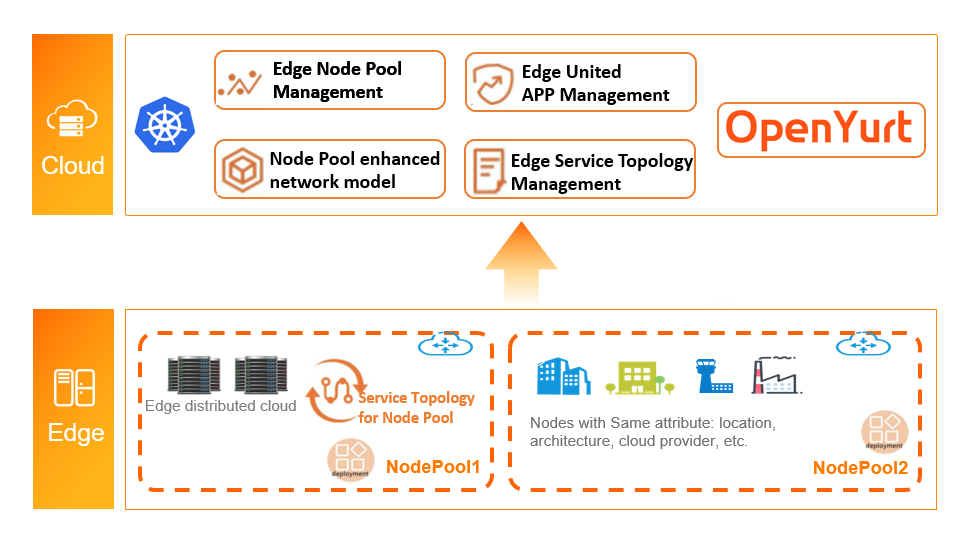

Yurt-App-Manager is a functional component that provides united edge management capabilities for an OpenYurt cluster, in order to comprehensively improve the efficiency of application deployment and reduce the complexity of operation and maintenance in edge scenario.

## Components Introduction

- Considering the edge computing scenario, the edge nodes can usually be grouped by their locations, or other logical characteristics, such as their CPU architecture, telecom carriers or cloud providers. The nodes among different groups could also be isolated from each other by various obvious reasons, such as network unreachablility, resource heterogeneity, resource unsharability, and application independence. This is the origin of the edge Node Pool.

- Same applications and images may need to be deployed into different Node Pools.

- The endpoints of native Kubernetes service may spread over any node in the cluster. Hence, high probability endure of unreachable access or low efficiency may occur when the service flow accesses across nodes from different groups.

In order to solve the issues above, OpenYurt proposes the solution from three layers,

- Node unified management by Node Pool. Nodes can be managed unitedly according to their regions or other logical characteristics.
- Application unified management by YurtAppSet(previous UnitedDeployment). The workloads would be deployed into different node pools. The replicas, versions, etc. can be configured at node pool level.
- Traffic unified management by refined Service Topology. The access to endpoints can be limited by simple configuration, for example, the endpoints can only be accessed from the nodes within the same node pool, or the same node.

Yurt-App-Manager is a standard extension of Kubernetes, and provides NodePool controller and YurtAppSet (previous UnitedDeployment) controller, for providing edge node and edge application OPS capabilities, respectively.

## NodePool overview

Yurt-App-Manager provides a Node Pool controller, which abstracts out the concept of node pool according to specific node attributes, such as region, CPU architecture, cloud provider, etc., so that nodes can be managed unitedly at a pool level.

We are used to grouping and managing the nodes by different Kubernetes Labels, but with the increase of nodes and labels' quantity, the operation and maintenance of nodes (such as batch configuration about scheduling policies, taints, etc.) will become more and more complex, as shown in the following figure:

Nodepool makes an abstraction of node by group of nodes, so that we can manage the nodes in different edge regions from the perspective of node pool,  as shown in the following figure:

## YurtAppSet (previous UnitedDeployment)

With the increasing geographical distribution and the differentiated requirements of applications, the operation and maintenance of edge system has become increasingly complex, for example:

- You need to modify each deployment one by one when upgrading the image.
- You need to define the naming rule for deployment to indicate the same application

- Except for the names, nodeselectors and replicas, other configuration differences for multiple deployments of the same application are relatively small.

YurtAppSet (previous UnitedDeployment) capibility is provided by the Yurt-App-Manager by default. Through Kubernetes CRD resource, it uniformly manages deployments with create/update/delete operations.

YurtAppSet (previous UnitedDeployment) controller provides a template to define applications and manages multiple workloads to match multiple regions. The workload in YurtAppSet is deployed for a pool. Currently, two kinds of workload are supported, they are `StatefulSet` and `Deployment`. The controller will create child workloads according to the pool configurations in YurtAppSet. Each resource has a desired number of `replicas` of PODs. By only one YurtAppSet instance, you can automatically maintain multiple Deployment or StatefulSet, and meanwhile keep differentiated configurations for different pools, such as replicas.

For more intuitive operational experience, please refer to Yurt-App-Manager [tutorial](../user-manuals/workload/node-pool-management.md).

More discussions about Yurt-App-Manager please refer to the issues and pull requests in OpenYurt community,

- issue124：[YurtAppSet usages](https://github.com/openyurtio/openyurt/issues/124)
- issue171：[ [feature request\] the definition of NodePool and YurtAppSet](https://github.com/openyurtio/openyurt/issues/171)

- pull request 173： [[proposal\] add nodepool and YurtAppSet crd proposal](https://link.zhihu.com/?target=https%3A//github.com/alibaba/openyurt/pull/173)

