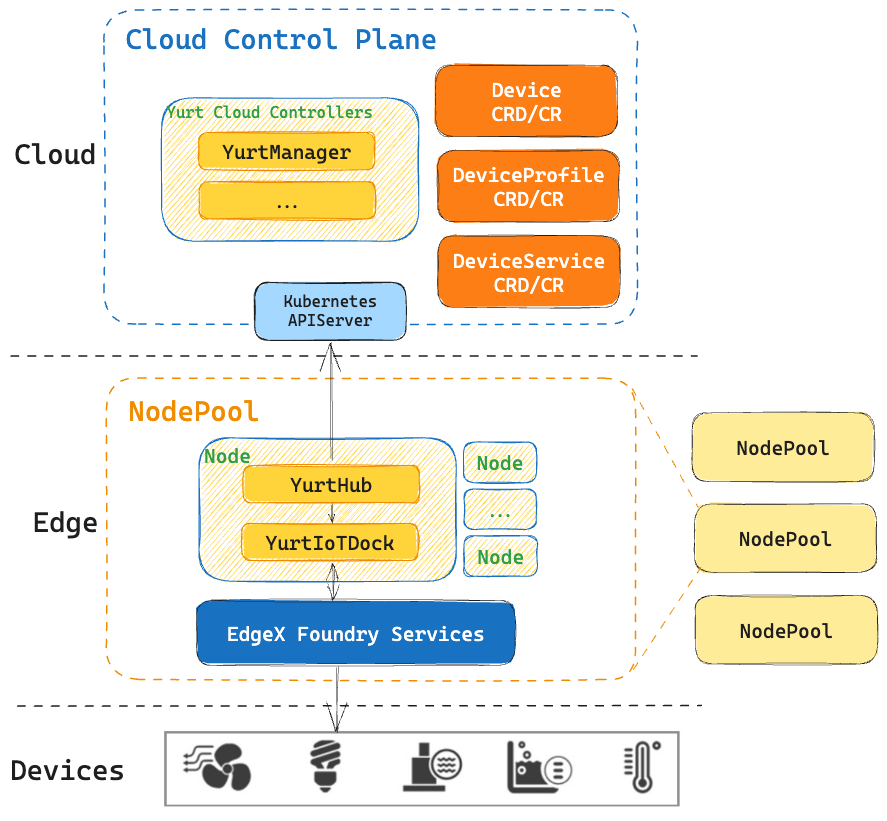

## Background

OpenYurt has been designed to meet various DevOps requirements against typical edge infrastructures. It provides the same user experience for managing the edge applications as if they were running in the cloud infrastructure.
However, when the related management capability is extended to the edge "device" layer, the following problems may occur:

- In order to support various edge devices, the existing framework must develop special adapters for each category of devices;
- When adapting Kubernetes to the edge computing environments, existing solutions either change the system architecture or modify core components (such as kubelet) significantly.

At the same time, we saw a lot of great edge device management platforms emerging in the community，such as EdgeX Foundry. inspiring by the Unix philosophy, "Do one thing and do it well",
we believe that Kubernetes should focus on managing computing resources while edge devices management can be done by adopting existing edge computing platforms.

A overall architecture about cloud-edge-device depicted below


The communication range of edge devices is usually limited to a certain network area. Therefore, edge nodes in the same network area can be divided into a nodepool. So a device management platform and a yurt-iot-dock can be deployed in each nodepool:

- When communicating with kube-apiserver on the cloud, Yurt-Device-Controller only watches the device objects in its nodepool and synchronizes the updated specs to the corresponding devices through the corresponding device management platform.
- When communicating with the device management platform，YurtHub, NodePool, and UnitedDeployment capabilities are reused. The device information in the node pool is abstracted into device, deviceService, and deviceProfile objects and synchronized to the cloud.

## Edge device management platform

EdgeX Foundry is a powerful, ecosystem-supported, edge computing platform for the Internet of Things (IoT) that is plug-and-play and open-source. It offers a high level of flexibility and scalability, significantly reducing the complexity of interoperability between applications and edge devices, sensors, and other hardware. OpenYurt has collaborated with the EdgeX Foundry community and achieved deep integration in version 1.4.0. In addition to yurt-iot-dock, OpenYurt also provides the PlatformAdmin CRD to simplify the deployment of EdgeX Foundry in edge scenarios.

Combined with the above cloud side architecture diagram, the architecture diagram of OpenYurt and EdgeX Foundry integration is as follows:



### PlatformAdmin

> In previous versions, OpenYurt introduced a controller called yurt-edgex-controller to manage EdgeX Custom Resources (CRs). EdgeX CR serves as an abstraction for deploying EdgeX Foundry within OpenYurt. Users can manipulate CRs to manage the deployment, updates, and deletion of EdgeX without the need for complex YAML files or Helm Charts. By creating an EdgeX CR, users can leverage yurt-edgex-manager, which deploys EdgeX based on the CR's version and the corresponding Nodepool's name. Within a cluster, users can deploy multiple instances of EdgeX based on the number of Nodepools. Each EdgeX instance can be configured with a specific version and a set of EdgeX services.

Starting from OpenYurt v1.4.0, the yurt-edgex-controller has been merged into yurt-manager. Users no longer need to deploy any additional components separately. By installing yurt-manager, users can gain access to all the capabilities for managing edge devices without any additional steps.


- **PlatformAdmin**：PlatformAdmin has evolved from the previous versions of the EdgeX Custom Resource Definition (CRD) and serves as an abstraction for the edge device management platform. Users can simply provide input such as the platform to be integrated, the name of the NodePool to be deployed, the desired version, and other relevant details. This allows for the deployment of a complete edge device management platform within the specified NodePool.
- **AutoCollector**：OpenYurt relies on the AutoCollector tool for automatic adaptation and integration with EdgeX within its internal implementation. This tool has been utilized since the Jakarta release and continues to be used in the latest release, Minnesota. Going forward, OpenYurt will maintain its dependency on AutoCollector for rapid adaptation to new versions of EdgeX. This ensures efficient integration and compatibility between OpenYurt and EdgeX in future releases.
- **Component Mechanism**：In the v1.4.0 release, we have further enhanced the integration with EdgeX. The current PlatformAdmin Custom Resource (CR) supports one-click configuration of optional components. You can refer to the [Components Documentation](../reference/iot/components.md) for the component names to be used in the configuration. This allows for easier customization and selection of specific components within the EdgeX ecosystem through the PlatformAdmin CR.
- **PlatformAdminFramework**：In the v1.4.0 release, we introduced the Component mechanism to cater to entry-level users. Additionally, to accommodate advanced users who require customized configurations, we also provided a Framework mechanism. The configuration files corresponding to PlatformAdmin are stored in the Kubernetes cluster as ConfigMaps. Advanced users can simply modify the contents of the ConfigMap, following the native Kubernetes specifications, to customize their edge device management platform according to their specific needs.

In OpenYurt, EdgeX services are exposed to the outside world through Kubernetes Services. Despite different EdgeX instances using the same Kubernetes service name, ServiceTopology ensures that EdgeX components can only access other components belonging to the same EdgeX instance, preventing any cross-access scenarios.

The platformadmin-controller leverages the capabilities of YurtAppSet to deploy EdgeX components within a NodePool. This allows for the deployment and management of EdgeX components specifically within the designated NodePool, ensuring proper isolation and control within the OpenYurt environment.

### AutoCollector

AutoCollector is a component responsible for automatically collecting and synchronizing information about edge components. The platformadmin-controller reads standardized configuration files collected by AutoCollector and uses them as templates to deploy EdgeX components. When a new version of EdgeX becomes available, OpenYurt automatically synchronizes with it, reducing the manual effort required for frequent adaptation to new versions. Additionally, AutoCollector is responsible for converting single-architecture images of EdgeX components into multi-architecture images and synchronizing them to the OpenYurt repository. This ensures compatibility and availability of EdgeX components across different architectures in the OpenYurt environment.

With the help of AutoCollector, OpenYurt has already achieved support for all versions of EdgeX starting from Hanoi. In the future, AutoCollector will continue to be utilized to quickly keep pace with updates in EdgeX versions. This ensures that OpenYurt remains compatible with the latest releases of EdgeX and can efficiently adapt to any changes or enhancements introduced in subsequent versions.


### Version of PlatformAdmin

| Version | Image                             | Release Date | Changes                   | Remark |
|---------|-----------------------------------|--------------|---------------------------|--------|
| v0.1.0  | openyurt/yurt-edgex-manager:0.1.0 | 2021.09      | First Release             |    -    |
| v0.2.0  | openyurt/yurt-edgex-manager:0.2.0 | 2022.05      | Support EdgeX LTS Version |    -    |
| v1.4.0 | openyurt/yurt-manager:v1.4.0       | 2023.09  | All versions from 2.x to 3.0 are supported   | Merge yurt-edgex-manager into yurt-manager |

## Edge device synchronization component

### device management related CRDs

To manage devices in the real world, we should make some abstractions，Being a component connecting cloud and edge management platform, Yurt-device-controller proposed 3 CRDs: DeviceProfile、DeviceService and Device：

- **DeviceProfile**：defines a type of devices using same kind of protocol, which includes some generic information like the manufacturer's name, the device description, and the device model. DeviceProfile also defines what kind of resources (e.g., temperature, humidity) this type of device provided and how to read/write these resources.
- **DeviceService**：defines the way of how to connect a device to the OpenYurt, like the URL of the device. The DeviceService can not exist alone. Every DeviceService must associate with a DeviceProfile.
- **Device**：is used to refer to a sensor, actuator, or IoT "thing", it gives the detailed definition of a specific device, like which DeviceProfile it belongs to and which DeviceService it used to connect to the system.

### Architecture

By abstracting the three types of Custom Resource Definitions (CRDs) mentioned above, it is possible to reflect the basic status information of devices. Interacting with the corresponding controller and edge device management platform, the discovered edge devices can be promptly mapped to the cloud. Simultaneously, the yurt-iot-dock component synchronizes modifications made to device properties on the cloud (e.g., setting the on/off state of a lighting device) to the edge devices, thereby affecting the physical devices in the real world. Users can achieve the goal of operating and managing complex edge devices in a cloud-native manner by declaratively modifying the corresponding fields of CRs. The following are the three components that constitute the yurt-iot-dock:

- **Device controller**: It can abstract device objects in the edge platform into device CRs and synchronize them to the cloud. With the support of device controller, users can influence the actual device on the edge platform through the operation of cloud device CR, such as creating a device, deleting a device, updating device attributes (such as setting the light on and off, etc.).
- **DeviceService controller**: It can abstract deviceService objects in the edge platform into deviceService CRs and synchronize them to the cloud. With the support of deviceService Controller, users can view deviceService information of edge platforms in the cloud, and create or delete deviceService CRs to affect the actual deviceService of edge platforms.
- **DeviceProfile controller**: It can abstract deviceProfile objects in the edge platform into deviceProfile CRs and synchronize them to the cloud. With the support of deviceProfile Controller, users can view deviceProfile information of edge platforms in the cloud, and create or delete deviceProfile CRs to affect the actual deviceService of edge platforms.

### Version of Yurt-IoT-Dock

| Version | Image                                  | Release Date | Changes                   | Remark |
|---------|----------------------------------------|--------------|---------------------------|--------|
| v0.1.0  | openyurt/yurt-device-controller:v0.1.0 | 2021.09      | First Release             | -      |
| v0.2.0  | openyurt/yurt-device-controller:v0.1.0 | 2022.05      | Support EdgeX LTS Version | -      |
| v1.4.0 | openyurt/yurt-iot-dock:v1.4.0          | 2023.09  | Merge into main repo        | -    |
| latest | openyurt/yurt-iot-dock:latest          | 2023.09  | Added support for edgex 3.0 | -    |

### Tutorial

yurt-iot-dock is used as a component of the PlatformAdmin CR and can be deployed to the corresponding node pool by adding it to PlatformAdmin, for example:

```yaml
apiVersion: iot.openyurt.io/v1alpha2
kind: PlatformAdmin
metadata:
  name: edgex-sample
spec:
  version: minnesota
  poolName: hangzhou
  components:
  - name: yurt-iot-dock
```

Similarly, by removing yurt-iot-dock from the components list, you can cancel the deployment of yurt-iot-dock in the corresponding NodePool. This allows you to selectively control which components are deployed within specific NodePools.

**For details, see [Cloud Native Device Management](../user-manuals/iot/edgex-foundry.md).**

## References

- [OpenYurt](https://openyurt.io/)
- [EdgeX Foundry](https://www.edgexfoundry.org/)
