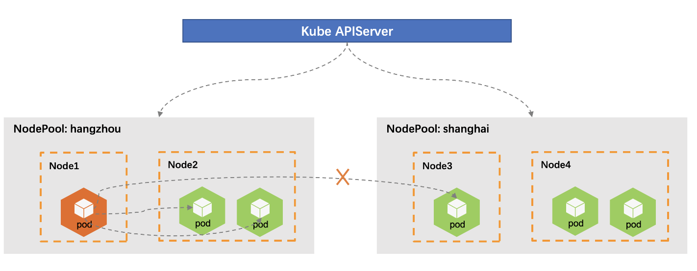
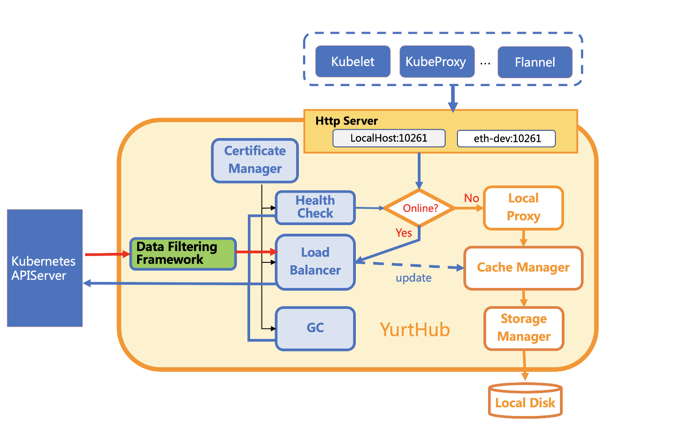

## 1. Features

As a important component of OpenYurt, `YurtHub` provides additional capabilities for the edge-side components in the scenario of cloud-edge computing.

### 1）Edge Autonomy

OpenYurt supports edge autonomy, which means even under the circumstance of network disconnection between cloud and edge, the workload containers at edge can run as they are when they restart, instead of being evicted and rescheduled.

`YurtHub` will cache resources at the edge side to ensure that `kubelet` and pods can get resources they need when the network between cloud and edge are disconnect.


### 2）Traffic Closure


In the native Kubernetes, the endpoints of a service are distributed among the whole cluster. But in OpenYurt we can divided nodes into nodepools, and manage them at the granularity of nodepool. On the base of it, we can also manage resources in each nodepool individually, such as using YurtAppSet to manage pods in different nodepools.

In the scenario of edge computing, resources in one nodepool are often independent on those in other nodepools, and nodes sometimes can only reach the nodes in the same nodepools. To meet this need, `YurtHub` provides the capability of traffic closure to ensure the client can only reach the endpoints in the same nodepool making the traffic closed in the granularity of nodepool.



### 3）Seamlessly Migrate Pods to Edge

In the native Kubernetes, Pods uses InClusterConfig to visit the `Kube-APIServer` by default. But in the scenario of cloud-edge computing, the cloud side and the edge side are often separated in different networks, thus pods cannot reach the `Kube-APIServer` through InClusterConfig. In addition, under the circumstance of disconnection between cloud and edge, the restart of pod will end in failure because it cannot get the resource from `Kube-APIServer`.

To solve the above two problems, `YurtHub` provides users a way to seamlessly migrate their pods to the edge side with no modification. For these pods which using InClusterConfig to visit the `Kube-APIServer`, `YurtHub` will automatically revise the Kubernetes addresses they use to redirect the traffic from `Kube-APIServer` to the `YurtHub`, without any modification of pod yaml configurations.


### 4）Support of Multiple Cloud APIServers

`YurtHub` can work well with multiple cloud apiservers to adapt different scenarios, such as the dedicated cloud scenario which often runs `Kube-APIServer` in HA mode, and the edge computing scenario which communicates through dedicated network and public network at the same time.

- rr(round-robin)：select the address in turn, default.
- priority: select the address according to its priority, only when it is unreachable, other addresses with lower priority will be use.

### 5）Management of Node Certificate

`YurtHub` serves as a client to redirect the requests to the APIServer and meanwhile it serves as a HTTP/HTTPS server to receive requests from `kubelet` and pods running on the node. In the aim of security, `YurtHub` manages the client certificate and the server certificate it needs.

`YurtHub` uses the capability of automatic certificate rotation of Kubernetes. Before certificates on the node expiring, it will automatically ask the cloud for new certificates. This mechanism, meanwhile, solves the following problem which will result in the failure when `YurtHub` restarts: `YurtHub` fails to rotate its certificates for the cloud-edge network breakdown, and fails again after the network recovering because of the expiration of certificates.

## 2. Architecture

`YurtHub` can run on the cloud node and the edge node. Thus, it has two work mode: "edge" and "cloud".

### 1）Edge Mode

The following figure shows the architecture of `YurtHub` working in "edge" mode.



In this figure, the processing of requests is clearly shown.

- When the network between cloud and edge is healthy, requests coming from pods and `kubelet` will be sent to the `Kube-APIServer` through `Load Balancer`. And responses returned back from `Kube-APIServer` will first be filtered by `Load Balancer`. Load Balancer then will cache resources contained in responses and finally send them back to the client.
- When the network between cloud and edge breaks, requests coming from pods and `kubelet` will be processed by `Local Proxy`.

According the above data flows, we can divided components of `YurtHub` into two kinds: Cloud Request Processing Module and Edge Request Processing Module. The Edge Request Processing Module is made of the following components:

- **Local Proxy**
   takes the responsibility of handling resource requests from Pods and `Kubelet` when the cloud-edge network breaks, and makes the client unconscious of the disconnection. `Local Proxy` supports Get/List/Watch requests and will construct responses with cached resources. For those it does not support, such as Delete/Create/Update, it will return error messages. `Cache Manager` is used in this process.

- **Cache Manager**
   takes the responsibility of caching and retrieving resources. It provides caching interface to cache resources contained in the response and retrieving interface to get resources from cache. The former is used by `Load Balancer`, and the later is used by `Local Proxy`.

- **Storage Manager**
   defines functions to manipulate resources in cache, including Create, Update, Delete, Get, List and so on. Finally, resources will be serialized and stored in the cache.

- **Network Manager**
   takes the responsibility of setting iptables of host. Through these iptables rules, requests that originally sent to the `Kube-APIServer` will be redirected to the `YurtHub`.

The Cloud Request Processing Module is made of the following components:

- **Certificate Manager**
   takes the responsibility of managing necessary certificates that are needed when communicating with `Kube-APIServer`, including client cert of `YurtHub` and CA cert of the cluster. It will apply for certificates first and continuously update them before expiration.

- **Health Check**
   will periodically check if the `YurtHub` can reach the `Kube-APIServer` and set the healthy status according to the result. The healthy status will help the `YurtHub` determine whether to send received requests to the cloud or handle them at the edge side. In addition, `Health Check` also takes the responsibility of sending the heartbeat to the cloud.

- **Load Balancer**
   takes the responsibility of establishing the connection between `YurtHub` and `Kube-APIServer`. It will send requests from pods and `Kubelet` to the cloud. `Load Balancer` supports multiple Kube-APIServer addresses, and use Round-Robin or Priority mode to do the load balance. It uses `Data Filtering Framework` to process responses and `Storage Manager` to cache resources in responses.

- **Data Filtering Framework**
   takes the responsibility of filtering data to extend the capability of `YurtHub`. Currently, three filters are included.

  - MasterService Filter：
  enable users to seamlessly migrate pods which uses InClusterConfig to the edge side without modification.
  
  - ServiceTopology Filter：
  provide the capability of traffic closure, limiting the endpoints in the same nodepool as the node.

  - DiscardCloudService Filter：
  ensure that client at the edge side uses public network to reach the endpoints of cloud service instead of the PodIP when the cloud and edge are in the separated network.

- **GC Manager**
   Each time when `YurtHub` restarts, it will recycle pod resources in the cache which does not exist any more at the cloud. During the runtime, it will periodically recycle cached event resources of `kubelet` and `kube-proxy` .

### 2）Cloud Mode

The following figure shows the architecture of `YurtHub` working in "cloud" mode.


Compared with the "edge" mode, `YurtHub` runs in "cloud" mode will not check the healthy status of connection to `Kube-APIServer` because the network at the cloud side is stable enough. `YurtHub` will send all requests it received to `Kube-APIServer` and do not need to cache resources. Thus, it also disable modules relative to handling request locally.

## 3. Reference

```plain
--access-server-through-hub  Default: true
```

Determine whether pods connect to kube-apiserver through `YurtHub`

```plain
--bind-address  Default: "127.0.0.1"
```

The address of `YurtHub Server`. `YurtHub Server` listens on this address serving for requests of pprof, token, healthz and metrics. It works with the option `--serve-port`.

```plain
--cert-mgr-mode  Default: "hubself"
```

Set the mode of `CertManager`. Its value can only be "hubself", which means `YurtHub` will apply for certificates.

```plain
--disabled-resource-filters
```

Its value is a list of disabled filters. All filters are enabled by default.

```plain
--disk-cache-path   Default: "/etc/kubernetes/cache/"
```  

The path where to store cached resources.

```plain
--dummy-if-ip  Default: "169.254.2.1"
```

The IP address of the virtual network interface which is used by containers to connect to `YurtHub`. It's should not be in the range of 169.254.31.0/24 and 169.254.1.1/32.

```plain  
--dummy-if-name  Default: "YurtHub-dummy0"
```

The name of the virtual network interface.
  
```plain
--enable-dummy-if  Default: true
```

If enable the virtual network interface.

```plain
--enable-iptables  Default: true
```

If enable the management of iptables.

```plain
--enable-node-pool  Default: true
```

If `YurtHub` needs to list/watch nodepool resources.

```plain
--enable-resource-filter  Default: true
```  

If enable the filter functions which will filter data in responses returned from the cloud.

```plain
--gc-frequency  Default: 120min
```

The frequency of recycling cached resources.

```plain  
--heartbeat-failed-retry  Default: 3
```

The max times `YurtHub` will retry to update the heartbeat.

```plain
--heartbeat-healthy-threshold  Default: 2
```

The number of consecutive times the Kube APIServer is detected as healthy before it is marked as healthy.

```plain
--heartbeat-timeout-seconds  Default: 2s
```

Timeout when `YurtHub` updates heartbeat.

```plain
--hub-cert-organizations
```

Additional organization names that will be added into the certificate of `YurtHub`. Multiple names should be separated by comma.

```plain
--join-token
```

The token `YurtHub` will use to apply for certificates.

```plain
--kubelet-ca-file  Default: "/etc/kubernetes/pki/ca.crt"
```  

The path of CA cert that kubelet will use.

```plain
--kubelet-client-certificate  Default: "/var/lib/kubelet/pki/kubelet-client-current.pem"
```

The path of client cert that kubelet will use.

```plain  
--kubelet-health-grace-period  Default: 40s
```

The time `YurtHub` can tolerate the no response of `Kubelet`. After it, `YurtHub` will not update the heartbeat.
  
```plain
--lb-mode  Default: "rr"
```

The mode `Load Balancer` will use. Its value can be "rr" which means Round-Robin, or "priority" which means it prefers to use address with high priority.

```plain
--max-requests-in-flight  Default: 250
```

The max pending number of coming requests. If exceed this number, the request will be rejected.

```plain
--node-name
```

The name of the node where the `YurtHub` is running.

```plain
--nodepool-name
```

The name of the nodepool where the `YurtHub` is running.

```plain  
--profiling  Default: true
```

If enable profile.
  
```plain
--proxy-port  Default: "10261"
```

The HTTP port serves for proxy. HTTP requests sent to this port will be sent to `Kube-APIServer`.

```plain
--proxy-secure-port  Default: "10268"
```

The HTTPS port serves for proxy. HTTPS requests sent to this port will be sent to `Kube-APIServer`.

```plain
--root-dir  Default: "/var/lib/YurtHub"
```

Path of files `YurtHub` will use.

```plain
--serve-port  Default: "10267"
```

The port `YurtHub Server` will listen on for HTTP requests. It should be used with option --bind-address.

```plain  
--server-addr
```

Addresses of `Kube-APIServer`. Multiple addresses should be separated by comma.

```plain
--version
```

Output the version of `YurtHub`.

```plain
--working-mode  Default: "edge"
```

Working mode of `YurtHub`. It can be "edge" which means `YurtHub` is running on an edge node, or "cloud" which means `YurtHub` is running on a cloud node.

