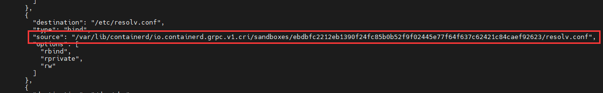
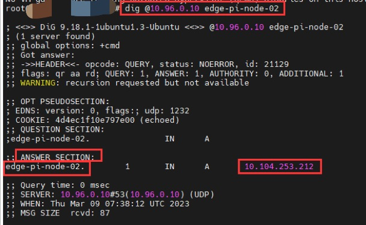

**1. prometheus cannot get the edge node metrics**

prometheus cannot get edge node metrics


**Troubleshooting method**

1. Log in to the node where the prometheus-pod is located, and check the running log of the prometheus container

```shell
$ crictl ps -a
$ crictl logs $containerID<b9a9f9d9fdb1e>
```


2. check the prometheus container DNS configuration file resolv.conf to obtain the domain name resolution server address

```shell
crictl inspect $containerID<b9a9f9d9fdb1e>
```



```shell
$ cat /var/lib/containerd/io.containerd.grpc.v1.cri/sandboxes/ebdbfc2212eb1390f24f02445e7737c62421c84caef92623/resolv.conf
```


Get the domain name server `nameserver` address of the prometheus pod

3. Use the `dig` command, set the domain name resolution server to the `nameserver` address of prometheus, resolve the domain name that the service cannot access, and get the corresponding resolved ip

```shell
$ dig @10.96.0.10$ Unreachable service domain name <edge-pi-node-02>
```



> **If there is no `dig` command, install the dns toolkit according to the corresponding system as follows**
>
> ```shell
> $ apt install dnsutils #ubuntu system
> $ yum install bind-utils #centos system
> ```

4. replace the unreachable service domain name with the ip address just resolved in `curl` command and check if it can be accessed

`https://edge-pi-node-02:10250/metrics` is replaced by: `https://10.104.253.212:10250/metrics`

```shell
$ curl -k -v https://10.104.253.212:10250/metrics
```

If it can be accessed normally, the result of the `curl` command is as follows, and the node in ipvs mode should have created a virtual service forwarding rule corresponding to the ip

