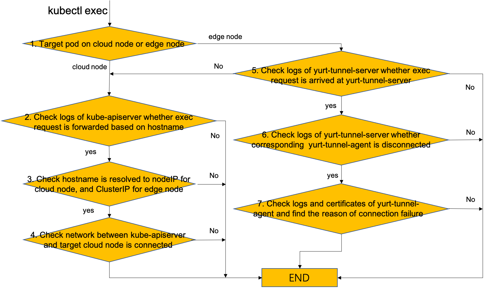

** 1. How to locate the cause of `kubectl exec`command execution failure **

please check according to the process in the figure below.



- if `exec` request info can't be found in logs of kube-apiserver, please set log level of kube-apiserver to 3(--v=3)
- make sure `kube-apiserver` use `yurt-tunnel-dns` pod to resolve hostname. please reference the tutorial of kube-apiserver adjustment here: https://openyurt.io/docs/installation/openyurt-prepare#3-kube-apiserver-adjustment

** 2. kubectl logs edge node error：error: Error from server (ServiceUnavailable): the server is currently unable to handle the request ( pods/log xxx)**

For more details about this problem, you can refer to [issue 984](https://github.com/openyurtio/openyurt/issues/984).
Please make sure that you are using the latest `yurt-tunnel-server/agent` image (the latest tag of image is confusing, please check the created time).

** 3. kubectl logs edge node error：error: You must be logged in to the server (the server has asked for the client to provide credentials ( pods/log xxx))**

For more details about this problem, you can refer to [issue 984](https://github.com/openyurtio/openyurt/issues/984).
This is most likely to be an issue caused by outdated tunnel server certificate. You can clean up the tunnel server certificate and redeploy yurt-tunnel-server.

```bash
rm -rf /var/lib/yurttunnel-server/pki
kubectl delete pod yurt-tunnel-server-xxxxxx -n kube-system
```

** 4. kubectl exec error: unable to upgrade connection: fail to setup the tunnel: fail to setup TLS handshake through the Tunnel**

`kubectl port-forward` may also fail the following similar error.

```bash
root@control-plane:~# kubectl port-forward <...>
error: unable to upgrade connection: fail to setup the tunnel: fail to setup TLS handshake through the Tunnel: write unix @->/tmp/interceptor-proxier.sock: write: broken pipe
```

Fundamentally this problem should be observed because `yurt-tunnel-server/agent` connection cannot be established.

It is likely that this problem may happen since `yurt-tunnel-agent` is not deployed to the corresponding edge nodes.

In that case, it is highly recommended to go through [Setup openyurt components](https://openyurt.io/docs/installation/manually-setup#32-setup-openyurtopenyurt-components) to make sure `yurt-tunnel-server/agent` pods are deployed to appropriate cloud and edge nodes.

If this problem can be observed by requesting `kubectl exec/port-forward` to cloud node which does not require `yurt-tunnel-server/agent` to access the kubelet running on the node, issue may be related to network setting `/etc/hosts`.

If `/etc/hosts` includes any IP addresses with the same hostname registered to Kubernetes / OpenYurt cluster, it might lead the request to be over `yurt-tunnel-server/agent`.

This request will eventually fail with the error message, since there will be no `yurt-tunnel-agent` running on cloud nodes.

In this case, those unrelated IP addresses and hostname would need to be commented out.

For more details, please refer to [issue 1024](https://github.com/openyurtio/openyurt/issues/1024).