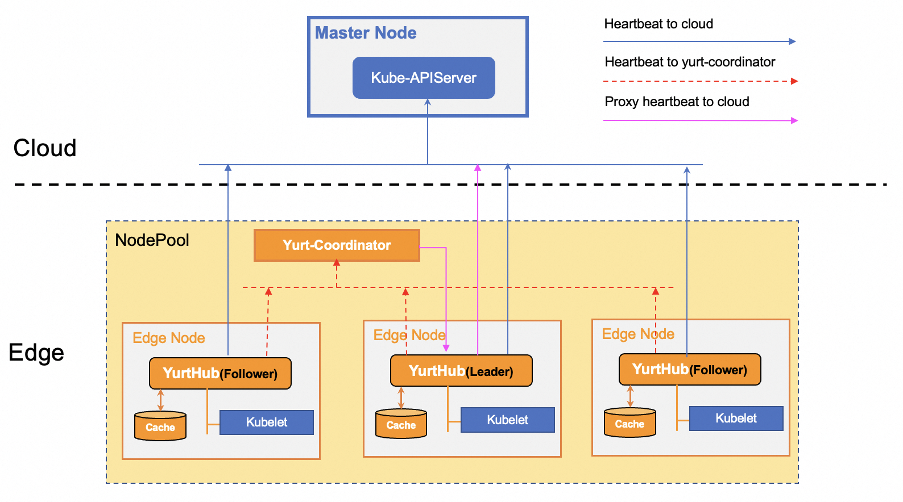
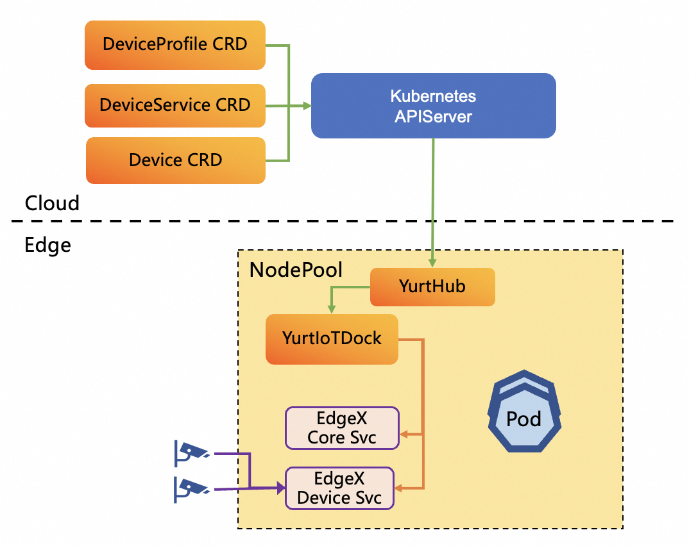

Welcome to the world of OpenYurt!

**OpenYurt is the first edge computing platform that is non-intrusive to cloud-native systems in the industry**. It unifies the management of scattered massive edge heterogeneous resources (such as CDN sites, IoT all-in-one machines and other edge computing power) from the control side (located in the cloud or central server room, etc.).
It helps users to easily complete large-scale application delivery, operation and maintenance, and control on massive edge resources.

OpenYurt will continue to work on exploring cloud-native edge computing platform standards for cloud-edge-device collaboration, and will also combine community mainstream computing, networking, storage, application orchestration, security, AI, IoT and other projects or solutions to build a complete upstream and downstream ecology.

## Key Features
**1. Powerful edge autonomy capability**

In Kubernetes, normally if a node is disconnected from the apiserver, the running Pods cannot be restored upon a node reboot. Moreover, pods on edge nodes will be evicted by native controllers of the Kube-Controller-Manager component when node heartbeat is not reported for more than 5m.
This brings a significant challenge for the cloud-edge orchestration since the cloud-edge networking can be unreliable.  As illustrated in the figure below, OpenYurt addresses this issue by implementing a per-node proxy (YurtHub) along with local storage to cache the state of the cloud apiserver.
Consequently, when a node loses its connection, the cached states remain accessible to Kubelet, KubeProxy, and any user Pods. Furthermore, OpenYurt enhances node reliability through the Yurt-Coordinator component.
Nodes within the same NodePool that have lost cloud connectivity have the ability to transmit their heartbeat to Yurt-Coordinator, the leader Yurthub within NodePool then proxies these node heartbeats to the cloud. This mechanism prevents the eviction of pods on edge nodes, ensuring their stability despite any network disconnections.

**2. Cross NodePool network communication capability**

In an edge computing Kubernetes cluster, nodes are often distributed across various geographical regions. Consequently, when relying on a native Container Network Interface (CNI) solution, Pods within different NodePools may be unable to communicate using Pod IP, Service IP, or Node IP, particularly if each NodePool resides within its own isolated LAN.
Raven offers a networking solution that enables cross-NodePool communication within an OpenYurt cluster. A node daemon is deployed on each node, with one daemon per NodePool designated as the gateway. This gateway daemon establishes a VPN tunnel between NodePools, while the other daemons within the same NodePool set up cross-NodePool network routing rules to direct traffic through this gateway node.
Additionally, Raven is designed to intercept only the traffic that needs to traverse between NodePools, allowing intra-NodePool traffic to continue using the native CNI network solution.
This means that Raven can integrate effortlessly with existing CNI network solutions such as Flannel, Calico, and others. As illustrated in the figure below, cross-NodePool traffic is routed to the gateway node and then transmitted via the VPN tunnel, ensuring seamless interconnectivity across the cluster.

**3. Multi-NodePool management**

For better cloud-edge orchestration, OpenYurt pioneers the idea of managing a Pool, which encapsulates the management of node resources, applications, and workload traffic. The edge computing resources are usually classified and divided into nodepools according to their geographical distributions. In order to manage applications and traffic in multiple nodepools conveniently, There are several features are developed for nodepool as following:
  - A set of new workload models, such as YurtAppSet and YurtAppDaemon are introduced for managing workloads in multi-nodepool.
    - YurtAppSet provides an alternative to manage pods in specified nodepools by using multiple workloads, and pod distribution across nodepools is determined by the replica number of each workload.
    - YurtAppDaemon is used for ensuring that all(or some) nodepools run a copy of a workload(Deployment or StatefulSet). As nodepools are added to the cluster, workloads are added to them automatically. As nodepools are removed from the cluster, those workloads are garbage collected.
  - Service topology capability for routing traffic in nodepool. This feature can ensure any service that a Pod accesses is backed by endpoints within the same nodepool, which is quite useful when cross-nodepool networking is impractical or expensive.

**4. Advanced workload upgrade model**

In cloud-edge architecture, it is easy to get stuck during DaemonSet upgrade process if the number of NotReady nodes exceeds the maxUnavailable of RollingUpdate because cloud-edge network connection is unreliable. In another scenario, because edge nodes may belong to different users (such as new energy vehicles), end users expect that pods on nodes are not automatically upgraded, but that users themselves decide whether to start the pods upgrade on nodes. To address the above challenges, OpenYurt enhances the DaemonSet upgrade model and adds OTA(On-The-Air) and AdvancedRollingUpdate upgrade models.
  - AdvancedRollingUpdate Upgrade Model: It is used for solving the upgrade block by notReady nodes. During the upgrade process, the workload upgrade on ready nodes will be completed firstly, while the notReady nodes are skipped. If the node status recovers to ready, the workload upgrade on the node also will be completed automatically.
  - OTA Upgrade Model: This model is more flexible. As described in below Figure, users can query whether there is a new version of the pod through the REST API on the edge node. Then users can trigger pod upgrade through the REST API on edge nodes if a new version exists, which is quite useful when the decision of workload upgrade belongs to the owner of edge nodes instead of the owner of the cluster. For example: application upgrade on new energy vehicles.

**5. Programmable resource access control**

The programmable data filtering framework is an integral part of the YurtHub component. As illustrated in the figure below, this framework processes the response data from the cloud. It employs a series of filters to adapt the data seamlessly and on-demand, ensuring it meets the unique needs of cloud-edge collaboration.
Currently, the framework supports five filters within its chain, with the flexibility to incorporate additional filters as needed. The current filters include:

- masterservice Filter: This filter modifies the ClusterIP and HTTPS port of the default master service (default/kubernetes) to match the YurtHub component's listening address. The goal is to enable pods on edge nodes, using InClusterConfig, to connect to the cloud's kube-apiserver via the YurtHub component transparently.

- servicetoplogy Filter: This filter reorganizes `endpointslices` based on the service topology settings. It ensures that service traffic is only directed to pods within the same nodepool, maintaining efficient service communication.

- discardcloudservice Filter: Designed for the kube-proxy components on edge nodes, this filter eliminates LoadBalancer services that are not reachable via pod IP, as these cloud services are inaccessible from the edge nodes.

- inclusterconfig Filter: This filter comments out kubeconfig settings in the kube-system/kube-proxy configmap. By doing so, it allows kube-proxy components on edge nodes to use InClusterConfig for accessing the cloud kube-apiserver.

- nodeportisolation Filter: The filter is crafted to allow administrators to specifically choose which NodePort services to keep and which to remove within a NodePool. By doing so, it prevents the kube-proxy component within that NodePool from processing any NodePort traffic that isn't required. This control means administrators can decide which NodePort services are accessible from outside the Kubernetes cluster in each NodePool. As a result, this enhances the cluster's network configuration by increasing security and optimizing performance.

**6. Cloud-edge network bandwidth reduction**

A [performance test](https://openyurt.io/docs/test-report/yurthub-performance-test#traffic) has shown that in a large-scale OpenYurt cluster, the cloud-edge traffic will increase rapidly if pods are deleted and recreated since the kube-proxy components on the edge nodes watch for all endpoints/endpointslices changes. It's worth mentioning that identical endpoints data is transmitted to edge nodes within the same nodepool, which may not be the most efficient approach. This is due to the fact that cloud-edge networking traffic often relies on public networks, which can incur higher costs.
Leveraging the Yurt-Coordinator mentioned above, OpenYurt proposes to introduce a notion of pool-scoped metadata which are unique within a nodepool such as the endpoints/endpointslices data. As described in below Figure, the leader Yurthub will read the pool-scoped data from the cloud kube-apiserver and update the load to yurt-coordinator. As a result, all other YurtHubs will retrieve the pool-scoped data from the yurt-coordinator, eliminating the use of public network bandwidth for retrieving such data from the cloud kube-apiserver.

**7. Cloud-native edge device management**

OpenYurt defines a set of APIs for managing edge devices through cloud Kubernetes controlplane. The APIs abstract the device’s basic properties, main capabilities and the data that should be transmitted between the cloud and the edge. OpenYurt provides integration with mainstream OSS IoT device management solutions, such as EdgeXFoundry using the APIs. As described in below Figure, An instance of YurtIoTDock component and EdgeXFoundry service are deployed in each nodepool. YurtIoTDock component can get the changes of Device CRD from cloud kube-apiserver and convert the desired spec of Device CRD to requests of EdgeXFoundry, then transmit the requests to EdgeXFoundry service in real-time. On the other hand, YurtIoTDock can subscribe to the device status from EdgeXFoundry service, and update the status of Device CRD when status is changed.

## What's Next
Here are some recommended next steps:
- Start to install [OpenYurt](./installation/summary.md).
- Learn OpenYurt's [Architecture](./core-concepts/architecture.md).
