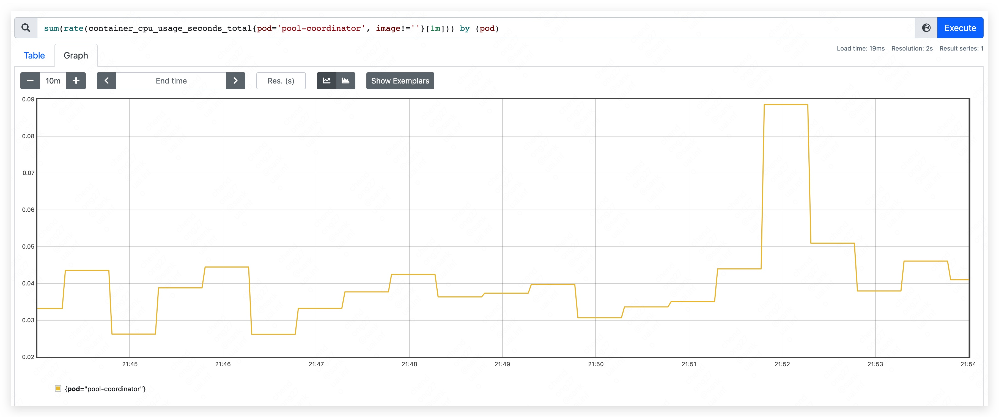
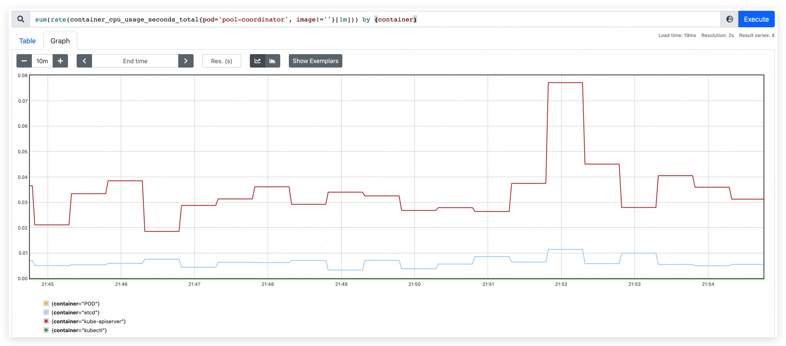
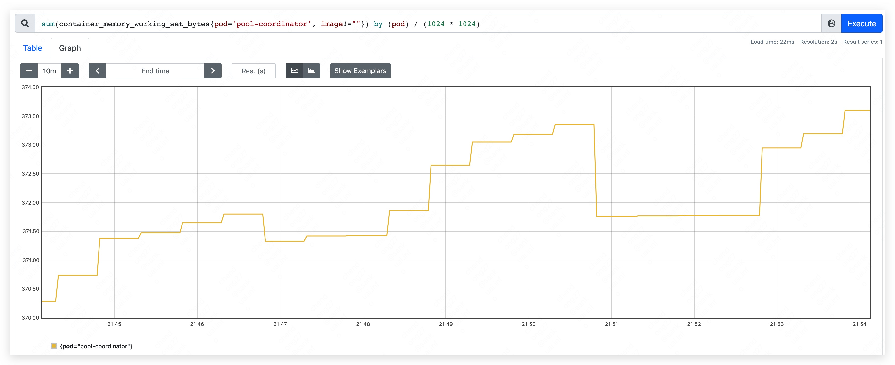
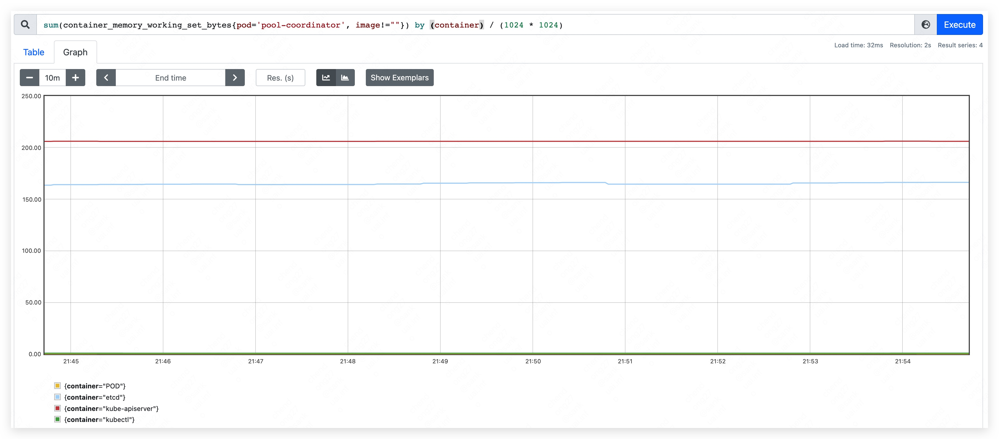
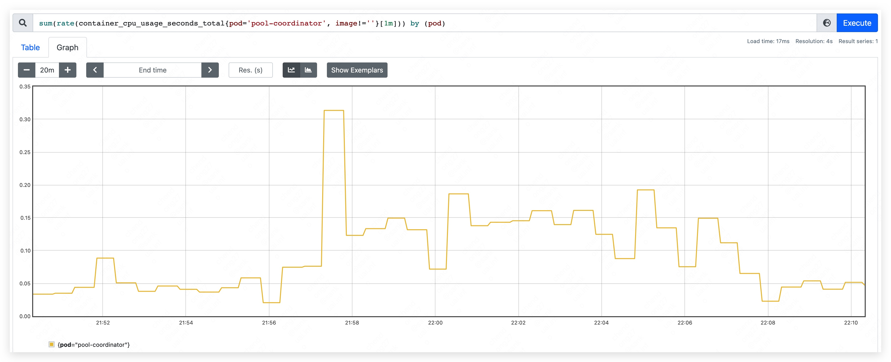
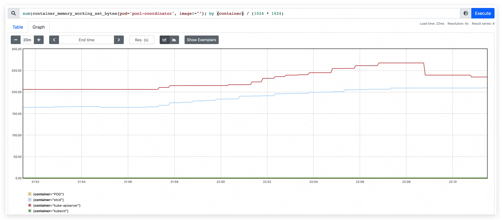
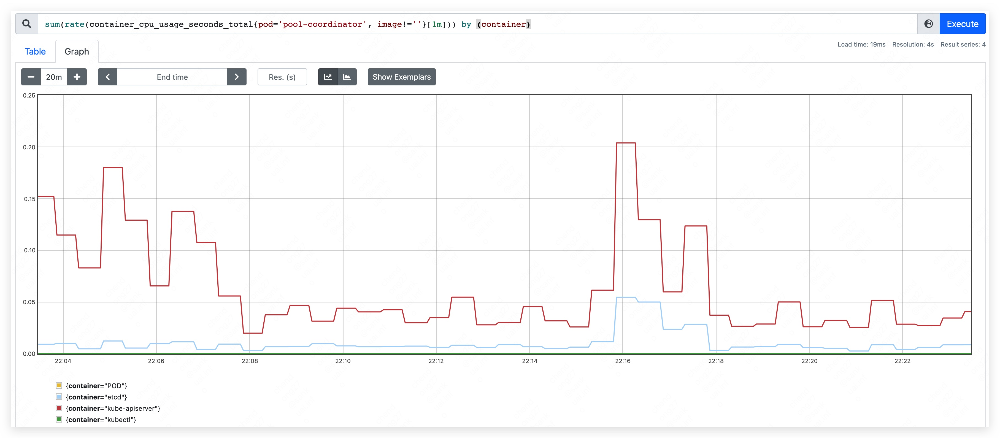
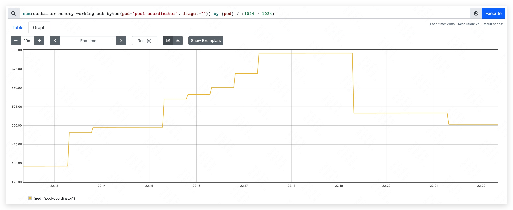
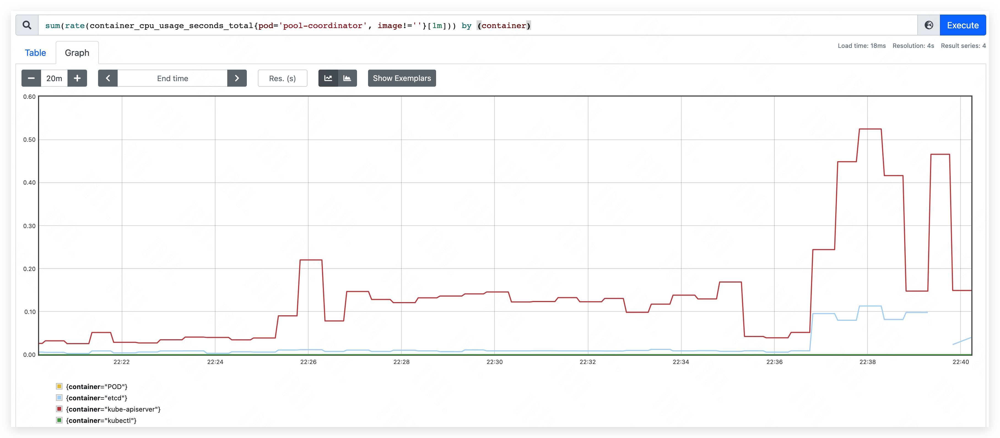

## Background

Pool Coordinator is an important component in edge node pool. OpenYurt uses pool coordinator to select a yurthub master and backup the resources in edge node pool.

In this article, we test the performance of pool-coordinator pod and give a suggestion resource configuration.


## Test Environment

### Kubernetes Version

`Major:"1", Minor:"22", GitVersion:"v1.22.0", GitCommit:"c2b5237ccd9c0f1d600d3072634ca66cefdf272f", GitTreeState:"clean", BuildDate:"2021-08-04T17:57:25Z", GoVersion:"go1.16.6", Compiler:"gc", Platform:"linux/amd64"`

### Node Configuration

Master and work node are virtual machines run on VMWare Fusion.

#### Operating System
|  | Master  | Node  |
| --- | --- | --- |
| LSB Version  | :core-4.1-amd64:core-4.1-noarch | :core-4.1-amd64:core-4.1-noarch |
| Distributor ID  | CentOS | CentOS |
| Description | CentOS Linux release 8.4.2105 | CentOS Linux release 8.4.2105 |
| Release  | 8.4.2105 | 8.4.2105 |

#### CPU

|  | Master  | Node  |
| --- | --- | --- |
| Architecture  | x86_64 | x86_64 |
| CPU op-mode (s) | 32-bit, 64-bit | 32-bit, 64-bit |
| Byte Order  | Little Endian | Little Endian  |
| CPU (s) | 4 | 4 |
| On-line CPU(s) list | 0-3 | 0-3 |
| Thread(s) per core | 1 | 1 |
| Core(s) per socket | 1 | 1 |
| Socket(s)  | 4 | 4 |
| NUMA node(s) | 1 | 1 |
| Vendor ID  | GenuineIntel | GenuineIntel |
| CPU family  | 6 | 6 |
| Model  | 158 | 158 |
| Model name  | Intel(R) Core(TM) i7-9750H CPU @ 2.60GHz | Intel(R) Core(TM) i7-9750H CPU @ 2.60GHz |
| Stepping  | 10 | 10 |
| CPU MHz | 2592.000 | 2592.000 |

#### Memory
|  | Master  | Node  |
| --- | --- | --- |
| Total memory  | 7829472 K | 7829472 K |

#### Disk
|  | Master              | Node                |
| --- |---------------------|---------------------|
| Total Size   | 20GiB   | 20GiB   |

## Test Method

* Start the pool-coordinator pod and record the beginning resource used.
* Write a mount of resources and record the resource used of pool-coordinator. In this test, we write 1000 pods and 500 nodes into pool-coordinator. The size of each pod and node both are 8KB.
* Delete all resources in pool-coordinator. To see whether resource used will go down to the beginning level.
* Rewrite a mount of resources to pool-coordinator and patch them frequently and randomly. Check the resource used of current situation.
* Check the result of leader election.


## Test Result

### Phase one

Start pool-coordinator pod and record the beginning resource used.

* CPU used: 70m ~ 90m
* mem used: 370MB.
  * apiserver used 205MB.
  * etcd used 165MB.







### Phase two

Write a mount of resources and record the resource used of pool-coordinator. In this test, we write 1000 pods and 500 nodes into pool-coordinator. The size of each pod and node both are 8KB.

* top CPU used: 310m
* top mem used: 450MB. 
  * apiserver used 240MB.
  * etcd used 210MB.







### Phase three

Delete all resources in pool-coordinator. To see whether resource used will go down to the beginning level.

* top CPU used: 260m
* top mem used: 590MB. 
  * apiserver used 350MB.
  * etcd used 240MB.






### Phase four

Rewrite a mount of resources to pool-coordinator and patch them frequently and randomly. Check the resource used of current situation.

* top CPU used: 640m.
* mem used rise continually and result in etcd container OOM.





### Phase five

Run program to do leader election and check the result. We can see that program acquired leader successfully.

```shell
I1103 20:47:15.123746   87201 leaderelection.go:248] attempting to acquire leader lease default/test-lock...
I1103 20:47:15.260887   87201 leaderelection.go:258] successfully acquired lease default/test-lock
I1103 20:47:15.260951   87201 main.go:465] Controller loop...
```

Check the lease resource in pool-coordinator. We can see the lease resource too.

```shell
$ kubectl get lease
NAME        HOLDER                                 AGE
test-lock   2cd06119-8be6-4e0e-a6aa-398f1eca32c0   102s
```


## Conclusion

After testing, we got the minimum resource limit that pool-coordinator needed: CPU 310m、memory 450MB.

And we see that deleting resource in etcd will not let the resource used of pool-coordinator goes down.

It is caused by the storage mechanism of etcd, which will add tombstone revision instead of deleting resource immediately.

When patching resource frequently, the memory used of etcd go up. If we set the memory limit of etcd, it will cause etcd container OOM.

Finally, we got that CPU is not the limit resource of pool-coordinator. And the memory used of etcd container should be limited to an acceptable level to protect other pod in edge node pool

So, in an edge node pool, when node number less than 500 and pod number less then 1000, we recommend the resource configuration below:

```yaml
apiserverResources:
  requests:
    cpu: 250m
---
etcdResources:
  limits:
    cpu: 200m
    memory: 512Mi
  requests:
    cpu: 100m
    memory: 256Mi
```
