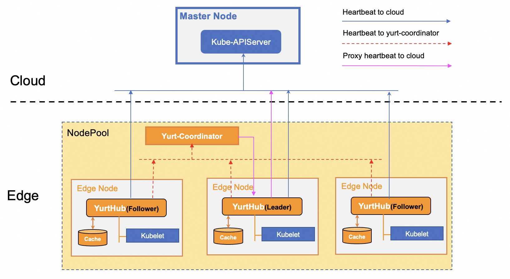

## Background introduction

In native Kubernetes, when the heartbeat of the edge node is not reported for a certain period of time, the cloud controller will expel the Pod on the node (delete it and rebuild it on the normal node). In the cloud edge collaboration scenario, edge side have different requirements. Some services expect that when the heartbeat cannot be reported due to the disconnection of the cloud edge network (the node itself is normal in this case), service Pods can be maintained (no ejections occur), and only when the node is faulty can the Pod be migrated and rebuilt.

## Architecture design

OpenYurt version 1.2 creates a centralized heartbeat proxy mechanism based on the Yurt-Coordinator + YurtHub, as shown in the following figure:

- When the cloud side network of a node is normal, Kubelet sends a heartbeat message to both the cloud center and Yurt-Coordinator through the YurtHub component.
- When the cloud side network of a node is disconnected, Kubelet fails to report the heartbeat to the cloud through the YurtHub component. In this case, the heartbeat reported to the Yurt-Coordinator has a specific label.
- Leader YurtHub realtime heartbeat data in list/watch Yurt-Coordinator. If the obtained heartbeat data contains a specific label, yurthub forwards the heartbeat data to the cloud center.

The heartbeat proxy mechanism implemented by Yurt-Coordinator and YurtHub ensures that nodes' heartbeat can still be reported to the cloud center even when the cloud edge network is disconnected. In this way, service pods on nodes are not expelled. At the same time, the node whose heartbeat is reported by the agent will also be added with a special taints in real time to restrict the management and control from dispatching new Pods to this node.

## How to use

The heartbeat proxy function is supported by Yurt-Coordinator. If you want to use this capability, note the following configurations:
- Ensure that the OpenYurt version is greater than 1.2.0
- Ensure that each node Pool has a Yurt-Coordinator instance running
- YurtHub component startup parameter `--enable-coordinator = true`