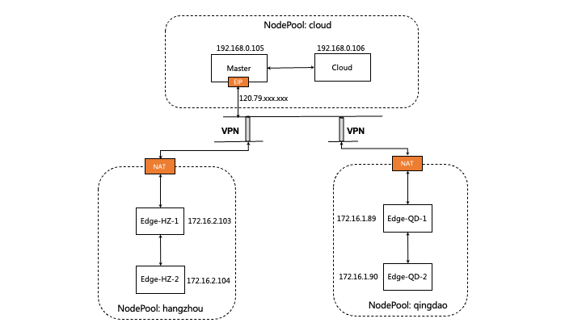

This document introduces how to install raven and use raven to enhance edge-edge and edge-cloud network communication in an edge cluster.

Suppose you have an edge kubernetes cluster with nodes in different physical regions, and already deploy the `Raven Controller Manager` and `Raven Agent` in this cluster,You can refer to the  [installation tutorial](../../installation/manually-setup.md) if you do not have Raven installed, the details of `Raven Controller Manager` are in [here](https://github.com/openyurtio/raven-controller-manager/blob/main/README.md).

## Label nodes in different physical regions

As follows, suppose the cluster has five nodes, located in three different regions, where the node `master` is cloud node.

``` bash
$ kubectl get nodes -o wide
NAME                      STATUS   ROLES                  AGE     VERSION    INTERNAL-IP     EXTERNAL-IP   OS-IMAGE                KERNEL-VERSION                CONTAINER-RUNTIME
izbp15inok0kbfkg3in52rz   Ready    Edge-HZ-1              27h     v1.22.11   172.16.2.103    <none>        CentOS Linux 7 (Core)   3.10.0-1160.81.1.el7.x86_64   docker://19.3.15
izbp15inok0kbfkg3in52sz   Ready    Edge-HZ-2              26h     v1.22.11   172.16.2.104    <none>        CentOS Linux 7 (Core)   3.10.0-1160.81.1.el7.x86_64   docker://19.3.15
izm5eb24dmjfimuaybpnqzz   Ready    Edge-QD-1              29h     v1.22.11   172.16.1.89     <none>        CentOS Linux 7 (Core)   3.10.0-1160.80.1.el7.x86_64   docker://19.3.15
izm5eb24dmjfimuaybpnr0z   Ready    Edge-QD-2              29h     v1.22.11   172.16.1.90     <none>        CentOS Linux 7 (Core)   3.10.0-1160.80.1.el7.x86_64   docker://19.3.15
izwz9dohcv74iegqecp4axz   Ready    control-plane,master   5d21h   v1.22.11   192.168.0.195   <none>        CentOS Linux 7 (Core)   3.10.0-1160.80.1.el7.x86_64   docker://20.10.2
izwz9ey0js5z7mornclpd6z   Ready    cloud                  3h3m    v1.22.11   192.168.0.196   <none>        CentOS Linux 7 (Core)   3.10.0-1160.80.1.el7.x86_64   docker://20.10.2
```

We use a [Gateway](https://github.com/openyurtio/raven-controller-manager/blob/main/pkg/ravencontroller/apis/raven/v1alpha1/gateway_types.go) CR to manage nodes in different physical regions, and label nodes to indicate which `Gateway` these nodes are managed by.

For example, We label nodes in region `hangzhou` with value `gw-hangzhou`, indicating that these nodes are managed by the `gw-hangzhou` gateway.

```bash
$ kubectl label nodes izbp15inok0kbfkg3in52rz izbp15inok0kbfkg3in52sz raven.openyurt.io/gateway=gw-hangzhou
node/izbp15inok0kbfkg3in52rz not labeled
node/izbp15inok0kbfkg3in52sz not labeled
```

Similarly, we label node in `cloud` with value `gw-cloud`, and nodes in region `qingdao` with value `gw-qingdao`.

```bash
$ kubectl label nodes izwz9dohcv74iegqecp4axz izwz9ey0js5z7mornclpd6z raven.openyurt.io/gateway=gw-cloud
node/izwz9dohcv74iegqecp4axz labeled
node/izwz9ey0js5z7mornclpd6z labeled
```

```bash
$ kubectl label nodes izm5eb24dmjfimuaybpnqzz izm5eb24dmjfimuaybpnr0z raven.openyurt.io/gateway=gw-qingdao
node/izm5eb24dmjfimuaybpnqzz  labeled
node/izm5eb24dmjfimuaybpnr0z  labeled
```

Apply the following command to check that raven is running properly

``` bash
$ kubectl get pod -n kube-system | grep raven-agent-ds
raven-agent-ds-4b587                              1/1     Running             0              25h
raven-agent-ds-dmh66                              1/1     Running             0              25h
raven-agent-ds-gb5qj                              1/1     Running             0              25h
raven-agent-ds-gzpfh                              1/1     Running             0              170m
raven-agent-ds-ksxq6                              1/1     Running             0              25h
raven-agent-ds-qhjtb                              1/1     Running             0              25h
```


## 2. How to use

### 2.1 Gateways

- Create Gateway CR

```bash
$ cat <<EOF | kubectl apply -f -
apiVersion: raven.openyurt.io/v1beta1
kind: Gateway
metadata:
  name: gw-hangzhou
spec:
  proxyConfig:
    Replicas: 1
  tunnelConfig:
    Replicas: 1
  endpoints:
    - nodeName: izbp15inok0kbfkg3in52rz
      underNAT: true
      port: 10262
      type: proxy
    - nodeName: izbp15inok0kbfkg3in52rz
      underNAT: true
      port: 4500
      underNAT: true
      type: tunnel
---
apiVersion: raven.openyurt.io/v1alpha1
kind: Gateway
metadata:
  name: gw-cloud
spec:
  exposeType: PublicIP
  proxyConfig:
    Replicas: 1
    proxyHTTPPort: 10255,9445
    proxyHTTPSPort: 10250,9100
  tunnelConfig:
    Replicas: 1
  endpoints:
    - nodeName: izwz9dohcv74iegqecp4axz
      underNAT: false
      port: 10262
      type: proxy
      publicIP: 120.79.xxx.xxx
    - nodeName: izwz9dohcv74iegqecp4axz
      underNAT: false
      port: 4500
      type: tunnel
      publicIP: 120.79.xxx.xxx

---
apiVersion: raven.openyurt.io/v1alpha1
kind: Gateway
metadata:
  name: gw-qingdao
spec:
  proxyConfig:
    Replicas: 1
  tunnelConfig:
    Replicas: 1
  endpoints:
  - nodeName: izm5eb24dmjfimuaybpnqzz
    underNAT: true
    port: 10262
    type: proxy
  - nodeName: izm5eb24dmjfimuaybpnr0z
    underNAT: true
    port: 4500
    type: tunnel
EOF
```

- Parameters Introduction：
1. ```spec.exposedType```: The type of public network exposure, empty indicates that the gateway will not be exposed, either LoadBalancer or PublicIP can be used to exposed gateway in internet. 
2. ```spec.endpoints```: Indicates a set of alternative gateway endpoints, some of which are selected by the yurtmanager as gateway endpoints based on node status
3. ```spec.endpoints.nodeName```: The name of gateway endpoints
   1. ```spec.endpoints.type```: The type of gateway endpoints, the value is set to proxy if the node is proxy mode endpoints, and the value is also can be set to tunnel if the node is tunnel mode endpoints. 
4. ```spec.endpoints.port```: Ports exposed by the gateway endpoints service: TCP 10262 in proxy mode and UDP 4500 in tunnel mode
5. ```spec.endpoints.publicIP```: The public ip of gateway endpoints
6. ```spec.endpoints.underNAT```: Whether to use NAT to access the public network. Generally, false is set on the cloud, and true is set on the edge
7. ```spec.proxyConfig.Replicas```: Replicas of gateway endpoints in enable proxy mode
8. ```spec.proxyConfig.proxyHTTPPort```: A insecure port for a cloud-side proxy mode communication agent, such as port 10255, which kubelet listens for
9. ```spec.proxyConfig.proxyHTTPPort```: A secure port for a cloud-side proxy mode communication agent, such as port 10250, which kubelet listens for
10. ```spec.tunnelConfig.Replicas```: Replicas of gateway endpoints in enable tunnel mode，which must be 1 currently

- Describe the status of all gateways
1. Check whether the Gateway node is elected in the Status of the gateway. The Yurt Manager component, GatewayPickup Controller, is responsible for the election.
2. Check whether the public IP address and exposed port are correct
3. Check whether the enabled mode meets the expectations
```bash
$ kubectl get cm raven-cfg -n kube-system -o yaml
apiVersion: v1
data:
  enable-l3-tunnel: "true"
  enable-l7-proxy: "true"
kind: ConfigMap
metadata:
  annotations:
    meta.helm.sh/release-name: raven-agent
    meta.helm.sh/release-namespace: kube-system
  creationTimestamp: "2023-11-24T06:44:54Z"
  labels:
    app.kubernetes.io/managed-by: Helm
  name: raven-cfg
  namespace: kube-system
```
```bash 
$ kubectl get gateways

NAME          AGE
gw-cloud      22h
gw-hangzhou   22h
gw-qingdao    22h

$ kubectl get gateway gw-cloud -o yaml
apiVersion: raven.openyurt.io/v1alpha1
kind: Gateway
metadata:
  name: gw-cloud
spec:
  exposeType: PublicIP
  proxyConfig:
    Replicas: 1
    proxyHTTPPort: 10255,9445
    proxyHTTPSPort: 10250,9100
  tunnelConfig:
    Replicas: 1
  endpoints:
    - nodeName: izwz9dohcv74iegqecp4axz
      underNAT: false
      port: 10262
      type: proxy
      publicIP: 120.79.xxx.xxx
    - nodeName: izwz9dohcv74iegqecp4axz
      underNAT: false
      port: 4500
      type: tunnel
      publicIP: 120.79.xxx.xxx
status:
  activeEndpoints:
  - config:
      enable-l7-proxy: "true"
    nodeName: izwz9dohcv74iegqecp4axz
    port: 10262
    publicIP: 47.xxx.xxx.xxx
    type: proxy
  - config:
      enable-l3-tunnel: "true"
    nodeName: izwz9dohcv74iegqecp4axz
    port: 4500
    publicIP: 47.xxx.xxx.xxx
    type: tunnel
  nodes:
  - nodeName: izwz9dohcv74iegqecp4axz
    privateIP: 192.168.0.195
    subnets:
    - 10.224.0.128/26
  - nodeName: izwz9ey0js5z7mornclpd6z
    privateIP: 192.168.0.196
    subnets:
    - 10.224.0.0/26

$ kubectl get gateway gw-hangzhou -o yaml
apiVersion: raven.openyurt.io/v1beta1
kind: Gateway
metadata:
  name: gw-hangzhou
spec:
  proxyConfig:
    Replicas: 1
  tunnelConfig:
    Replicas: 1
  endpoints:
    - nodeName: izbp15inok0kbfkg3in52rz
      underNAT: true
      port: 10262
      type: proxy
    - nodeName: izbp15inok0kbfkg3in52rz
      underNAT: true
      port: 4500
      underNAT: true
      type: tunnel
status:
  activeEndpoints:
  - config:
      enable-l7-proxy: "true"
    nodeName: izbp15inok0kbfkg3in52rz
    port: 10262
    publicIP: 120.79.xxx.xxx
    type: proxy
  - config:
      enable-l3-tunnel: "true"
    nodeName: izbp15inok0kbfkg3in52rz
    port: 4500
    publicIP: 120.79.xxx.xxx
    type: tunnel
  nodes:
  - nodeName: izbp15inok0kbfkg3in52rz
    privateIP: 172.16.2.103
    subnets:
    - 10.224.1.128/26
  - nodeName: izbp15inok0kbfkg3in52sz
    privateIP: 172.16.2.104
    subnets:
    - 10.224.1.0/26
```

### Test pod-to-pod networking (tunnel mode)

- Create test pod

```bash
$ cat <<EOF | kubectl apply -f -
apiVersion: apps/v1
kind: Deployment
metadata:
  name: busy-box
spec:
  replicas: 4
  selector:
    matchLabels:
      app: busy-box
  template:
    metadata:
      labels:
        app: busy-box
    spec:
      containers:
      - name: busy-box
        image: busybox
        command:
        - /bin/sh
        - -c
        - sleep 3000
      nodeSelector:
        openyurt.io/is-edge-worker: "true"
EOF
```

- Get test pod 

```bash
$ kubectl get pod -o wide
busy-box-6f46f8585b-48zb9   1/1     Running   0          76s   10.244.19.3     izbp15inok0kbfkg3in52sz   <none>           <none>
busy-box-6f46f8585b-9nm64   1/1     Running   0          76s   10.244.16.161   izm5eb24dmjfimuaybpnqzz   <none>           <none>
busy-box-6f46f8585b-kv4dw   1/1     Running   0          76s   10.244.17.19    izm5eb24dmjfimuaybpnr0z   <none>           <none>
busy-box-6f46f8585b-t5v9d   1/1     Running   0          76s   10.244.18.4     izbp15inok0kbfkg3in52rz   <none>           <none>
```

- Test networking across edge 

```bash
$ kubectl exec -it busy-box-6f46f8585b-48zb9 -- sh
/ # ping 10.244.17.19 -c 4
PING 10.244.17.19 (10.244.17.19): 56 data bytes
64 bytes from 10.244.17.19: seq=0 ttl=59 time=78.048 ms
64 bytes from 10.244.17.19: seq=1 ttl=59 time=77.424 ms
64 bytes from 10.244.17.19: seq=2 ttl=59 time=77.490 ms
64 bytes from 10.244.17.19: seq=3 ttl=59 time=77.472 ms

--- 10.244.17.19 ping statistics ---
4 packets transmitted, 4 packets received, 0% packet loss
round-trip min/avg/max = 77.424/77.608/78.048 ms

```

- Log in to the non-gateway node Edge-HZ-2 and ping the non-gateway node Edge-QD-2 to test the connectivity of nodes across network domains,
```bash
# Edge-HZ-2(Non-Gateway)：
ping 172.16.1.90 -c 4
PING 172.16.1.90 (172.16.1.90) 56(84) bytes of data.
64 bytes from 172.16.1.90: icmp_seq=1 ttl=61 time=77.5 ms
64 bytes from 172.16.1.90: icmp_seq=2 ttl=61 time=77.3 ms
64 bytes from 172.16.1.90: icmp_seq=3 ttl=61 time=78.5 ms
64 bytes from 172.16.1.90: icmp_seq=4 ttl=61 time=77.3 ms

--- 172.16.1.90 ping statistics ---
4 packets transmitted, 4 received, 0% packet loss, time 3003ms
rtt min/avg/max/mdev = 77.314/77.682/78.531/0.533 ms
```

```bash
# Capture package
# Edge-HZ-1 (Gateway)：
tcpdump -i raven0
tcpdump: verbose output suppressed, use -v or -vv for full protocol decode
listening on raven0, link-type EN10MB (Ethernet), capture size 262144 bytes
16:13:12.132496 IP 172.16.2.104 > 172.16.1.90: ICMP echo request, id 2, seq 1, length 64
16:13:13.133606 IP 172.16.2.104 > 172.16.1.90: ICMP echo request, id 2, seq 2, length 64
16:13:14.134172 IP 172.16.2.104 > 172.16.1.90: ICMP echo request, id 2, seq 3, length 64
16:13:15.135570 IP 172.16.2.104 > 172.16.1.90: ICMP echo request, id 2, seq 4, length 64
```

```bash
# Capture package
# Edge-QD-1 (Gateway)：
tcpdump -i raven0
tcpdump: verbose output suppressed, use -v or -vv for full protocol decode
listening on raven0, link-type EN10MB (Ethernet), capture size 262144 bytes
16:13:12.174023 IP 172.16.1.90 > 172.16.2.104: ICMP echo reply, id 2, seq 1, length 64
16:13:13.175096 IP 172.16.1.90 > 172.16.2.104: ICMP echo reply, id 2, seq 2, length 64
16:13:14.176813 IP 172.16.1.90 > 172.16.2.104: ICMP echo reply, id 2, seq 3, length 64
16:13:15.177024 IP 172.16.1.90 > 172.16.2.104: ICMP echo reply, id 2, seq 4, length 64
```

```bash
# Capture package
# Edge-QD-2(Non-Gateway)：
tcpdump -i raven0
tcpdump: verbose output suppressed, use -v or -vv for full protocol decode
listening on raven0, link-type EN10MB (Ethernet), capture size 262144 bytes
16:13:12.173087 IP iZm5eb24dmjfimuaybpnr0Z > 172.16.2.104: ICMP echo reply, id 2, seq 1, length 64
16:13:13.174148 IP iZm5eb24dmjfimuaybpnr0Z > 172.16.2.104: ICMP echo reply, id 2, seq 2, length 64
16:13:14.175884 IP iZm5eb24dmjfimuaybpnr0Z > 172.16.2.104: ICMP echo reply, id 2, seq 3, length 64
16:13:15.176090 IP iZm5eb24dmjfimuaybpnr0Z > 172.16.2.104: ICMP echo reply, id 2, seq 4, length 64
```

### Test cross-domain http networking (proxy mode)

In the edge scenario, the Intranet IP addresses of the edge devices often conflict with each other in closed Intranet environments, and the tunnel mode cannot support host communication in IP conflict scenarios. Therefore, the proxy mode must be enabled to support cross-domain HTTP/HTTPS requests.
enable proxy model, and set  ```enable-l7-proxy: "true"```

```bash
$ kubectl get cm raven-cfg -n kube-system -o yaml
apiVersion: v1
data:
  enable-l3-tunnel: "true"
  enable-l7-proxy: "true"
kind: ConfigMap
metadata:
  annotations:
    meta.helm.sh/release-name: raven-agent
    meta.helm.sh/release-namespace: kube-system
  creationTimestamp: "2023-11-24T06:44:54Z"
  labels:
    app.kubernetes.io/managed-by: Helm
  name: raven-cfg
  namespace: kube-system
```

```bash
$ kubectl exec -it busy-box-6f46f8585b-48zb9 -- sh
echo hello word
hello word
```

# Other Features：
By default, raven uses IPSec as the VPN back end, and we also provide WireGuard as an alternative. You can do the following to switch to the WireGuard back end.
* Raven requires the WireGuard kernel module to be loaded on the gateway node in the cluster. As of Linux 5.6, the kernel includes WireGuard in-tree; Linux distributions with older kernels will need WireGuard installed. For most Linux distributions, this can be done using the system package manager. For more information, see Installing WireGuard.
  * The gateway node will require an open UDP port to communicate. By default, the WireGuard uses UDP port 51820. Run the following command.
    ```bash
    cd raven
    git checkout v0.4.1
    VPN_DRIVER=wireguard make deploy
    ```
    
# Using VPN Tunnel
If using an IPSec tunnel (implemented via libreswan) as the backend, you can enter the raven agent container and check the relevant status by using the command ```ipsec status/look``` or ```/usr/libexec/ipsec status/look```. Additionally, make appropriate use of the ipsec tool to troubleshoot related issues.
If using a Wireguard tunnel as the backend implementation for the VPN, you can enter the raven agent container, install the wireguard-tools tool, and refer to the tool's instructions to troubleshoot related issues.
Raven relies entirely on open-source IPSec and Wireguard tools without any customization. You can refer to open-source communities and related technical blogs to resolve everyday issues.