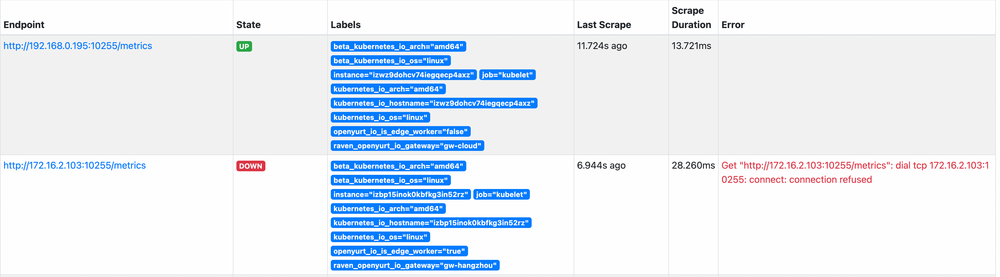

title: Prometheus
---


This document demonstrates how to scrape metrics from edge node through Raven within an OpenYurt cluster, you can refer to the [installation tutorial](../../installation/manually-setup.md) if Raven components are not deployed. Cloud and edge are usually in different network area, so the Raven project is needed to communicate across network area. Prometheus pull metrics of the resources and objects of the edge gateway node through the VPN built by raven agent, and the pull request of collecting non-gateway node metrics is forwarded by gateway node in the network area.

## Environment

- OpenYurt v1.2+

- Raven v0.3.0+

- Prometheus

If you don't have an OpenYurt on hand, you can refer [installation tutorial](../../installation/summary.md) to create one or convert from an exist Kubernetes cluster.

## Prometheus config
Prometheus uses IP by default to access the metric addresses of the nodes, and the Raven project has implemented communication across network area, so using Prometheus on the OpenYurt project is consistent with native k8s.

### collect kubelet metrics
The function to collect node metrics from kubelet can be added by modifying the configmap of prometheus. For instance, prometheus collects metrics for the node through the read-only port 10255 that kubelet listens on by the relabel configuration:
```yaml
- job_name: 'kubelet'
    kubernetes_sd_configs:
      - role: node
    scheme: https
    tls_config:
      ca_file: /var/run/secrets/kubernetes.io/serviceaccount/ca.crt
      insecure_skip_verify: true
    authorization:
      credentials_file: /var/run/secrets/kubernetes.io/serviceaccount/token
    relabel_configs:
      - action: labelmap
        regex: __meta_kubernetes_node_label_(.+)
      - source_labels: [__address__]
        action: replace
        target_label: __address__
        regex: ([^:;]+):(\d+)
        replacement: ${1}:10255
      - source_labels: [__scheme__]
        action: replace
        target_label: __scheme__
        regex: https
        replacement: http
```
- For more information about relabel configuration, refer to the following [prometheus_relabel_config](https://prometheus.io/docs/prometheus/latest/configuration/configuration/#relabel_config).

- Different components required different `sourceLabels`，refer to the following[kubernetes_sd_config](https://prometheus.io/docs/prometheus/latest/configuration/configuration/#kubernetes_sd_config).

Note: If you also use read-only port 10255, please note that you configure kubelet to enable listening on port 10255, otherwise an error like the one shown in the figure will occur

