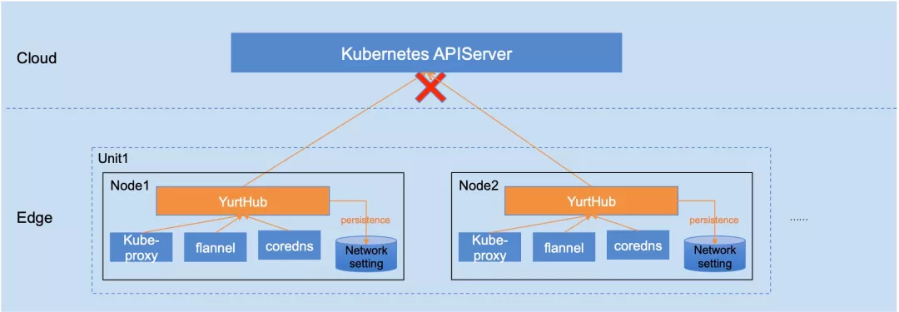

导读：OpenYurt 自开源以来，以非侵入式的架构设计融合云原生和边缘计算两大领域，引起了不少行业内同学的关注。阿里云推出开源项目 OpenYurt，一方面是把阿里云在云原生边缘计算领域的经验回馈给开源社区，另一方面也希望加速云计算向边缘延伸的进程，并和社区共同探讨未来云原生边缘计算架构的统一标准。
本文主要介绍了 OpenYurt 中组件 YurtHub 的扩展能力。

## OpenYurt介绍
阿里云边缘容器服务上线 1 年后，正式开源了云原生边缘计算解决方案 OpenYurt，跟其他开源的容器化边缘计算方案的区别在于：OpenYurt 秉持 Extending your native Kubernetes to edge 的理念，对 Kubernetes 系统零修改，并提供一键式转换原生 Kubernetes 为 openyurt，让原生 K8s 集群具备边缘集群能力。

同时随着 OpenYurt 的持续演进，也一定会继续保持如下发展理念：

- 非侵入式增强 K8s

- 保持和云原生社区主流技术同步演进

## YurtHub架构说明
在[前面的文章](./2020-06-18-YurtHub-design-detail.md)中，我们介绍了 OpenYurt 的边缘自治能力，重点解读了其中的组件 YurtHub。其架构图如下：
OpenYurt组件YurtHub构架图：

与Kubernetes设计理念契合，YurtHub的优势之一是，非常容易扩展出更多的能力。

## YurtHub的拓展能力

### 1）边缘网络自治
首先介绍一下何谓边缘网络自治：即在边缘和云端网络断连时，不管是业务容器重启，或是边缘节点重启等，边缘业务的跨节点通信可以持续工作或是自动恢复。

在OpenYurt中，实现边缘自治需要解决如下的问题（以flannel vxlan overlay网络为例）：
- 问题 1: 节点上的网络配置可以自治，kube-proxy 的 iptables / ipvs 规则，flannel 的 fdb / arp / route 配置，coredns 的域名解析等网络配置，在节点重启后可以自动恢复，否则边缘跨节点通信将无法持续；
- 问题 2: 业务容器 IP 保持不变，因为和云端网络断连状态下容器 IP 变化将无法通知到其他节点；
- 问题 3: vtep(vxlan tunnel endpoint) 的 mac 地址保持不变，原因和容器 IP 保持不变类似。

从问题 1 可以看出，必须解决 kube-proxy / flannel / coredns 等组件的自治，才能实现网络配置的自治。如果之前边缘自治是采用重构 kubelet 来实现的话，要实现边缘网络自治就会碰到很大的麻烦，如果强行把重构的 kubelet 自治能力移植到各个网络组件 (kube-proxy / flannel / coredns)，也对整个架构将是噩梦。

在 OpenYurt 中因为 YurtHub 的独立性，kube-proxy / flannel / coredns 等网络组件轻松使用 YurtHub 来实现网络配置的自治能力。因为 YurtHub 缓存了 service 等网络配置资源在 local storage，即使断网并且节点重启，网络组件仍然可以获得断网前的 object 状态以及相应的配置信息。如下图所示:

问题 2，3 和 Kubernetes core 无关，主要涉及到 cni 插件和 flanneld 的增强，后续文章中再详细介绍。
### 2）多云端地址支持
公有云上的 Kubernetes 高可用部署时，多实例 kube-apiserver 前面一般都挂了一个 SLB，但是在专有云场景下或者边缘计算场景下，节点需要通过多个云端地址来访问。比如:

- 专有云场景：因为没有 SLB 服务，用户需要在云端通过 VIP 方式来自行实现 kube-apiserver 的负载均衡，或者像 kubespray 那样在每个节点上部署一个 nginx 来实现多云端地址的访问；
- 边缘计算场景: 考虑到边缘和云端之间网络的稳定性和安全性要求，某些场景下用户也通过专线和公网两种方式和云端通信，比如优先采用专线，当专线故障时能自动切换到公网通信。

YurtHub正式考虑到了上述的需求，支持多云端地址访问。云端地址的负载均衡模式可以选择：
- rr(round-robin)：轮转模式，默认选择该模式；

- priority: 优先级模式，高优先级地址故障后才使用低优先级地址。

具体可以参照 YurtHub 的 LB 模块，如下图所示：

### 3）节点维度的云端流控
对于一个分布式系统来说，流控都是一个无法回避的问题。原生 Kubernetes 从集群视角在 kube-apiserver 中以及从访问者视角在 client-go 库中封装了流量管控，在边缘计算场景下，client-go 的流量管控既分散又对业务有一定侵入，显然不能很好的解决流控问题。

YurtHub 在边缘可以接管不论是系统组件还是业务容器对云端访问的流量，可以很好的解决节点维度的云端流控问题。目前 YurtHub 的流控配置是：单节点上对云端的并发请求数超过 250 个时，将拒绝新的请求。

### 4）节点证书轮转管理
Kubernetes 已经支持节点证书自动轮换，即当节点证书快过期前，kubelet 会自动向云端申请新的节点证书。但是在边缘计算场景下，很有可能因为边缘和云端网络的断连，造成 kubelet 将无法完成证书的轮换。证书过期后即使和云端网络连接恢复，节点证书也可能无法自动轮换，并造成 kubelet 的频繁重启。

YurtHub 在接管节点和云端通信流量时，同时也可以接管节点的证书管理。这样既解决了各类安装工具对节点证书的管理的不一致，也解决了证书过期后网络再恢复时的证书轮换问题。另外目前 YurtHub 还是 kubelet 共享节点证书，YurtHub 的独立节点证书管理功能将在近期开源。

### 5）其他
YurtHub 除了前面介绍的扩展能力，还有很多有价值的能力，在此也简单介绍：
- 节点多租隔离管理：在具备多租隔离能力的 Kubernetes 集群中，假定节点归属于某个租户，那么 YurtHub 将可以确保节点上所有云端请求都只返回节点所属租户的资源。比如说 list service 将只返回该租户的 service。而这种多租隔离能力不需要其他组件做任何修改。当然如果要实现集群内的多租隔离，需要配合相应的多组 CRD 等，详细可以参照[项目kubernetes-sigs/multi-tenancy](https://github.com/kubernetes-sigs/multi-tenancy)
- 集群间节点迁移：某些场景下，边缘节点需要从集群 A 迁移到集群 B，常规操作是先从集群 A 下线，然后再次接入集群 B，最后在集群 B 部署节点上的应用。因为 YurtHub 对节点流量以及节点证书的接管，可以直接对 YurtHub 注入集群B的信息，让节点无损迁移到集群 B；
- 通过域名访问云端kube-apiserver等等一些其他功能。

## 总结
通过上述的扩展能力可以看出：

- YurtHub 不仅仅是边缘节点上的带有数据缓存能力的反向代理，而且对 Kubernetes 节点应用生命周期管理加了一层新的封装，提供边缘计算所需要的核心管控能力；

 

- YurtHub 不仅仅适用于边缘计算场景，其实还可以作为节点侧的一个常备组件，适用于使用 Kubernetes 的任意场景。相信这也会驱动 YurtHub 向更高性能，更高稳定性发展。

[原文链接](https://mp.weixin.qq.com/s/gYxK3GLhDRNkHibYgTchOg)
