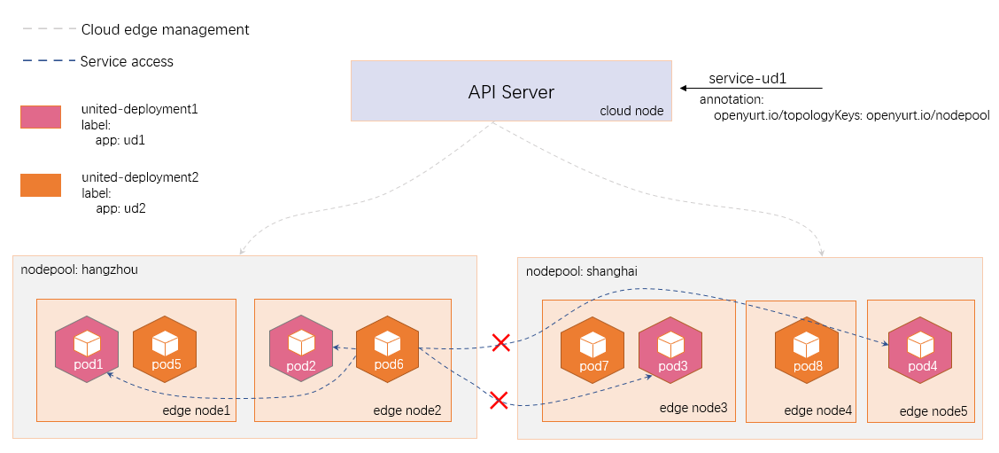

## 服务拓扑

服务拓扑（Service Topology）可以让一个服务根据集群的节点拓扑进行流量路由。 例如，一个服务可以指定流量被优先路由到和客户端 pod 相同的节点或者节点池上。

通过在原生的 Service 上添加 Annotation 实现流量的拓扑配置，相关参数如下所示：

|    **annotation Key**    |                    **annotation Value**                     |           说明           |
| :----------------------: | :---------------------------------------------------------: | :----------------------: |
| openyurt.io/topologyKeys |                   kubernetes.io/hostname                    |  流量被路由到相同的节点  |
| openyurt.io/topologyKeys | openyurt.io/nodepool <br/>或 <br />kubernetes.io/zone<br /> | 流量被路由到相同的节点池 |

下图为服务拓扑功能的一个例子。`service-ud1` 添加了注解 `openyurt.io/topologyKeys: openyurt.io/nodepool `, 当 `pod6` 访问 `service-ud1` 的时候，由于 `pod6` 位于 `edge node2`，也就是位于杭州节点池，因此其流量只会发往杭州节点池的 `pod1` 或 `pod2`上，而不会跨节点池，所以 `pod3` 和 `pod4` 收不到。从而实现了同一个节点池中的流量闭环。



## 前提条件

1. Kubernetes v1.18或以上版本，因为需要支持 EndpointSlice 资源。
2. 集群中部署了 Yurt-app-manager。

## 使用方法演示

确保 Kubernetes 版本大于1.18。

```bash
$ kubectl get node
NAME                 STATUS   ROLES    AGE     VERSION
kind-control-plane   Ready    master   6m21s   v1.18.19
kind-worker          Ready    <none>   5m42s   v1.18.19
kind-worker2         Ready    <none>   5m42s   v1.18.19
```

确保集群中部署了 Yurt-app-manager。

```BASH
$ kubectl get pod -n kube-system 
NAME                                         READY   STATUS    RESTARTS   AGE
coredns-66bff467f8-jxvnw                     1/1     Running   0          7m28s
coredns-66bff467f8-lk8v5                     1/1     Running   0          7m28s
etcd-kind-control-plane                      1/1     Running   0          7m39s
kindnet-5dpxt                                1/1     Running   0          7m28s
kindnet-ckz88                                1/1     Running   0          7m10s
kindnet-sqxs7                                1/1     Running   0          7m10s
kube-apiserver-kind-control-plane            1/1     Running   0          7m39s
kube-controller-manager-kind-control-plane   1/1     Running   0          5m38s
kube-proxy-ddgjt                             1/1     Running   0          7m28s
kube-proxy-j25kr                             1/1     Running   0          7m10s
kube-proxy-jt9cw                             1/1     Running   0          7m10s
kube-scheduler-kind-control-plane            1/1     Running   0          7m39s
yurt-app-manager-699ffdcb78-8m9sf            1/1     Running   0          37s
yurt-app-manager-699ffdcb78-fdqmq            1/1     Running   0          37s
yurt-controller-manager-6c95788bf-jrqts      1/1     Running   0          6m17s
yurt-hub-kind-control-plane                  1/1     Running   0          3m36s
yurt-hub-kind-worker                         1/1     Running   0          4m50s
yurt-hub-kind-worker2                        1/1     Running   0          4m50s
```

### 配置 kube-proxy

开启 `kube-proxy` 的 `EndpointSliceProxying` [特性门控](https://kubernetes.io/zh/docs/reference/command-line-tools-reference/feature-gates/)，并配置其连接 `Yurthub`。

```bash
$ kubectl edit cm -n kube-system kube-proxy
apiVersion: v1
data:
  config.conf: |-
    apiVersion: kubeproxy.config.k8s.io/v1alpha1
    bindAddress: 0.0.0.0
    featureGates: # 1. enable EndpointSliceProxying feature gate.
      EndpointSliceProxying: true
    clientConnection:
      acceptContentTypes: ""
      burst: 0
      contentType: ""
      #kubeconfig: /var/lib/kube-proxy/kubeconfig.conf # 2. comment this line.
      qps: 0
    clusterCIDR: 10.244.0.0/16
    configSyncPeriod: 0s
```

重启 `kube-proxy`。

```bash
$ kubectl delete pod --selector k8s-app=kube-proxy -n kube-system
pod "kube-proxy-cbsmj" deleted
pod "kube-proxy-cqwcs" deleted
pod "kube-proxy-m9dgk" deleted
```

### 创建节点池

- 创建用于测试的节点池。

```bash
$ cat << EOF | kubectl apply -f -
apiVersion: apps.openyurt.io/v1alpha1
kind: NodePool
metadata:
  name: beijing
spec:
  type: Cloud

---

apiVersion: apps.openyurt.io/v1alpha1
kind: NodePool
metadata:
  name: hangzhou
spec:
  type: Edge
  annotations:
    apps.openyurt.io/example: test-hangzhou
  labels:
    apps.openyurt.io/example: test-hangzhou

---

apiVersion: apps.openyurt.io/v1alpha1
kind: NodePool
metadata:
  name: shanghai
spec:
  type: Edge
  annotations:
    apps.openyurt.io/example: test-shanghai
  labels:
    apps.openyurt.io/example: test-shanghai
EOF
```

- 将主节点 `kind-control-plane` 加入到北京节点池，工作节点 `kind-worker` 加入到杭州节点池， `kind-worker2 ` 加入到上海节点池。

```bash
$ kubectl label node kind-control-plane apps.openyurt.io/desired-nodepool=beijing
node/kind-control-plane labeled

$ kubectl label node kind-worker apps.openyurt.io/desired-nodepool=hangzhou
node/kind-worker labeled

$ kubectl label node kind-worker2 apps.openyurt.io/desired-nodepool=shanghai
node/kind-worker2 labeled
```

- 查看节点池信息。

```bash
$ kubectl get np
NAME       TYPE    READYNODES   NOTREADYNODES   AGE
beijing    Cloud   1            0               63s
hangzhou   Edge    1            0               63s
shanghai   Edge    1            0               63s
```

### 创建 UnitedDeployment

- 创建 `united-deployment1` 用于测试。为了便于测试，我们使用 `serve_hostname` 镜像，当访问 9376 端口时，容器会返回它自己的主机名。

```bash
$ cat << EOF | kubectl apply -f -
apiVersion: apps.openyurt.io/v1alpha1
kind: UnitedDeployment
metadata:
  labels:
    controller-tools.k8s.io: "1.0"
  name: united-deployment1
spec:
  selector:
    matchLabels:
      app: united-deployment1
  workloadTemplate:
    deploymentTemplate:
      metadata:
        labels:
          app: united-deployment1
      spec:
        template:
          metadata:
            labels:
              app: united-deployment1
          spec:
            containers:
              - name: hostname
                image: mirrorgooglecontainers/serve_hostname
                ports:
                - containerPort: 9376
                  protocol: TCP
  topology:
    pools:
    - name: hangzhou
      nodeSelectorTerm:
        matchExpressions:
        - key: apps.openyurt.io/nodepool
          operator: In
          values:
          - hangzhou
      replicas: 2
    - name: shanghai
      nodeSelectorTerm:
        matchExpressions:
        - key: apps.openyurt.io/nodepool
          operator: In
          values:
          - shanghai
      replicas: 2
  revisionHistoryLimit: 5
EOF
```

- 创建 `united-deployment2` 用于测试。这里我们使用`nginx` 镜像，用来访问由 `united-deployment1` 创建的 `hostname` pod。

```bash
$ cat << EOF | kubectl apply -f -
apiVersion: apps.openyurt.io/v1alpha1
kind: UnitedDeployment
metadata:
  labels:
    controller-tools.k8s.io: "1.0"
  name: united-deployment2
spec:
  selector:
    matchLabels:
      app: united-deployment2
  workloadTemplate:
    deploymentTemplate:
      metadata:
        labels:
          app: united-deployment2
      spec:
        template:
          metadata:
            labels:
              app: united-deployment2
          spec:
            containers:
              - name: nginx
                image: nginx:1.19.3
                ports:
                - containerPort: 80
                  protocol: TCP
  topology:
    pools:
    - name: hangzhou
      nodeSelectorTerm:
        matchExpressions:
        - key: apps.openyurt.io/nodepool
          operator: In
          values:
          - hangzhou
      replicas: 2
    - name: shanghai
      nodeSelectorTerm:
        matchExpressions:
        - key: apps.openyurt.io/nodepool
          operator: In
          values:
          - shanghai
      replicas: 2
  revisionHistoryLimit: 5
EOF
```

- 查看由上述 unitedDeployment 创建出来的 pod 信息。

```bash
$ kubectl get pod -l "app in (united-deployment1,united-deployment2)" -o wide
NAME                                                 READY   STATUS    RESTARTS   AGE   IP           NODE           NOMINATED NODE   READINESS GATES
united-deployment1-hangzhou-fv6th-66ff6fd958-f2694   1/1     Running   0          18m   10.244.2.3   kind-worker    <none>           <none>
united-deployment1-hangzhou-fv6th-66ff6fd958-twf95   1/1     Running   0          18m   10.244.2.2   kind-worker    <none>           <none>
united-deployment1-shanghai-5p8zk-84bdd476b6-hr6xt   1/1     Running   0          18m   10.244.1.3   kind-worker2   <none>           <none>
united-deployment1-shanghai-5p8zk-84bdd476b6-wjck2   1/1     Running   0          18m   10.244.1.2   kind-worker2   <none>           <none>
united-deployment2-hangzhou-lpkzg-6d958b67b6-gf847   1/1     Running   0          15m   10.244.2.4   kind-worker    <none>           <none>
united-deployment2-hangzhou-lpkzg-6d958b67b6-lbnwl   1/1     Running   0          15m   10.244.2.5   kind-worker    <none>           <none>
united-deployment2-shanghai-tqgd4-57f7555494-9jvjb   1/1     Running   0          15m   10.244.1.5   kind-worker2   <none>           <none>
united-deployment2-shanghai-tqgd4-57f7555494-rn8n8   1/1     Running   0          15m   10.244.1.4   kind-worker2   <none>           <none>
```

### 创建含有 openyurt.io/topologyKeys 注解的服务

```bash
$ cat << EOF | kubectl apply -f -
apiVersion: v1
kind: Service
metadata:
  name: svc-ud1
  annotations:
    openyurt.io/topologyKeys: openyurt.io/nodepool
spec:
  selector:
    app: united-deployment1
  type: ClusterIP
  ports:
  - port: 80
    targetPort: 9376
EOF
```

### 创建不含 openyurt.io/topologyKeys 注解的服务

```bash
$ cat << EOF | kubectl apply -f -
apiVersion: v1
kind: Service
metadata:
  name: svc-ud1-without-topology
spec:
  selector:
    app: united-deployment1
  type: ClusterIP
  ports:
  - port: 80
    targetPort: 9376
EOF
```

### 测试服务拓扑功能

通过使用上海节点池中的 pod 访问上述创建的两个服务来测试服务拓扑功能。当访问含有 `openyurt.io/topologyKeys` 注解的服务时，流量会被路由到位于上海节点池中的节点上。

为了进行比较，我们首先测试没有`openyurt.io/topologyKeys`注解的服务。结果如下，可以看到它的流量既可以被杭州节点池接收，也能被上海节点池接收，并不受节点池的限制。

```bash
$ kubectl exec -it united-deployment2-shanghai-tqgd4-57f7555494-9jvjb bash
root@united-deployment2-shanghai-tqgd4-57f7555494-9jvjb:/# curl svc-ud1-without-topology:80
united-deployment1-hangzhou-fv6th-66ff6fd958-twf95
root@united-deployment2-shanghai-tqgd4-57f7555494-9jvjb:/# curl svc-ud1-without-topology:80
united-deployment1-shanghai-5p8zk-84bdd476b6-hr6xt
root@united-deployment2-shanghai-tqgd4-57f7555494-9jvjb:/# curl svc-ud1-without-topology:80
united-deployment1-hangzhou-fv6th-66ff6fd958-twf95
root@united-deployment2-shanghai-tqgd4-57f7555494-9jvjb:/# curl svc-ud1-without-topology:80
united-deployment1-hangzhou-fv6th-66ff6fd958-f2694
```

然后我们测试含有`openyurt.io/topologyKeys`注解的服务。结果如下，可以看到其流量只能路由到上海节点池中的节点。

```bash
$ kubectl exec -it united-deployment2-shanghai-tqgd4-57f7555494-9jvjb bash
root@united-deployment2-shanghai-tqgd4-57f7555494-9jvjb:/# curl svc-ud1:80
united-deployment1-shanghai-5p8zk-84bdd476b6-wjck2
root@united-deployment2-shanghai-tqgd4-57f7555494-9jvjb:/# curl svc-ud1:80
united-deployment1-shanghai-5p8zk-84bdd476b6-hr6xt
root@united-deployment2-shanghai-tqgd4-57f7555494-9jvjb:/# curl svc-ud1:80
united-deployment1-shanghai-5p8zk-84bdd476b6-wjck2
root@united-deployment2-shanghai-tqgd4-57f7555494-9jvjb:/# curl svc-ud1:80
united-deployment1-shanghai-5p8zk-84bdd476b6-hr6xt
```
