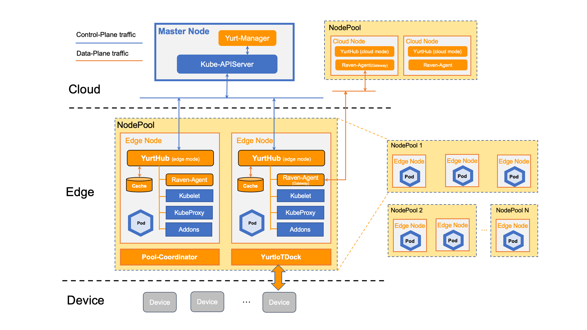

OpenYurt的整体架构如下:

其中蓝色框为原生Kubernetes组件，橙色框中组件为OpenYurt组件。

### 节点分类

- Cloud Node：通过内网与Kubernetes Master连接，主要用于部署运行中心控制组件。节点Label: openyurt.io/is-edge-worker: false
- Edge Node：通过公网与Kubernetes Master连接，一般和边缘生产环境距离较近，主要用于部署运行边缘业务容器。节点Label: openyurt.io/is-edge-worker: true

### 边缘访问云端Kube-apiserver的管控流量

Edge Node上的Kubelet, kube-proxy, Flannel以及其他云原生组件访问云端kube-apiserver的流量都会经过YurtHub组件，同时YurtHub组件会在本机磁盘上缓存云端返回的数据，当云边网络异常时YurtHub将使用本地缓存数据来恢复边缘业务。

### 云边数据面流量

由于边缘侧节点的网络区域与云上网络域不在一个网络平面内，并且边缘节点一般不暴漏在公网上，为了实现云与边、边与边的网络通信，Raven组件通过构建VPN的方式打通云边主机网络与容器网络，这些云边的数据面流量将从通过Raven Agent实现互访互通。

### OpenYurt组件介绍

- **YurtHub:**
  - 节点维度的SideCar，节点上组件和kube-apiserver之间的流量代理，有边缘(edge)和云端(cloud)两种运行模式。其中边缘YurtHub会缓存云端返回的数据。
  - 部署形态：以Static Pod形态运行在每个节点上。

- **Raven:**
  - 构建云边VPN访问通道，实现云边、边边网络互通，其中RavenControllerManager组件协调Gateway节点,以及RavenAgent组件负责构建VPN以及路由管理。
  - 部署形态：RavenControllerManager以Deployment形态部署在Cloud Node或Master Node上，Raven Agent以DaemonSet部署在所有节点上。
  - 
- **Yurt-Manager：**
  - Yurt-Manager 组件由多个控制器和 webhook 组成，用于确保 Kubernetes 在云边协同场景下像在正常数据中心一样工作。
  - 部署形态：建议将 Yurt-Manager 组件与 Kubernetes 控制平面组件（如 Kube-Controller-Manager）共同定位。Yurt-Manager 作为一个 Deployment 部署，通常包括两个实例，一个master和一个slave。

- **YurtDeviceController/YurtEdgeXManager:**
  - 用于边缘IOT解决方案的非侵入融合，通过云原生模式管控边缘设备。目前EdgeX Foundry已经无缝集成到OpenYurt架构中。
  - YurtEdgeXManager以Deployment形态部署在Cloud Node上，YurtDeviceController以YurtAppSet(之前名为UnitedDeployment)形态部署在Edge Node上，每个NodePool上部署一套YurtDeviceController。

- **Pool-Coordinator:**
  - 在节点池内提供KV数据存储(仅存储在内存中)和分布式锁等能力，供YurtHub选举产生Leader，从而实现心跳代理，云边流量复用，节点池内运维监控等能力。
  - 以YurtAppDaemon形态部署，会确保每个边缘节点池中有一个实例。

