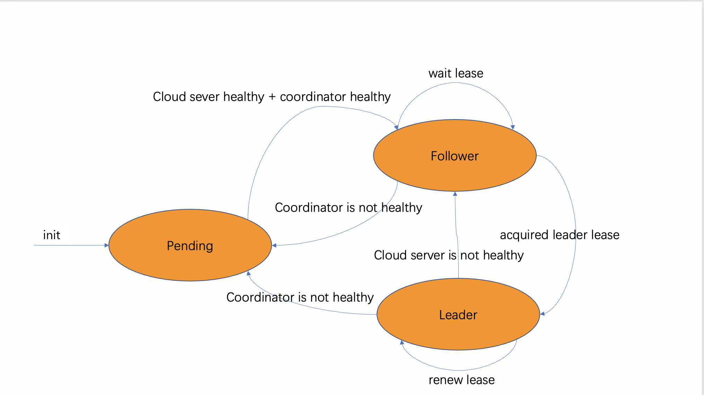

## 1. 功能简介

Yurt-Coordinator可以为边缘节点池提供以下功能：

1. 边缘节点心跳代理

在云边协同计算场景下，边缘节点与云端断连是一种常见的情况。当云端长时间没有收到边缘节点的心跳信息，其原因可能有两种:

- 一种是云边网络断开但边缘节点仍然正常运行
- 另一种是边缘节点故障无法恢复

对于前一种情况，边缘节点上的业务仍然正常运行，为了边缘业务的稳定，此时不应该进行Pod驱逐；对于后一种情况，为了保证业务的可用性，应该将Pod驱逐到其他健康的边缘节点上继续提供服务。在原先的方案中，云端很难区分这两种情况。Yurt-Coordinator提供了一种心跳代理的解决方案，节点池中云边网络正常的节点会负责将断连节点的心跳代理转发到云端并附带额外的信息，云端可以根据该信息区分这两种情况而采取对应的策略。

1. 节点池维度资源的缓存和复用

在云边协同计算场景下，云边带宽资源有限且费用较高，而一个节点池中的边缘节点从云端获取的资源存在大量重复（如Endpoints和EndpointSlices）。Yurt-Coordinator为节点池中的节点提供了资源缓存和复用能力，对于这些重复的资源，一个节点池仅需要从云端拉取一次，其他边缘节点都可以直接从缓存中获取，从而减少了云边带宽的消耗。

Yurt-Coordinator组件本质上是一个由Kube-APIServer和etcd组成的Pod，采用YurtAppDaemon的形式部署，每个节点池有一个实例。

## 2. 概念介绍

### 2.1 YurtHub Leader选举

当启用Yurt-Coordinator的能力后，节点池中的所有YurtHub会通过Yurt-Coordinator进行Leader选举，选举出的Leader YurtHub会负责对断连节点的心跳进行代理转发。集群中的YurtHub共有三种角色：

1. Leader YurtHub：成功竞选为Leader的YurtHub，其需要同时保持与云端APIServer和Yurt-Coordinator的连接。
2. Follower YurtHub：竞选Leader失败的YurtHub。这些YurtHub会持续尝试竞选Leader。
3. Pending YurtHub：未参与竞选的YurtHub。YurtHub在初始阶段会处于该状态，或当节点池中的Yurt-Coordinator不健康时，节点池中的YurtHub都会进入该状态。

## 3. 实现细节

### 3.1 边缘节点心跳代理

边缘节点池中，YurtHub会同时将心跳信息（NodeLease）发送给云端和Yurt-Coordinator，同时监视云边网络状况。当YurtHub发现云边断连时，会在发送到Yurt-Coordinator的心跳信息中加入一条注释`openyurt.io/delegate-heartbeat: true`，表明该节点无法独立地将心跳发送到云端。同时Leader Yurthub会list/watch Yurt-Coordinator中的NodeLease资源，当发现带有该注释的心跳后会将其连带注释代理转发到云端APIServer。此时云端可以根据心跳和注释区分边缘节点的运行情况：

1. 节点心跳正常且无注释：该节点运行正常，云边连接正常
2. 节点心跳正常但带注释：该节点运行正常，云边断连
3. 节点心跳缺失：该节点无法正常运行

### 3.2 节点池资源缓存和复用

节点池中竞选出的Leader YurtHub会负责向云端list/watch节点池维度的资源，主要是Endpoints和EndpointSlices。Leader YurtHub会将资源本身及其后续变化持续更新到Yurt-Coordinator的etcd中。节点池中的所有YurtHub都可以通过Kubernetes原生的RESTful API，从Yurt-Coordinator的APIServer中获取这些资源，避免从云端直接拉取，从而达到复用的目标。

Yurt-Coordinator有两种状态指标：

1. Healthy：

Yurt-Coordinator成功部署并正常运行，节点可以向其更新心跳信息。但此时Yurt-Coordinator中还未完全缓存节点池资源，因此无法处理针对这些资源的请求。

2. Ready：

Yurt-Coordinator已经成功缓存了节点池资源，此时可以处理节点池内部对这些资源的请求。

节点池资源缓存和云端同步后，Leader YurtHub会创建并持续更新Yurt-Coordinator中的一个名为`leader-informer-sync`的lease。其他YurtHub会监视该lease，当发现该lease存在且未过期时，就会将对节点池资源的请求发送到Yurt-Coordinator进行处理。

