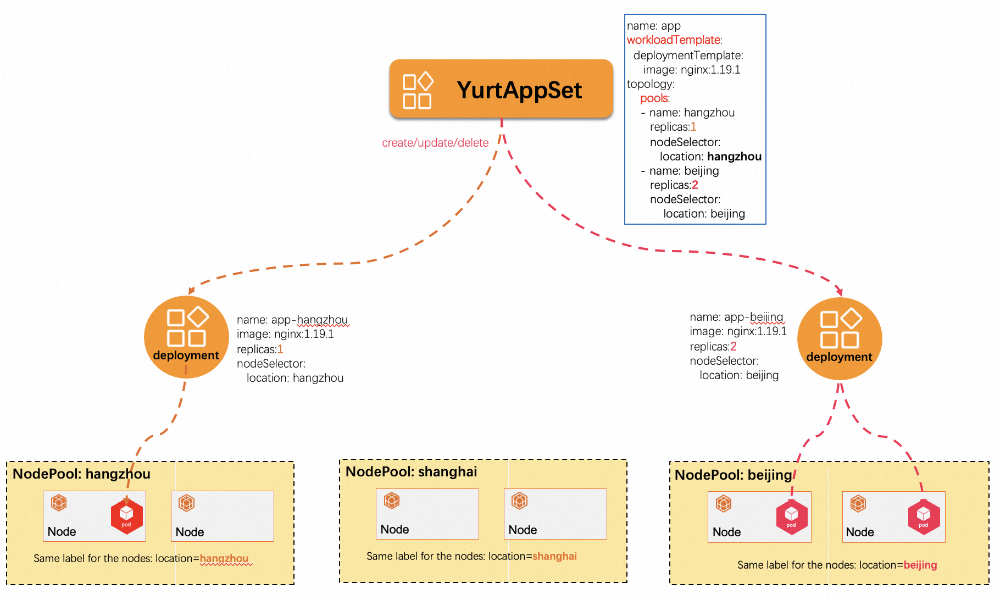
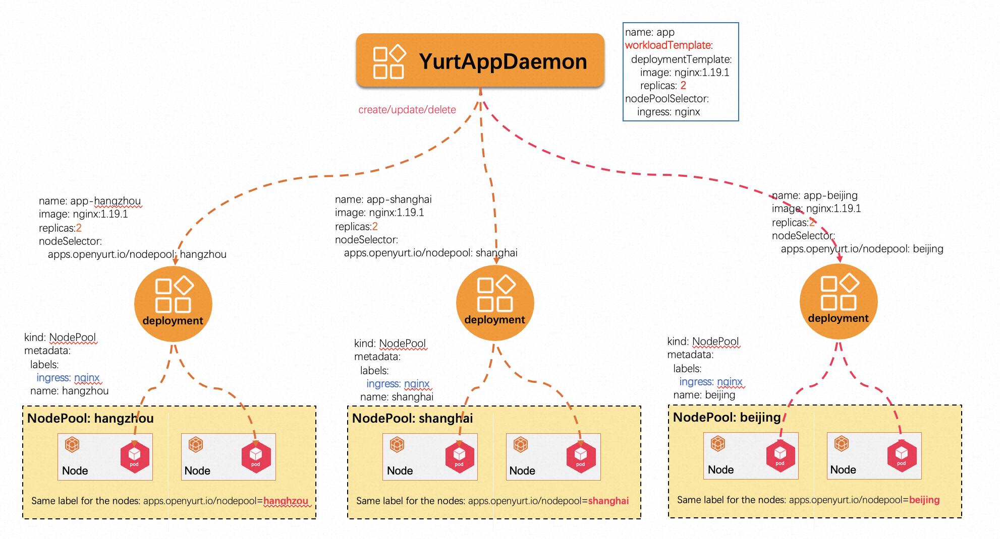

## 1.功能简介

Yurt-Manager 组件由多个控制器和 webhook 组成，用于确保 Kubernetes 在云边协同场景下像在正常数据中心一样工作，例如轻松管理多区域工作负载，为边缘工作负载（DaemonSet 和静态 Pod）提供 AdvancedRollingUpdate 和 OTA 升级等功能。
建议将 Yurt-Manager 组件与 Kubernetes 控制平面组件（如 Kube-Controller-Manager）共同定位。Yurt-Manager 作为一个 Deployment 部署，通常包括两个实例，一个master和一个slave。

每个控制器和 webhook 的描述如下。

### 1.1 csrapprover 控制器

由于 Kubernetes 中对 CSR（证书签名请求）的严格批准策略，OpenYurt 组件（例如 YurtHub）生成的 CSR 不会自动被 Kube-Controller-Manager 批准。
因此，Yurt-Manager 内的名为 csrapprover 的控制器负责批准 OpenYurt 组件的 CSR。

### 1.2 daemonpodupdater 控制器

在云边协同场景中，当存在 NotReady 节点时，DaemonSet 的传统 RollingUpdate 策略很容易受阻。为解决这个问题，daemonpodupdater 控制器提出了两种新的升级模型：AdvancedRollingUpdate 和 OTA（空中）升级。
AdvancedRollingUpdate 策略首先升级 Ready 节点上的 Daemon Pod，并跳过 NotReady 节点。当节点从 NotReady 转为 Ready 时，该节点上的Daemon Pod 会自动升级。
OTA 策略用于边缘节点所有者（而非集群所有者）决定升级工作负载的场景。这种方法尤其适用于电动汽车等情况，其中边缘节点所有者对升级过程具有更大的控制权。

### 1.3 delegatelease 控制器

delegatelease 控制器需要与 pool-coordinator 组件协同工作。当节点与云断开连接时，通过 pool-coordinator 组件报告的节点Leader将带有 `openyurt.io/delegate-heartbeat=true` annotation。
在检测到具有此annotation的Lease后，delegatelease 控制器将给节点打上 `openyurt.io/unschedulable` 污点，确保新创建的 Pod 无法调度到此类节点上。

### 1.4 podbinding 控制器

某些边缘服务要求在节点故障时 Pod 不被驱逐，而要求特定 Pod 绑定到特定节点。例如，图像处理应用程序需要绑定到连接到摄像头的计算机，而智能交通应用程序必须固定到位于特定路口的计算机。
用户可以向节点添加 `apps.openyurt.io/binding=true` annotation 来启用 Pod与节点绑定的功能，确保该节点上的所有 Pod 都与其绑定并且不受云边网络的影响。

podbinding 控制器在节点的 `apps.openyurt.io/binding` annotation 被修改时负责管理 Pod 容忍度。如果节点的 `apps.openyurt.io/binding` annotation 为 true，
Pod 中 `node.kubernetes.io/not-ready` 和 `node.kubernetes.io/unreachable` 容忍度的 TolerationSeconds 将设置为 0，这样即使云边网络离线，也不会驱逐节点上的 Pod。
相反，如果节点annotation没有设置为 true，则 Pod 中 `node.kubernetes.io/not-ready` 和 `node.kubernetes.io/unreachable` 容忍度的 TolerationSeconds 将设置为 300 秒。

### 1.5 ravenl3 控制器

ravenl3 控制器用于 Kubernetes 原生 L3 路由解决方案，提供跨区域的负载均衡和流量管理。在云边协同场景中，边缘服务和应用程序需要跨多个区域和数据中心进行通信。
ravenl3 控制器负责监控节点和服务，自动创建和更新 L3 路由表，确保边缘应用程序之间的通信高效可靠。

### 1.6 nodepool 控制器/webhook

NodePool 根据特定节点属性（例如地区、CPU 架构、云提供商等）将节点池的概念进行抽象，从而实现在池级别统一管理节点。

我们习惯于使用各种 Kubernetes 标签对节点进行分组和管理。然而，随着节点和标签数量的增加，节点的操作和维护（例如调度策略、污点等的批量配置）变得越来越复杂，如下图所示：

nodepool 控制器/webhook 可以从节点池的角度管理不同边缘地区的节点，如下图所示：

### 1.7 poolcoordinatorcert 控制器

poolcoordinatorcert 控制器负责为 pool-coordinator 组件准备证书和 kubeconfig 文件。所有证书和 kubeconfig 文件都以 Secret 资源的形式存储在系统中。

### 1.8 servicetopology 控制器

servicetopology 控制器用于协助 YurtHub 中的 [servicetopology filter](../user-manuals/resource-access-control/resource-access-control.md) 为集群提供服务拓扑路由功能。
当Service的拓扑Annotation被修改时，servicetopology 控制器会更新相应的Endpoints和 EndpointSlices，从而触发节点端YurtHub中的服务拓扑更新。

### 1.9 yurtstaticset controller/webhook

由于边缘设备数量庞大且分布式，手动部署和升级云边协作场景中的静态 Pod 可能导致操作挑战和错误风险增加。为解决这个问题，OpenYurt 引入了名为 YurtStaticSet 的新自定义资源定义（CRD），以改进静态 Pod 的管理。
yurtstaticset 控制器/webhook为静态 Pod 提供了 AdvancedRollingUpdate 和 Over-The-Air（OTA）升级功能。

### 1.10 yurtappset 控制器/webhook

在原生 Kubernetes 中，管理多个节点池中相同类型的应用程序需要为每个节点池创建一个 Deployment，这将导致较高的管理成本和潜在的错误风险。为了解决这个问题，YurtAppSet CRD 提供了一个定义应用程序模板（支持 Deployment 和 StatefulSet），并负责管理多个节点池中的工作负载。

YurtAppSet 需要用户通过配置其 Spec.Topology 字段来明确指定需要将工作负载部署到哪些节点池。这种方法简化了应用程序部署和管理过程，使得在多节点池环境中进行应用扩展、升级和维护变得更加容易。通过使用 YurtAppSet，用户可以集中管理多个节点池的应用部署，从而降低管理复杂性和潜在的错误风险。

### 1.11 yurtappdaemon 控制器/webhook

在原生 Kubernetes 中，DaemonSet 用于在每个节点上运行一个守护 Pod。当节点被添加或删除时，相应节点上的守护 Pod 会被自动创建或移除。然而，当工作负载需要根据节点池的创建和移除自动调整时，DaemonSet 无法满足我们的需求。

YurtAppDaemon 旨在确保在所有节点池或通过 Spec.NodePoolSelector 选定的节点池中自动部署模板(Spec.WorkloadTemplate)中指定的工作负载。当集群中新增或移除节点池时，YurtAppDaemon 控制器和 Webhook 会为相应的节点池创建或移除工作负载，从而确保符合要求的节点池中始终存在预期的 Pods。

