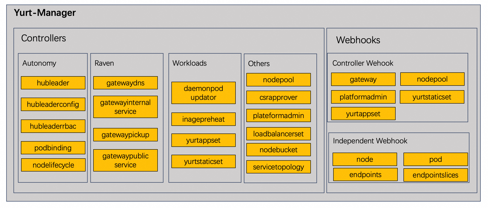
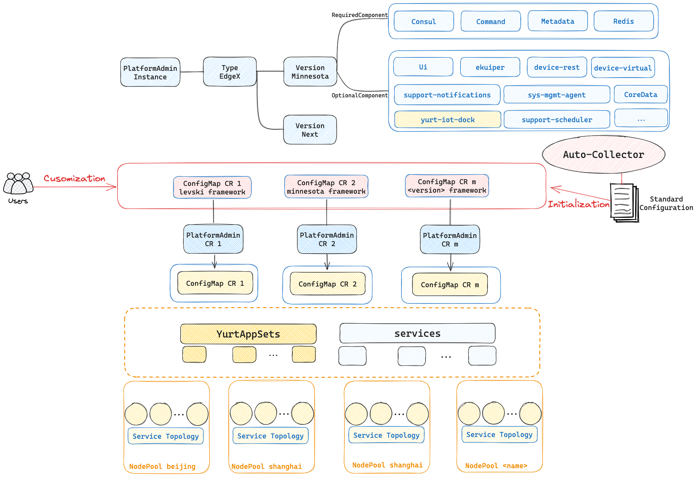

## 1. 功能简介

Yurt-Manager 组件由多个控制器和 Webhook 组成，用于确保 Kubernetes 在云边协同场景下像在常规数据中心一样顺畅运行。例如，它可以简化多地域工作负载的管理，并为边缘工作负载（DaemonSet 与静态 Pod）提供 AdvancedRollingUpdate 与 OTA（Over-The-Air）升级能力。

建议将 Yurt-Manager 与 Kubernetes 控制平面组件（如 Kube-Controller-Manager）部署在同一台机器上。Yurt-Manager 通常以 Deployment 形式部署，一般包含两个实例：一个主（leader）与一个备份。组件架构如下图所示：

1. 参数 `--controllers` 可精确控制哪些控制器被启用或停用。符号 `*` 表示启用所有默认启用的控制器；`foo` 表示仅启动名为 `foo` 的控制器；`-foo` 表示停用名为 `foo` 的控制器。请注意，多个控制器名称之间需用逗号分隔。
2. 控制器自带的 Webhook 会随对应控制器一并启用或停用。另一方面，独立 Webhook（Independent Webhooks）默认开启，但可通过启动参数 `--disable-independent-webhooks` 关闭。独立 Webhook `Node` 主要根据节点所属 NodePool 的属性为节点打上合适的标签。

## 2. 控制器与 Webhook 介绍

### 2.1 边缘自治相关控制器

#### 2.1.1 nodelifecycle 控制器

在启用 nodelifecycle 控制器之前，需要先关闭原有 Kube-Controller-Manager 中的同名控制器。新版 nodelifecycle 控制器在原生能力基础上有增强：对于带有 `apps.openyurt.io/binding=true` 注解的节点，即使节点状态变为 NotReady，控制器也不会将 `Pod.Status` 中的 `Ready` 条件置为 false。

#### 2.1.2 podbinding 控制器

部分边缘业务要求在节点故障时 Pod 不被驱逐，以实现 Pod 与节点的持久绑定。例如连接特定摄像头的图像处理应用，或需部署在特定路口的智能交通系统。
通过为节点添加 `apps.openyurt.io/binding=true` 注解可启用 Pod 绑定能力，使节点上的 Pod 与节点绑定，并不受云边网络状态变化影响。
podbinding 控制器在 `apps.openyurt.io/binding` 注解变更时负责维护 Pod 的容忍策略。当节点标记为 `apps.openyurt.io/binding=true` 时，Pod 上针对 `node.kubernetes.io/not-ready` 与 `node.kubernetes.io/unreachable` 的容忍时间（toleration seconds）会被设为 0，从而在云边网络中断时也不会将 Pod 从节点上驱逐。若节点未设为 true，这些容忍时间默认为 300 秒。

#### 2.1.3 HubLeader 控制器

依据配置的选举策略（基于标记或随机）在每个 NodePool 内选举 leader 节点，并在 NodePool 的 status 中维护 leader 端点列表，供 hub leader 能力使用。

#### 2.1.4 HubLeaderConfig 控制器

为每个 NodePool 创建并更新包含已选举 leader 端点及池级元数据的 ConfigMap。YurtHub 通过该 ConfigMap 获知本池中哪些节点为 leader。

#### 2.1.5 HubLeaderConfig 控制器（ClusterRole）

创建并维护 ClusterRole（`yurt-hub-multiplexer`），授予对池范围（pool-scoped）API 资源的 list、watch 权限。该控制器从所有 NodePool 收集 PoolScopeMetadata，并合并为 RBAC 规则。

### 2.2 Raven 相关控制器

#### 2.2.1 gatewaypickup 控制器

Raven 工程中定义了新的 CRD `Gateway`，作为跨网络域的网络信息载体。在 OpenYurt 集群中，每个网络域都需要创建一个 Gateway 自定义资源，用于记录可用的网关节点与网络配置。gatewaypickup 控制器对 Gateway 进行协调，从候选端点与节点信息中为每个网络域选举网关节点。

#### 2.2.2 gatewaydns 控制器

Raven L7 代理需要将所有针对 NodeName+Port 的 HTTP 请求转发到局域网内的网关节点。对 NodeName 的域名解析需要部署专用 DNS 组件 [raven-proxy-dns](../installation/raven-l7-proxy-prepare.md)，其使用 hosts 插件挂载名为 `kube-system/edge-tunnel-nodes` 的 ConfigMap，该 ConfigMap 将所有 NodeName 解析到 Service `kube-system/x-raven-proxy-internal-svc` 的 ClusterIP。gatewaydns 控制器负责动态维护该 ConfigMap 中的条目。

#### 2.2.3 gatewayinternalservice 控制器

Raven L7 代理需要将所有针对 NodeName+Port 的 HTTP 请求转发到局域网内的网关节点。gatewayinternalservice 控制器负责维护 Service `kube-system/x-raven-proxy-internal-svc` 的生命周期。注意：HTTP 请求端口因实际业务设计而异，可通过 Gateway `Spec.ProxyConfig` 配置代理的 HTTP/HTTPS 端口；gatewaypublicservice 控制器会据此更新 `x-raven-proxy-internal-svc` 中的端口以完成转发。所有 HTTPS/HTTP 请求最终会转发到 raven agent 的 10263/10264 端口。

#### 2.2.4 gatewaypublicservice 控制器

若选择以 LoadBalancer 类型暴露网关，gatewaypublicservice 控制器会维护对应的 LoadBalancer Service 与 Endpoints 的生命周期。

### 2.3 工作负载相关控制器

#### 2.3.1 daemonpodupdater 控制器

在云边协同场景中，当存在 NotReady 节点时，DaemonSet 的传统 RollingUpdate 策略容易卡住。为此，daemonpodupdater 控制器提供两种新模式：AdvancedRollingUpdate 与 OTA 升级。
AdvancedRollingUpdate 会先在 Ready 节点上升级 Daemon Pod，并跳过 NotReady 节点；当节点从 NotReady 恢复为 Ready 时，该节点上的 Daemon Pod 会自动升级。
OTA 适用于由边缘节点所有者（而非集群管理员）决定何时升级工作负载的场景，例如电动汽车等由边缘侧完全掌控升级时机的环境。

#### 2.3.2 ImagePreheat 控制器

在边缘节点间协调镜像预热。该控制器监听带有预热注解的 DaemonSet，并在工作负载部署前在目标节点上触发镜像拉取，以降低边缘场景下 Pod 启动延迟。

#### 2.3.3 yurtappset 控制器/Webhook

> OpenYurt 1.5 起，已将原先 yurtappset、yurtappdaemon 与 yurtappoverrider 的能力合并到同一 CRD：yurtappset v1beta1。

YurtAppSet 用于降低边缘场景下分散部署的复杂度，是在更高一层抽象上集中管理多类工作负载（例如可统一创建、更新、删除多个 Deployment）。

YurtAppSet 提供以下能力，以应对传统部署方式中更新效率低、运维复杂、配置冗余等问题。

- 统一模板定义（workloadTemplate）

可在 YurtAppSet 配置中使用 `workloadTemplate` 指定模板，在多个地域部署同一应用，避免重复配置与部署，并使创建、更新、删除等批量操作高效且一致。

- 自动化部署（nodepoolSelector）

可在配置中使用 `nodepoolSelector` 指定用于选择节点池的标签，使应用与节点池保持同步。创建或删除节点池时，系统会根据 `nodepoolSelector` 自动选择匹配的节点池部署工作负载，简化运维。

- 地域差异化部署（workloadTweaks）

可通过 `workloadTweaks` 对特定地域的工作负载做定制，无需在各地域分别管理或更新每个工作负载。

#### 2.3.4 yurtstaticset 控制器/Webhook

边缘设备数量大、分布广，在云边环境中手工部署与升级静态 Pod 风险与成本都很高。为此 OpenYurt 引入自定义资源 YurtStaticSet，以改进静态 Pod 的管理方式。yurtstaticset 控制器/Webhook 为静态 Pod 提供 AdvancedRollingUpdate 与 OTA 两种升级机制，便于在云边协同环境下完成版本管理与平滑升级。

### 2.4 其他

#### 2.4.1 nodepool 控制器/Webhook

用户通常用各类 Kubernetes 标签对节点分组管理；随着节点与标签增多，实施调度策略、批量打污点等运维工作会越来越重。NodePool 将具有共性（地理位置、CPU 架构、云厂商等）的一组节点抽象为节点池，在更高一层统一管理，使集群内节点分组结构清晰，显著简化节点运维。创建节点池时会根据池类型自动添加 `nodepool.openyurt.io/type` 标签，默认为 `edge`。

#### 2.4.2 csrapprover 控制器

Kubernetes 对 CSR（证书签名请求）的审批策略很严格，OpenYurt 组件（如 YurtHub）产生的 CSR 不会被 Kube-Controller-Manager 自动批准。Yurt-Manager 中的 csrapprover 控制器负责审批这些 CSR，保证组件正常工作。

#### 2.4.3 platformadmin 控制器/Webhook

PlatformAdmin 由早期 EdgeX CRD 演进而来，表示边缘设备管理平台的抽象。用户只需填写平台参数、目标 NodePool 名称、部署版本等，即可在节点池内部署完整的边缘设备管理平台。

集成在 yurt-manager 中的 platformadmin 控制器负责将 PlatformAdmin CR 解析为对应的 ConfigMap、Service 与 YurtAppSet，从而完成平台部署；并将 yurt-iot-dock 分发到相应节点池以实现边缘设备同步。用户还可通过 PlatformAdmin CR 的 `components` 字段选择要部署的 EdgeX 可选组件，详见[云原生设备管理相关章节](../user-manuals/iot/edgex-foundry.md)。

#### 2.4.4 servicetopologyendpoints/servicetopologyendpointslices 控制器

servicetopology 控制器配合 YurtHub 中的 [servicetopology filter](../user-manuals/resource-access-control/resource-access-control.md)，为集群提供服务拓扑路由能力。当 Service 的拓扑相关 Annotation 变更时，servicetopology 控制器会更新对应的 Endpoints 与 EndpointSlices，从而在节点侧 YurtHub 中触发服务拓扑更新。

#### 2.3.5 LoadBalancerSet 控制器

管理用于多地域 Service 暴露的 PoolService CRD。该控制器监听带有节点池选择注解的 Service，为每个 NodePool 创建 PoolService，并将其负载均衡状态聚合回父 Service。

#### 2.3.6 NodeBucket 控制器

为每个 NodePool 创建 NodeBucket 资源，将节点分组到多个桶（ConfigMap）中以便高效分发节点信息；每个桶内节点数量有限，避免单个 ConfigMap 过大。
