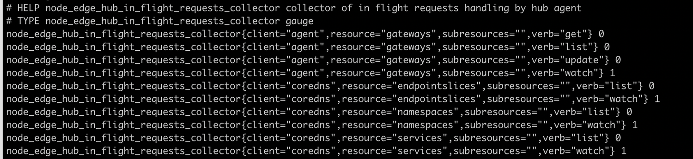
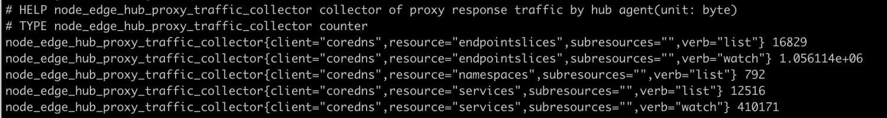

** 1. yurthub数据缓存目录 **

边缘节点上meta数据缓存路径为：/etc/kubernetes/cache/{componentName}/{resource}/{namespace}/{name}

** 2. yurthub组件使用证书存储目录**

- client证书: /var/lib/yurthub/pki/yurthub-current.pem
  用于访问云端kube-apiserver，权限同kubelet节点证书
- server证书: /var/lib/yurthub/pki/yurthub-server-current.pem
  用于yurthub启动https server，为边缘节点上各个组件提供TLS校验

目前证书有效期统一由kube-controller-manager组件决定(默认1年)，暂时不支持用户自配置。同时证书在过期前yurthub会执行证书轮转请求来更新证书。如果由于网络原因导致证书过期(轮转失败)，yurthub将使用bootstrap token重新申请证书。当然bootstrap token也过期的话，需要用户在边缘节点上执行: POST http://127.0.0.1:10267/v1/token -D "jointoken:xxx" 来更新bootstrap token即可，注意前面的xxx替换为有效的bootstrap token。

** 3. 如何查看有哪些请求经过yurthub转发给kube-apiserver**

边缘节点上执行：curl http://127.0.0.1:10267/metrics 查看下面内容即可：



node_yurthub_in_flight_requests_collector每一行代表一种类型请求，由client/resource/verb三元组决定。后面的数字0表示请求发生过，但是当前已经结束。数字1表示为当前有一个1个该请求。

注意点：
- list/watch一般配套出现的，如果只有list，没有watch，可能意味list请求没有结束，在yurthub中卡住了。比如集群中没有nodePool资源时，而yurthub的servicetopology filter会依赖nodePool资源。因此yurthub的servicetopology filter一直无法就绪，会阻塞coredns/kube-proxy list endpointslices请求。
- 如果yurthub重启了，可能出现只有watch，没有list的请求，这是正常现象。

** 4. 如何查看边缘节点各个组件与kube-apiserver交互的通信流量 **

边缘节点上执行：curl http://127.0.0.1:10267/metrics 查看下面内容即可：



通过node_yurthub_proxy_traffic_collector的信息，可以查看到各个请求从云端返回数据的总流量。单位为Byte
所以在边缘节点上的pod，一定要减少对大规模资源(如node，pods，endpointslice等资源的全量list请求)，否则会占用大量的公网带宽。

** 5. 使用InClusterConfig的Pod没有经过yurthub访问云端的kube-apiserver **

使用yurtadm join安装的节点，节点上的pod通过InClusterConfig访问kube-apiserver时，请求会自动经过yurthub进行转发，从而复用到yurthub的数据缓存，过滤，流量统计等一系列能力。如果发现yurthub的metrics并没有相关请求记录时，可以确认如下内容：
- 确定pod是否使用的是InClusterConfig，还是直接使用kube-apiserver地址访问。如果未使用InClusterConfig，先调整Pod使用InClusterConfig，然后重启Pod。
- 确认一下机器上缓存数据/etc/kubernetes/cache/kubelet/services/default/kubernetes中内容，Service的ClusterIP和Port是否为yurthub监听地址(默认为：169.254.2.1:10268)。如果内容不对，请重启kubelet(systemctl restart kubelet)后确认改缓存数据是否更新。
- 查看Pod(容器)中的环境变量: KUBERNETES_SERVICE_HOST和KUBERNETES_SERVICE_PORT，它们的值是否对应yurthub的监听地址(默认为：169.254.2.1:10268)。请重建pod(kubectl delete pod),确认环境变量是否更新。

** 6. 边缘节点上，service topology能力未生效**

- 查看/etc/kubernetes/cache/kube-proxy下对应endpointslice数据是否符合service topology。数据不符合预期时，重启kube-proxy后看再确认数据是否更新。
- 查看yurthub的metrics，看kube-proxy list endpointslice请求是否结束(数量为0表示结束)，如果该list请求没有结束的话，说明yurthub中的servicetopology filter还没有ready，一般是因为集群中nodePool资源没有创建导致的。

** 7. yurthub无法正常启动，主机上也未发现Exited的yurthub容器**

- journalctl -u kubelet查看kubelet组件日志，发现有错误信息：`dial tcp 127.0.0.1:10261: connect: connection refused`，表示Yurthub未正常启动
- docker ps -a查看主机上是否有Exited状态的yurthub容器
- 如果没有Exited状态的yurthub容器，请在kubelet日志查看yurthub无法启动原因
- 如果有Exited状态的yurthub容器，docker logs查看Exited yurthub容器日志，分析无法启动原因。

** 8. yurthub无法正常启动，日志显示在等待证书生成 **

yurthub需要的证书没有生成成功，可以通过下述方法来定位：
- 对集群执行：kubectl get csr，查看相关节点的证书csr是否有生成
- 如果csr未生成，一般是传入的bootstrap token是无效的token，清理节点后，使用有效bootstrap token再接入即可。
- 如果csr已经生成，但是状态一直是pending状态，表示yurt-manager一直无法approve该csr。查看yurt-manager是否已经安装并正常工作。

** 9. 边缘节点上yurthub缓存中的某个组件的metadata被删除了，如何恢复**

节点和云端网络连接正常状态下，重建一下对应pod即可恢复相关缓存meta数据。

** 10. 节点接入时，yurthub正常启动成功，但是所有请求一直报证书错误？**

这种情况可能是因为节点上有残留的yurthub证书，导致Yurthub启动时复用了该证书，从而产生证书报错的问题。可以在/var/lib/yurthub/pki目录下执行ls -la看下各个文件的生成时间，看生成时间是否合理。
同时在历史操作过的节点，重新接入集群时，建议先执行一次yurtadm reset，先清理一下节点上数据。

** 11. 用户自己的pod经过Yurthub访问云端的kube-apiserver，但是边缘节点上没有该Pod的缓存数据**

yurthub默认只会为kubelet，kube-proxy，coredns，flannel，tunnel-agent组件(通过http request heder中的User-Agent来确认)缓存数据，其他client(如client-A)的数据需要缓存，需要在kube-system/yurthub-cfg configmap中的cache_agents字段中增加：client-A，然后删除并重建该client-A Pod。
同时cache_agents也支持通用配置符：*, 这样所有的clients的response都会自动被缓存，但是用户需要重点关注缓存的磁盘占用状况。

** 12. 如何使用私有镜像仓库的yurthub镜像**

首先社区提供的镜像都有经过trivy的安全扫描，用户可以放心使用。由于yurthub采用static pod模式部署，因此无法通过imagePullSecrets方式来支持私有镜像仓库。
用户需要提前在机器上配置runtime来支持私有镜像仓库。如Containerd runtime私有仓库配置，可以参照：https://github.com/containerd/cri/blob/release/1.4/docs/registry.md#configure-registry-credentials

** 13. 组件已经通过yurthub访问云端kube-apiserver，但是边缘节点上的缓存目录中找不到相关的缓存数据**

为减轻本地磁盘缓存负载，yurthub默认只缓存组件[`kubelet`, `kube-proxy`, `flannel`, `coredns`, `yurt-tunnel-agent`, `yurthub`, `leader-yurthub`](https://github.com/openyurtio/openyurt/blob/master/pkg/yurthub/util/util.go#L84)从云端获取的元数据。
如果其他组件的元数据也需要缓存，开启方法如下：
- 确保该组件发起的HTTP请求Header中带有`User-Agent`信息，yurthub将根据`User-Agent header`中第一个`/`前面的内容来确定缓存目录中的{componentName}。当`User-Agent`为空时，组件的元数据将无法被缓存
- 手动配置`configmap kube-system/yurt-hub-cfg`的`cache_agents`字段添加{componentName}。
- 当`cache_agents: "*"`时，表示所有组件(必须带有User-Agent header)从云端获取的元数据都将被缓存。由于不少组件有大量的list/watch请求，全部缓存将对本地磁盘带来压力，因此需谨慎配置为`*`。
- 配置多个组件使用`,`分隔，例如两个组件的`User-Agent header`分别为`foo/v1.0.0`和`bar123/v1.0.0`，配置信息如下:
```
   cache_agents: "foo, bar123"
```