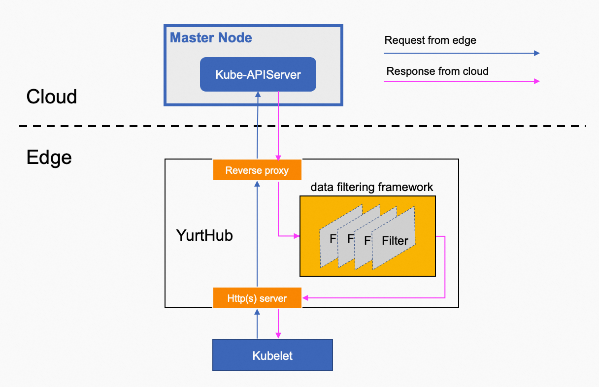

## 背景介绍
在云边协同环境中，边缘组件（例如 kube-proxy 或用户 pod）通常需要对从云端 kube-apiserver 获取的数据进行定制处理，以符合边缘计算场景的独特要求。比如，在 kube-proxy 拉取 endpointslices 数据时，它希望获取到的 endpoints 数据能够满足相对应 `Service` 所规定的服务拓扑需求（例如，只提供同一节点上的 endpoints），而非获取全部原始的 endpoints 数据。

## 架构设计

在 OpenYurt 架构中，YurtHub 搭载了一个内置的可编程数据过滤框架。通过该框架，指定请求的云端响应数据会经过一连串的过滤器进行处理，使得响应数据能够无缝且按需地转换，以便精准地满足云边协同场景下的特殊需求。该过程的细节如下图所示：



目前，过滤器链支持以下五个过滤器：

- masterservice 过滤器：将 default/kubernetes service的 ClusterIP 和 HTTPS 端口改为 YurtHub 组件正在监听的地址，使边缘节点上使用 InClusterConfig 的 pod 能够无感知地通过 YurtHub 组件访问云端 kube-apiserver。
- servicetopology 过滤器：根据service的服务拓扑设置重新组装 endpointslices，确保访问服务的流量只能转发给同一节点或 同一NodePool 中的 pod。
- discardcloudservice 过滤器：该过滤器将排除带有 svc.openyurt.io/discard=trueannotation 的 LB service。
- inclusterconfig 过滤器：在 kube-system/kube-proxy configmap 中注释 kubeconfig 设置，使边缘节点上的 kube-proxy 组件能够使用 InClusterConfig 访问云端 kube-apiserver。
- nodeportisolation 过滤器：根据 Service 的 nodeport.openyurt.io/listen 注解来过滤 NodePort Service，使 NodePort Service 只在指定的 NodePool 中监听，而不是整个集群的所有节点上。

每个过滤器能处理哪些请求的响应数据，由三元组: component/resource/verbs 来匹配请求。

- component：表示 HTTP 请求头中的 User-Agent，例如 kube-proxy。
- resource：表示请求的资源，例如 endpointslices。
- verbs：表示 HTTP 请求的Verb，例如 get、list、watch。

## 如何使用

如上所述，每个过滤器仅处理由`component/resource/verbs`确定的特定请求的响应数据。

下表显示了每个过滤器支持的默认`component/resource/verbs`：

| Filter        | Default components                            | resources | verbs |
|---------------|-----------------------------------------------|-----------|-------|
| masterservice | kubelet                                       | services | list, watch |
| servicetopology | kube-proxy, coredns, nginx-ingress-controller | endpoints, endpointslices | list, watch |
| discardcloudservice | kube-proxy                                    | services | list, watch |
| inclusterconfig | kubelet                                       | configmaps | get, list, watch |
| nodeportisolation | kube-proxy                                    | services | list, watch |

另外，如果还需要处理其他客户端的响应，用户可以按照以下方式配置 `kube-system/yurt-hub-cfg` configmap：

注意：请确保在运行客户端 pod 之前配置好 configmap。

```
// configured response for clients named foo and bar can be handled by servicetopology
apiVersion: v1
kind: ConfigMap
metadata:
  name: yurt-hub-cfg
data:
  servicetopology: "foo, bar"
```

## 如何新增一个过滤器

可以参考 [如何在YurtHub中新增一个过滤器](../../developer-manuals/how-to-write-a-filter.md)