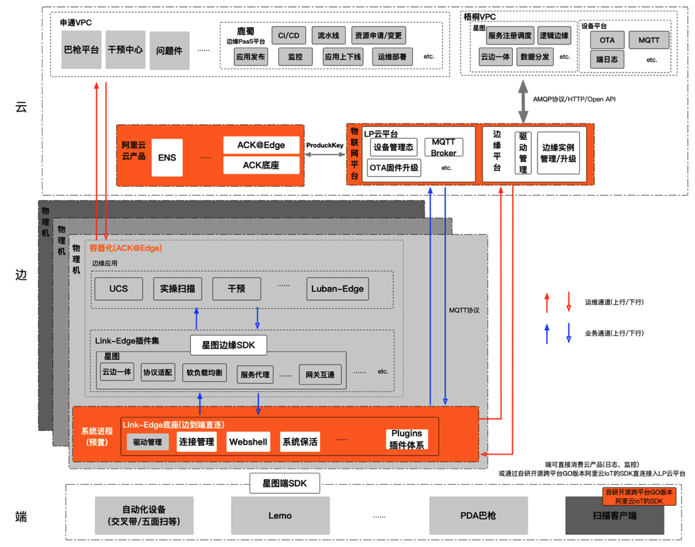

## 背景
&emsp;&emsp;快递行业是典型的实体行业，提供点对点的包裹运输服务，衍生出揽收、中转、派送环节。随着社会整体经济发展利好，快递行业的体量在不断增长，申通快递日常流转3000~5000万包裹，平均日常轨迹约5亿左右，大促期间近10亿，自动化分拣日均下发数据十几亿条(约几百G)，近10万扫描巴枪(Lemo/PDA)，几万+Windows扫描客户端，交叉带上百套，增速预估年20%以上，背后面临的是一个庞大的数字体系，未来的快递一定是数字体系的快递，涉及到大量的自动化、IoT及人机辅助等系统交互。而这些系统交互的背后本质上都是在为包裹实操服务，围绕着人，货，机，车四个维度展开。在整体单量持续不断增长的前提下，不同的实操维度面临的挑战不同，对时延，稳定性，高可用，以及扩展性要求也不同。    
&emsp;&emsp;在传统云到端的架构下，中转环节作为最核心的路由和实操职能，且有极强的边端特性。承载中转环节(包裹经过转运中心/网点流转环节)的核心节点是网点和转运中心，涉及不同的业务域对分布在全国100+转运中心，3000+网点各场地内的十几种异构设备/系统的边缘业务下沉。不同场地的基础设施条件参差不齐，业务系统对资源需求不同，同时健壮性也无法保证，在单量持续增长的基础上，已经出现严重的边端业务发展瓶颈，出现资源短缺/竞争，时延高，稳定性差，可用性缺失，CI/CD困难等一系列瓶颈问题。且在持续不断的引入各种IoT异构设备/系统(Lemo、PDA、交叉带，DWS等设备及配套系统，有windows,Android和自研OS几类)的压力下，传统云到端的架构现状根本无法满足实际边端场景需求。且这些问题都是各个域的共性问题。亟需一套面向海量设备接入的高可用、高稳定性、可扩展的云边端一体的混合云架构。  
&emsp;&emsp;在2019年申通快递全面数字化1.0时期，基于Kubernetes建设了申通云云原生PaaS平台，满足了云上应用的诉求，充分享受到了云原生带来的便利。但是在数字化2.0时期，在IoT及边端技术快速发展和应用的背景下，单纯云上Paas平台难以满足边端的高响应，低时延，大连接的强诉求，之后我们采用 OpenYurt 平台作为申通快递IoT云边端架构的核心一环，承载了边缘侧资源托管，应用管理，云管边端的云边协同的职责，利用 OpenYurt  的能力，将云原生的能力扩展到了在边缘侧，继承了云平台的众多优势和便利，打造面向边缘计算场景的云边端架构。

## 云边协同能力
&emsp;&emsp;申通快递IoT云边端架构的云边协同能力具体体现在哪里呢，又有哪些优势？整体架构中云边协同有两层含义，一是负责边缘资源运维管控的边缘PaaS平台的云边协同能力，二是边缘网关服务的云边协同能力。重点介绍边缘PaaS平台的云边协同。它主要职责是利用 OpenYurt 提供容器化的隔离环境，将Master集群统一部署在公有云，将Node结点下沉到边缘端，也就是分布在全国各地的转运中心，重写Node结点的心跳检测机制和自治逻辑，通过反向代理设计让边缘容器在相对稳定的局域网络环境里可以自运行。核心集成了Devops、单元化发布、生产日常环境隔离、资源监控等模块。使申通快递的边缘开发，同云上研发体系完全一致，发布边缘应用时一键生成边缘容器，并由PaaS平台提供统一部署，日志监控等云管控能力。

&emsp;&emsp;在此之上，申通快递自研的边缘Paas平台来做边缘DevOps，底层使用gitlab-runner来做持续集成引擎。CI 层面拉取gitlab代码、Docker做maven打包、构建镜像并上传；CD 层面引入开发人员提前写好helm charts，使用helm同时操作多单元的、多可用区的多个 OpenYurt 集群来做容器化发布，使用OpenYurt本身的资源调度能力，完成最合理的资源调度与规划。在边缘资源管控层面，申通快递根据中心与网点的分布情况与实时的rt统计，划分了四大可用区进行部署，分别为华东，西南，华北，华南可用区，每个可用区一套OpenYurt 集群，每套集群用来管理本区域分散的物理资源。4套集群统一通过上层的边缘PAAS平台统一控制。对申通快递来说，边缘容器化将边缘物理资源充分利用，在此基础上基于基础镜像，产出了边缘sls日志服务、边缘sunfire业务监控等。开发人员可随意配置告警，搭配秒级业务监控，实现快速的故障发现与处理。

&emsp;&emsp;申通快递业务上，将快递实操的核心扫描校验业务，通过云边协同能力，将扫描校验整个核心流程在边缘完成，支撑快递业务拦截件、预售等业务，从容应对双十一等海量数据大促，使快递实操扫描用户体验上一层新台阶。

## 业务价值
&emsp;&emsp;申通快递IoT云边端架构是快递行业在边缘侧演进云原生架构的首例落地方案。提供同云上研发体系完全一致的研发模型，以 OpenYurt 为技术底座，实现云上和云下资源的统一管理，打下坚实的混合云基础。

- 区域容灾

申通快递根据中心与网点的分布情况与实时的rt统计，同时为了减少爆炸半径，将集群拆分为4大区域进行部署，即4套OpenYurt集群。4套集群统一通过边缘paas平台统一控制，实现runtime最小化。四套集群分别为：华东(上海)，西南（成都），华北（北京）华南（深圳）。四套集群由更上层的边缘PAAS平台统一管理。

- 多环境隔离

&emsp;&emsp;根据不同场地的设备和应用情况，配置日常，预发，线上环境对于申通快递不同的场地，因为业务对设备的要求场景不同(比如北京转运中心有交叉带，广东转运中心没有)，逻辑层面则为不同的单元，可选不同的配置，同时开发环境分为3套日常、预发、线上环境。不同环境在物理层面和逻辑层面实现双层的环境隔离、网络隔离。更甚可支持不同单元，业务配置、数据库配置、pod规格、心跳等截然不同，实现应用单元自定义。

- IoT云边端架构云边协同带来的很多明显的价值:
    -  解决原始进程隔离模式带来的稳定性差问题，插件化架构设计，进程隔离和容器化隔离模式随意切换。提供一键初始装机、开箱即用的容器化隔离应用环境，边端应用相互间影响范围大幅缩小，边缘高可用，稳定性从99.9%提高到99.95%；
    - 减少边端服务器裸机资源浪费，通过控制弹性策略和超卖比可合理利用资源，降低长期整体投入成本。提供云管边端，边缘自治的混合云架构基础。
    - 云边协同的一体模式，统一的监控体系，研发模型，同云应用开发效率和体验一致，云原生边缘Devops平台，统一快递行业面向边缘IoT场景的研发，运维场景，整体边端体系RT降低到平均50ms以下，且消除抖动带来的额外影响。
    - 网络状况、双十一海量拦截数据量、实操扫描速度三者在只有云端情况下对快递公司来说必须做取舍。边缘端的引入，将三者同时解决。对形成内聚的云边一体的软件架构，扩展工程师设计思维起到推动作用。

&emsp;&emsp;边缘端容器化也是快递行业目前在边缘端演进云原生技术的首例，在2021年6月30号整个IoT云边端架构全网铺开后，在快递行业的边端场景是领先水平。
