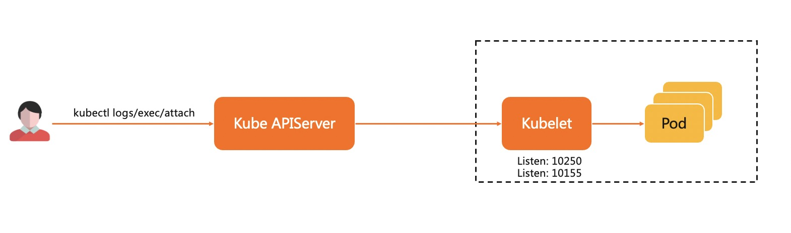
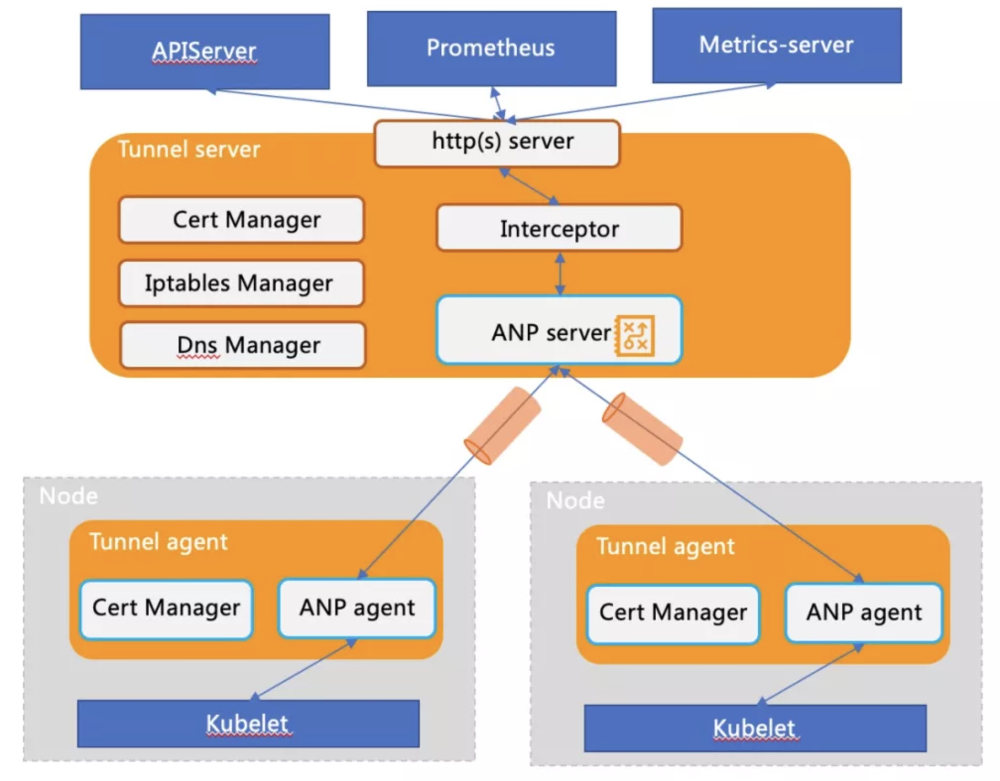

## 1. 背景简介

在应用的部署和运维过程中，用户常常需要获取应用的日志，或直接登录到应用的运行环境中进行调试。在 Kubernetes 环境中，我们通常使用 kubectl log，kubectl exec 等指令来实现这些需求。如下图所示，在 kubectl 请求链路上， kubelet 将扮演服务器端，负责处理由 kube-apiserver(KAS) 转发来的请求，这就要求 KAS 和 kubelet 之间需要存在一条网络通路，允许 KAS 主动访问 kubelet。



云与边一般位于不同网络平面，同时边缘节点普遍位于防火墙内部，采用云(中心)边协同架构，将导致原生 K8s 系统的运维监控能力面临如下挑战:

* K8s 原生运维能力缺失(如 kubectl logs/exec 等无法执行)
* 社区主流监控运维组件无法工作(如 Prometheus/metrics-server )

为了支持通过云端节点对边缘端应用进行运维操作，我们必须在云、边之间建立反向运维通道。

## 2. 反向通道

在 OpenYurt 中，我们引入了专门的组件 YurtTunnel 负责解决云边通信问题。反向通道是解决跨网络通信的一种常见方式，而 YurtTunnel 的本质也是一个反向通道。 它是一个典型的C/S结构的组件，由部署于云端的 Yurt—Tunnel-Server 和部署于边缘节点上的 Yurt-Tunnel—Agent组成。YurtTunnel的部署结构如下图所示， 反向通道整体的工作流程包括以下几个步骤：

* 在管控组件所在网络平面内，部署 Yurt-Tunnel-Server。
* Yurt-Tunnel-Server 对外开放一个公网可以访问的 IP。
* 在每个边缘节点部署一个 Yurt-Tunnel-Agent，并且通过 Server 的公网 IP 与 Server 建立长连接。
* 管控组件对边缘节点的访问请求都将转发到 Yurt-Tunnel-Server。
* Yurt-Tunnel-Server 再将请求通过对应的长连接发往目标节点。


## 3. 实现方式

在 K8s 云边一体化架构中构建一个安全、非侵入、可扩展的反向通道解决方案，方案中至少需要包括以下三部分能力。

* 隧道构建
* 隧道两端证书的自管理
* 云端组件请求被无缝导流到隧道

YurtTunnel 的架构模块如下图：



1) 隧道构建

* 当边缘的 Yurt-Tunnel-Agent 启动时，会根据访问地址与 Yurt-Tunnel-Server 建立连接并注册，并周期性检测连接的健康状态以及重建连接等。

Yurt-Tunnel-Agent注册的身份信息如下：
```Plain
"agentID": {NodeName}
"agentIdentifiers": ipv4={nodeIP}&host={NodeName}"
```

* 当 Yurt-Tunnel-Server 收到云端组件的请求时，需要把请求转发给对应的 Yurt-Tunnel-Agent 。因为除了转发初始请求之外，该请求 session 后续还有数据返回或者数据的持续转发(如 kubectl exec )。因此需要双向转发数据。同时需要支持并发转发云端组件的请求，意味需要为每个请求生命周期建立一个独立的标识。所以设计上一般会有两种方案。

方案 1: 初始云边连接仅通知转发请求，Yurt-Tunnel-Agent 会和云端建立新连接来处理这个请求。通过新连接可以很好的解决请求独立标识的问题，同时并发也可以很好的解决。但是为每个请求都需要建立一个连接，将消耗大量的资源。

方案 2: 仅利用初始云边连接来转发请求，大量请求为了复用同一条连接，所以需要为每个请求进行封装，并增加独立标识，从而解决并发转发的诉求。同时由于需要复用一条连接，所以需要解耦连接管理和请求生命周期管理，即需要对请求转发的状态迁移进行独立管理。该方案涉及到封包解包，请求处理状态机等，方案会复杂一些。

* OpenYurt 选择的 ANP 组件，采用的是上述方案2，这个和我们的设计初衷也是一致的。
* 请求转发链路构建封装在 Packet_DialRequest 和 Packet_DialResponse 中，其中 Packet_DialResponse.ConnectID 用于标识 request ，相当于 tunnel 中的 requestID。请求以及关联数据封装在 Packet_Data 中。Packet_CloseRequest 和 Packet_CloseResponse 用于转发链路资源回收。具体可以参照下列时序图：


* RequestInterceptor 模块的作用
  从上述分析可以看出，Yurt-Tunnel-Server 转发请求之前，需要请求端先发起一个 Http Connect 请求来构建转发链路。但是为 Prometheus、metrics-server 等开源组件增加相应处理会比较困难，因此在 Yurt-Tunnel-Server 中增加请求劫持模块 Interceptor ，用来发起 Http Connect 请求。

2) 证书管理

为了保证云边通道的长期安全通信，同时也为了支持 https 请求转发，YurtTunnel 需要自行生成证书并且保持证书的自动轮替。具体细节如下:

```Plain
# 1. Yurt-Tunnel-Server证书:
# https://github.com/openyurtio/openyurt/blob/master/pkg/yurttunnel/pki/certmanager/certmanager.go#L45-90
- 证书存储位置: /var/lib/yurt-tunnel-server/pki
- CommonName: "kube-apiserver-kubelet-client"  // 用于kubelet server的webhook校验
- Organization: {"system:masters", "openyurt:yurttunnel"} // 用于kubelet server的webhook校验和Yurt-Tunnel-Server证书的auto approve
- Subject Alternate Name values: {x-tunnel-server-svc, x-tunnel-server-internal-svc的ips和dns names}
- KeyUsage: "any"

# 2. Yurt-Tunnel-Agent证书：
# https://github.com/openyurtio/openyurt/blob/master/pkg/yurttunnel/pki/certmanager/certmanager.go#L94-112
- 证书存储位置: /var/lib/yurt-tunnel-agent/pki
- CommonName: "yurttunnel-agent"
- Organization: {"openyurt:yurttunnel"} // 用于Yurt-Tunnel-Agent证书的auto approve
- Subject Alternate Name values: {NodeName, nodeIP}
- KeyUsage: "any"

# 3. yurt-tunnel证书申请(CSR)均由Yurt-Tunnel-Server来approve
# https://github.com/openyurtio/openyurt/blob/master/pkg/yurttunnel/pki/certmanager/csrapprover.go#L115
- 监听csr资源
- 过滤非yurt-tunnel的csr(Organization中没有"openyurt:yurttunnel")
- approve还未Approved的csr

# 4. 证书自动轮替处理
# https://github.com/kubernetes/kubernetes/blob/master/staging/src/k8s.io/client-go/util/certificate/certificate_manager.go#L224
```

3) 无缝导流云端组件请求到隧道

因为需要无缝把云端组件的请求转发到 Yurt-Tunnel-Server ，也意味不需要对云端组件进行任何修改。因此需要对云端组件的请求进行分析，目前组件的运维请求主要有以下两种类型:

* 类型1: 直接使用 IP 地址访问，如: `http://{nodeIP}:{port}/{path}`
* 类型2: 使用域名访问, 如: `http://{NodeName}:{port}/{path}`

针对不同类型请求的导流，需要采用不同方案。

方案1: 使用 iptables dnat rules 来保证类型1的请求无缝转发到 Yurt-Tunnel-Server

```Shell
# 相关iptables rules维护代码: https://github.com/openyurtio/openyurt/blob/master/pkg/yurttunnel/iptables/iptables.go
# Yurt-Tunnel-Server维护的iptables dnat rules如下:
[root@xxx /]# iptables -nv -t nat -L OUTPUT
TUNNEL-PORT  tcp  --  *      *       0.0.0.0/0            0.0.0.0/0            /* edge tunnel server port */

[root@xxx /]# iptables -nv -t nat -L TUNNEL-PORT
TUNNEL-PORT-10255  tcp  --  *      *       0.0.0.0/0            0.0.0.0/0            tcp dpt:10255 /* jump to port 10255 */
TUNNEL-PORT-10250  tcp  --  *      *       0.0.0.0/0            0.0.0.0/0            tcp dpt:10250 /* jump to port 10250 */

[root@xxx /]# iptables -nv -t nat -L TUNNEL-PORT-10255
RETURN     tcp  --  *      *       0.0.0.0/0            127.0.0.1            /* return request to access node directly */ tcp dpt:10255
RETURN     tcp  --  *      *       0.0.0.0/0            172.16.6.156         /* return request to access node directly */ tcp dpt:10255
DNAT       tcp  --  *      *       0.0.0.0/0            0.0.0.0/0            /* dnat to tunnel for access node */ tcp dpt:10255 to:172.16.6.156:10264
```

方案2: 使用 dns 域名解析 NodeName 为 Yurt-Tunnel-Server 的访问地址，从而使类型 2 请求无缝转发到 yurt-tunnel。其工作原理如图所示：


* Yurt-Tunnel-Server会维护两个Service地址：
    * x-tunnel-server-svc: 主要expose 10262/10263端口，用于从公网访问Yurt-Tunnel-Server。如Yurt-Tunnel-Agent
    * x-tunnel-server-internal-svc: 主要用于云端组件从内部网络访问，如prometheus,metrics-server等
* Yurt-Tunnel-Server 内置一个 DNS Controller，动态配置 Core DNS Host 记录，维持 NodeName 与 IP 的映射关系(Cloud Node 根据 IP 直接可达，即直接映射为 Node IP;Edge Node 需要通过 Tunnel 隧道代理通信，即映射到 Yurt-Tunnel-Server Internal Service 的 cluster ip)
* 当云端组件通过 NodeName 访问 Edge 节点时，默认会通过 CoreDNS 做域名解析， 对 Edge Node 的请求会被定向到 Yurt-Tunnel-Server 的 internal service 的 ClusterIP，进而借助 kube-proxy 的转发能力，将请求负载均衡到健康的 Yurt-Tunnel-Server Pod 内
* Yurt-Tunnel-Server 会检查请求 Host 格式，当 Host 格式 NodeName 时，则通过节点名找到正确的 Agent 后端，转发数据


4) 端口扩展

如果用户需要访问边缘的其他端口(10250 和 10255 之外)，那么需要在 iptables 中增加相应的 dnat rules 或者 x-tunnel-server-internal-svc 中增加相应的端口映射，如下所示:

```Shell

# 例如需要访问边缘的9051端口
# 新增iptables dnat rule:
[root@xxx /]# iptables -nv -t nat -L TUNNEL-PORT
TUNNEL-PORT-9051  tcp  --  *      *       0.0.0.0/0            0.0.0.0/0            tcp dpt:9051 /* jump to port 9051 */

[root@xxx /]# iptables -nv -t nat -L TUNNEL-PORT-9051
RETURN     tcp  --  *      *       0.0.0.0/0            127.0.0.1            /* return request to access node directly */ tcp dpt:9051
RETURN     tcp  --  *      *       0.0.0.0/0            172.16.6.156         /* return request to access node directly */ tcp dpt:9051
DNAT       tcp  --  *      *       0.0.0.0/0            0.0.0.0/0            /* dnat to tunnel for access node */ tcp dpt:9051 to:172.16.6.156:10264

# x-tunnel-server-internal-svc中新增端口映射
spec:
  ports:
  - name: https
    port: 10250
    protocol: TCP
    targetPort: 10263
  - name: http
    port: 10255
    protocol: TCP
    targetPort: 10264
  - name: dnat-9051 # 新增映射
    port: 9051
    protocol: TCP
    targetPort: 10264
```
当然上述的 iptables dnat rules 和 service 端口映射，都是由 Yurt-Tunnel-Server 自动更新。用户只需要在 `kube-system` 下的 `yurt-tunnel-server-cfg` configmap 中增加端口配置即可。具体如下:

```Yaml
# 注意：由于证书不可控因素，目前新增端口只支持从Yurt-Tunnel-Server的10264转发
apiVersion: v1
data:
  dnat-ports-pair: 9051=10264 # 新增端口=10264(非10264转发不支持)
kind: ConfigMap
metadata:
  name: yurt-tunnel-server-cfg
  namespace: kube-system
```
