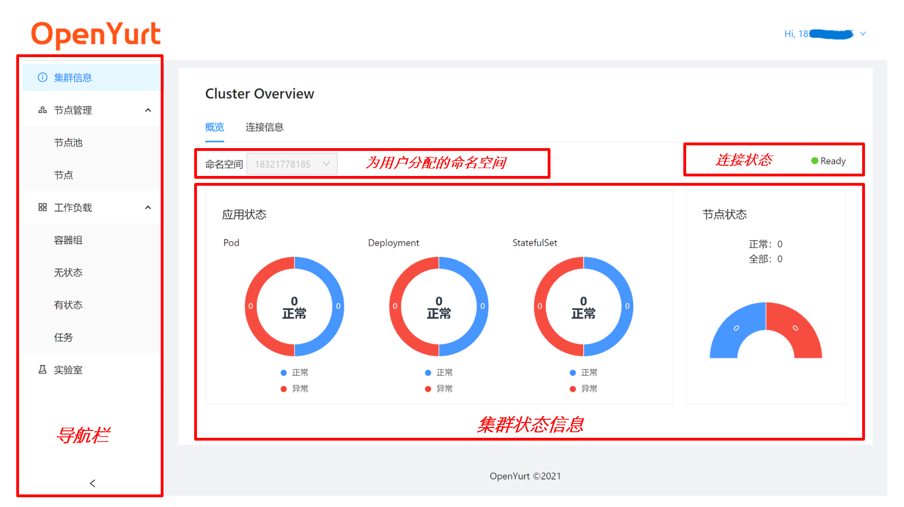
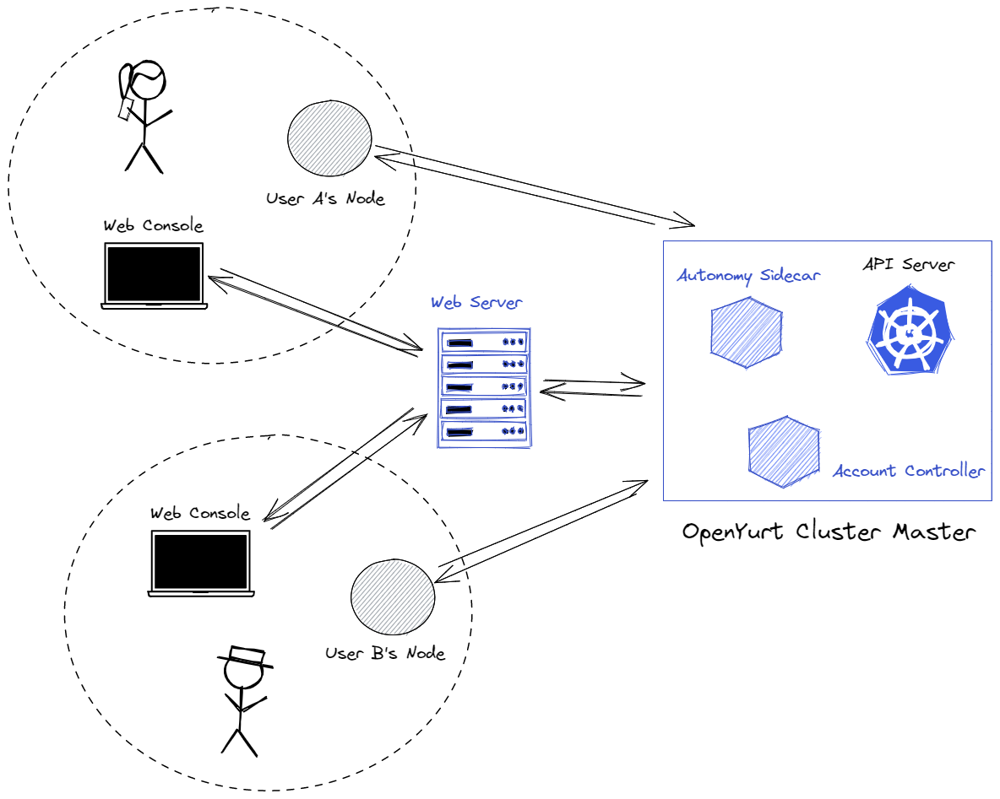

> 为了更好的用户体验， [体验平台 beta 版本](http://47.242.50.237/)已迁移到[新地址](http://47.242.50.237/)， [旧地址](http://139.224.236.157/)将在 7 日后停止维护。

## 总体介绍

OpenYurt 作为边缘云原生项目,涉及到边缘计算和云原生两个领域,许多边缘计算的开发者不熟悉云原生相关的知识。为了降低 OpenYurt 的使用门槛，帮助更多地开发者快速上手 OpenYurt，社区推出了 OpenYurt 体验中心这一平台。想要尝试 OpenYurt 能力的新用户无需从头搭建 OpenYurt 集群, 只需要在平台上申请一个测试账号，即可马上拥有一个可用的 OpenYurt 集群。

## 体验中心的功能

体验中心会为每个[注册用户](./user.md)分配一个 OpenYurt 集群。（注意这个集群并不是一个功能完整的 K8s 集群，用户只能在自己的 namespace 下活动，详情请参见体验中心的架构介绍）

对于该集群，体验中心提供了两种使用方式：

1. 用户可以使用体验中心提供的[Web 控制台](./web_console.md)来使用集群。控制台会展示集群的状态，并提供了一些常用操作，如：用户管理，节点接入，节点自治设置，实验室快速部署等功能。

2. 体验中心还提供了[`kubeconfig`的接入方式](./kubeconfig.md)，用户可以在本地配置`kubeconfig`，通过`kubectl`命令行来操作集群。

## 体验中心的架构

> 体验中的[dashboard](https://github.com/openyurtio/yurt-dashboard)部分已经开源，欢迎大家的建议反馈。
> 另外，如果大家对体验中心的实现感兴趣，可以参考 OpenYurt 双周会的[视频分享](https://www.bilibili.com/video/BV1pf4y1K7M4)。

体验中心主要由三部分组成：

1. Yurt Dashboard，一个类似于 kubernetes dashboard 的 Web 控制台，包含完整的前后端的 Web 应用。前端提供一个简单直观的操作界面，后端负责与集群的 API Server 通信
2. Account Controller，体验平台的用户信息以 CRD 的形式存储在集群中。Account Controller 负责管理用户账户及其相关资源（如 namespace, 证书等）的创建与注销。
3. Autonomy Sidecar，整个体验中心的所有用户共享同一个 OpenYurt 集群。自治组件实现集群的多租户隔离，使每个用户共享同一个 Master，但独占自己的边缘资源。
