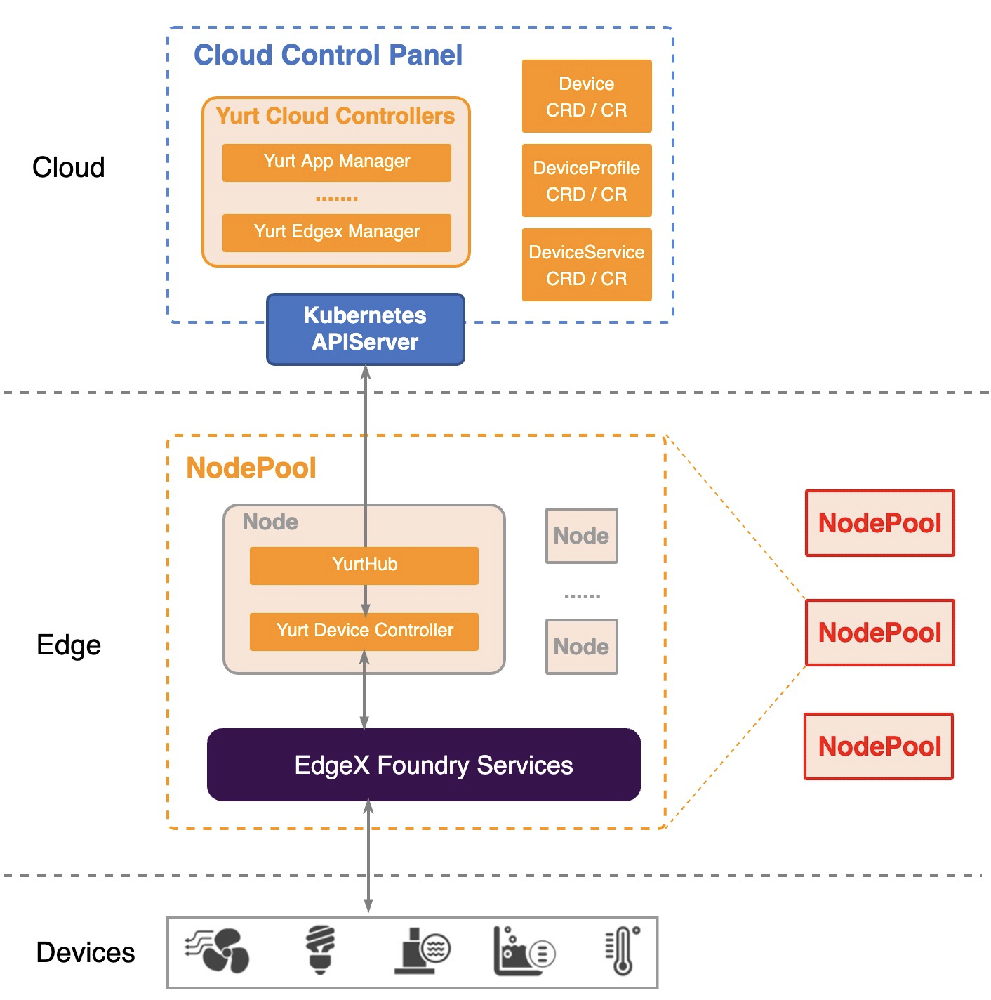

## 背景介绍

OpenYurt擅长以非侵入的方式，实现云边资源的统一管理和运维，使得边缘节点拥有云端相同的能力。但随着将相关纳管能力拓展至 “ 端 ”这一层时，由于近端设备异构资源支持复杂、通信方式多样、分布位置分散等特点，会出现以下问题：

- 为了支持各种边缘设备，现有的OpenYurt框架必须为每个类别的设备开发专用的适配器；
- 在直接纳管端设备的过程中，现有解决方案要么改变Kubernetes架构，要么显著修改核心组件，丢失一些上游K8S特性的同时，与OpenYurt的非侵入式理念相悖。

与此同时，我们也发现社区里涌现了许多优秀的边缘设备管理平台，如：EdgeX Foundry。受到Unix哲学“Do one thing, and do it well”的启发，OpenYurt将复杂端设备的管理交由成熟的物联网设备管理平台，并通过抽象与设备相关的资源与服务，以及部署yurt-device-controller组件，来打通边缘设备管理平台和云端之间的运维管理通道，允许用户声明式地管理边缘设备，为用户提供 Kubernetes 原生管理端设备的体验。

下面是云边端三者整体的架构模型：

边缘端设备的通信范围往往局限于某一网络区域内，因此可以将同一网络区域内的边缘节点划分为一个节点池，在每一个节点池内部署一个端设备管理平台和一个yurt device controller组件：

- 在与云端apiserver的通信中，yurt-device-controller只会监听属于该节点池内的设备对象，并将更新信息通过端设备管理平台及时地同步至对应的设备上；
- 在与端设备管理平台的通信中，复用YurtHub、节点池以及单元化部署等能力，yurt-device-controller组件只会访问本节点池内的端设备管理平台，并将接入该节点池内的设备信息抽象为device、deviceService和deviceProfile对象同步至云端；

## 组件介绍

### 设备信息抽象

为管理现实世界中的设备，需要对设备管理相关的服务进行抽象，Yurt-device-controller作为连通云和边缘管理平台的组件，抽象出了三个CRD，用于表示和管理对应设备管理平台上的资源，从而影响现实世界中的设备，它们分别是deviceProfile、deviceService和device：

- **DeviceProfile**：设备配置文件描述了使用相同协议的一种设备类型，其中包括一些通用信息，如制造商名称、设备描述和设备型号。 DeviceProfile 还定义了此类设备提供的资源类型（例如，温度、湿度）以及如何读取/写入这些资源。每个device都需要关联一个device profile；
- **DeviceService**：是针对与设备交互的边缘连接器的抽象，定义了如何将设备接入到边缘设备管理平台，包括设备的通信协议，通信地址等信息。每个device都需要关联一个device service；

- **Device**：是针对现实世界中端设备的抽象，例如：电器、警报系统、暖通空调设备、照明、传感器等设备，它给出了特定设备的详细定义，包括关联的 DeviceProfile（属于哪类设备） 、关联的 DeviceService（使用何种通信方式）以及设备特有属性（如照明设备的开关状态等）。

### 设备管理架构

通过抽象出上述三种CRD，可以反应出设备基本的状态信息，再使用对应的controller与边缘设备管理平台进行交互，可以将边侧发现的端设备及时映射至云端；与此同时，yurt-device-controller组件将云端针对设备属性的修改（例如：设置照明设备的开关状态）同步至端设备上，从而影响真实世界中的物理设备。用户只需要声明式地修改CRs的相应字段，以一种云原生的方式即可达到运维、管理复杂端设备的目的，下面是组成yurt-device-controller的三个组件：

- **DeviceProfile controller**: 它可以将边缘平台中的 deviceProfile 对象抽象为 deviceProfile CR 并同步到云端。在deviceProfile Controller的支持下，用户可以在云端查看边缘平台的deviceProfile信息，创建或删除deviceProfile CR来影响边缘平台的实际deviceProfile。
- **DeviceService controller**: 它可以将边缘平台中的 deviceService 对象抽象为 deviceService CR 并同步到云端。在deviceService Controller的支持下，用户可以在云端查看边缘平台的deviceService信息，创建或删除deviceService CR来影响边缘平台的实际deviceService。

- **Device controller**: 它可以将边缘平台中的device对象抽象为device CR并同步到云端。在设备控制器的支持下，用户可以声明式修改云端device CR来影响边缘平台上的实际设备，如创建设备、删除设备、更新设备属性（如设置灯的开和关等）。

### 版本记录

| 版本号    | 镜像地址                                   | 发布时间    | 发布内容                      | 备注    |
|--------|----------------------------------------|---------|---------------------------|-------|
| v0.1.0 | openyurt/yurt-device-controller:v0.1.0 | 2021.09 | 首次发布                      | - --- |
| v0.2.0 | openyurt/yurt-device-controller:v0.2.0 | 2022.05 | Support EdgeX LTS Version |       |
## 边缘设备管理平台

EdgeX Foundry 是一款由生态系统提供强力支持的边缘物联网即插即用型、开放式软件平台。它具有高度灵活和可扩展性，可以大大的降低应用与边缘设备，传感器等硬件互操作的复杂性。OpenYurt 与 EdgeX Foundry社区合作，在0.5.0版本完成了集成对接，除了yurt-device-controller，还提供了yurt-edgex-manager组件以简化edgex foundry在边缘场景下的部署工作。

结合上述的云边端架构图，OpenYurt与EdgeX Foundry集成的架构图如下：

### yurt-edgex-manager

OpenYurt 引入了一个yurt-edgex-controller的控制器来管理EdgeX CR。EdgeX CR是对EdgeX Foundy在OpenYurt中部署的一个抽象，用户可以操作CR的方式来管理EdgeX的部署，更新，删除。不再需要写复杂的Yaml文件以及Helm Chart。用户只需要创建一个EdgeX的CR，Yurt-edgex-manager会根据CR中版本以及对应的Nodepool的名字部署EdgeX。用户在一个集群中可以根据nodepool的数量部署多个EdgeX，每个EdgeX的版本，以及包括的EdgeX 服务可以配置。

- **EdgeX**: 是一套EdgeX foundy部署的抽象，包括EdgeX foundry的版本，以及需要部署的Nodepool的名字。 基础的EdgeX CR包括8个基础的EdgeX 服务和部署，此外还提供AdditionalDeployment和Additional Service的字段，让用户可以部署任何所需的EdgeX组件和第三方应用。

在OpenYurt中，EdgeX的服务通过以Kubernetes服务的形式来对外提供访问，尽管不同的EdgeX实例使用相同Kubernates服务名称，ServiceToploy 会确保EdgeX组件只能访问属于同一EdgeX实例的其他组件，而不会发生交叉访问的情绪。Yurt-edgex-controller利用unitedeployment的能力，在nodepool中部署edgeX的组件。

### 版本记录

| 版本号    | 镜像地址                              | 发布时间    | 发布内容                      | 备注  |
|--------|-----------------------------------|---------|---------------------------|-----|
| v0.1.0 | openyurt/yurt-edgex-manager:0.1.0 | 2021.09 | 首次发布                      |     |
| v0.2.0 | openyurt/yurt-edgex-manager:0.2.0 | 2022.05 | Support EdgeX LTS Version |     |

## 参考链接

- [Yurt-edgex-manager](https://github.com/openyurtio/yurt-edgex-manager)
- [Yurt-device-controller](https://github.com/openyurtio/yurt-device-controller)

- [OpenYurt 官网](https://openyurt.io/)
- [EdgeX Foundry官网](https://www.edgexfoundry.org/)

