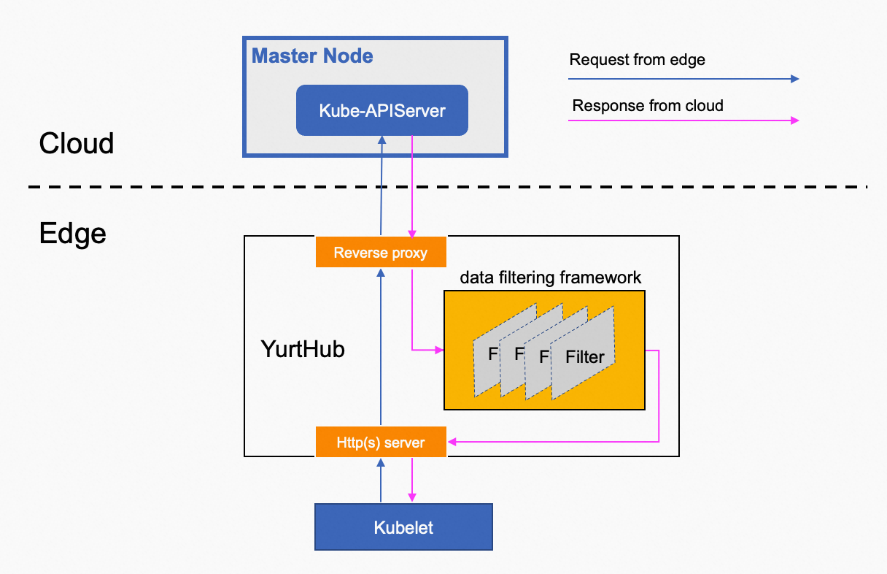

## 背景介绍
在云边协同场景中，对边缘组件（如 kube-proxy 或用户 pod）从云端 kube-apiserver 获取的数据可以执行自定义处理，以满足边缘场景的特定需求。例如，当 kubelet 获取 `default/kubernetes service` 时，它期望该service包含可访问的 kube-apiserver 地址，而不是原生服务 ClusterIP 地址。这允许边缘节点上的 pod 可以无缝地使用 InClusterConfig 访问云端 kube-apiserver。

## 架构设计

可编程数据过滤框架内置于 YurtHub 组件中。来自云端 kube-apiserver 的指定请求的响应数据通过一系列过滤器，实现对响应数据的无感知和按需转换，以满足云边协同场景的特定需求。如下图所示。



目前，过滤器链支持以下五个过滤器：

- masterservice 过滤器：将 `default/kubernetes` 服务的 ClusterIP 和 HTTPS 端口改为 YurtHub 组件正在监听的地址，使边缘节点上使用 InClusterConfig 的 pod 能够无感知地通过 YurtHub 组件访问云端 kube-apiserver。
- servicetopology 过滤器：根据service的服务拓扑设置重新组装 endpointslices，确保访问服务的流量只能转发给同一节点或 NodePool 中的 pod。
- discardcloudservice 过滤器：过滤掉kube-proxy获取的service中的LB service，因为边缘目前未支持LB service。
- inclusterconfig 过滤器：在 `kube-system/kube-proxy` configmap 中注释 kubeconfig 设置，使边缘节点上的 kube-proxy 组件能够使用 InClusterConfig 访问云端 kube-apiserver。
- nodeportisolation 过滤器：通过根据 Service 的 `nodeport.openyurt.io/listen` 注解配置来过滤 NodePort Service，使NodePort Service可以仅在指定 NodePool 中监听，而不是在整个集群的所有节点上监听。

每个过滤器仅处理由请求三元组确定的特定请求的响应数据：component/resource/verbs
- component：表示 HTTP 请求头中的 User-Agent，例如 kube-proxy。
- resource：表示请求的资源，例如 endpointslices。
- verbs：表示 HTTP 请求的Verb，例如 get、list、watch。

## 如何使用

如上所述，每个过滤器仅处理由`component/resource/verbs`确定的特定请求的响应数据。

下表显示了每个过滤器支持的默认`component/resource/verbs`：

| Filter        | Default components                            | resources | verbs |
|---------------|-----------------------------------------------|-----------|-------|
| masterservice | kubelet                                       | services | list, watch |
| servicetopology | kube-proxy, coredns, nginx-ingress-controller | endpoints, endpointslices | list, watch |
| discardcloudservice | kube-proxy                                    | services | list, watch |
| inclusterconfig | kubelet                                       | configmaps | get, list, watch |
| nodeportisolation | kube-proxy                                    | services | list, watch |

另外，如果还需要处理其他客户端的响应，用户可以按照以下方式配置 `kube-system/yurt-hub-cfg` configmap：

注意：请确保在运行客户端 pod 之前配置好 configmap。

```
// configured response for clients named foo and bar can be handled by servicetopology
apiVersion: v1
kind: ConfigMap
metadata:
  name: yurt-hub-cfg
data:
  servicetopology: "foo, bar"
```
