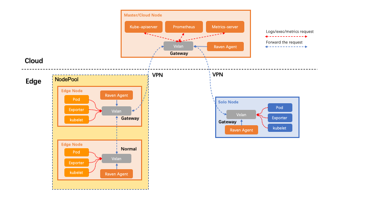

本文档主要讲述如何在已有的OpenYurt集群上通过Yurt-Tunnel组件的DNS模式来实现Promethues对边缘端设备的metrics进行采集。

## 环境要求

- OpenYurt v0.5.0+

- CoreDNS v1.6.8+

- prometheus-operator

  如果你还没有OpenYurt集群，你可以使用 [yurtctl工具](https://github.com/openyurtio/openyurt/blob/master/docs/tutorial/yurtctl.md) 来初始化一个OpenYurt集群或将一个Kubernetes集群转换为OpenYurt集群，prometheus-operator的安装可以参考[kube-prometheus](https://github.com/prometheus-operator/kube-prometheus#quickstart)。

## 1.修改coreDNS配置

OpenYurt会创建`yurt-tunnel-nodes`ConfigMap，其中保存着各节点的对应的DNS记录。

### 1.将 `yurt-tunnel-nodes`挂载至coreDNS中

```bash
kubectl patch deployment coredns -n kube-system  -p '{"spec": {"template": {"spec": {"volumes": [{"configMap":{"name":"yurt-tunnel-nodes"},"name": "edge"}]}}}}'
kubectl patch deployment coredns -n kube-system   -p '{"spec": { "template": { "spec": { "containers": [{"name":"coredns","volumeMounts": [{"mountPath": "/etc/edge", "name": "edge", "readOnly": true }]}]}}}}'
```

### 2.修改coreDNS的配置文件

使用 [hosts](https://coredns.io/plugins/hosts/) 插件将 `yurt-tunnel-nodes`中的 dns 记录加载到coreDNS中.

```bash
$ kubectl edit configmap coredns -n kube-system
...........
 Corefile: |
    .:53 {
        errors
        health {
           lameduck 5s
        }
        ready
        hosts /etc/edge/tunnel-nodes {    # add hosts plugin
            reload 300ms
            fallthrough
        }
        kubernetes cluster.local in-addr.arpa ip6.arpa {
           pods insecure
           fallthrough in-addr.arpa ip6.arpa
           ttl 30
        }
        prometheus :9153
        forward . /etc/resolv.conf {
           max_concurrent 1000
        }
        cache 30
        loop
        reload
        loadbalance
    }
```

### 3.重启coreDNS

```bash
 kubectl patch deployment coredns -n kube-system -p '{"spec":{"template":{"spec":{"containers":[{"name":"coredns","env":[{"name":"RESTART","value":"'$(date +%s)'"}]}]}}}}'
```

## 2.Prometheus 配置

prometheus默认使用IP来访问节点的metric地址，我们需要通过prometheus提供的relabel功能将IP改写为节点hostname。`promethues-operator`使用ServiceMonitor CRD来定义抓取配置，因此需要修改ServiceMonitor来增加relabel功能。

- 更多关于relabel的配置信息可以参考 [prometheus_relabel_config](https://prometheus.io/docs/prometheus/latest/configuration/configuration/#relabel_config).

- 不同的组件relabel所需要的`sourceLabels`可能不同，可以参考[kubernetes_sd_config](https://prometheus.io/docs/prometheus/latest/configuration/configuration/#kubernetes_sd_config).

### 收集kubelet的metrics

在kubelet的ServiceMonitor中增加relabel规则，用`__meta_kubernetes_endpoint_address_target_name`替换掉节点IP：

```yaml
$ kubectl edit serviceMonitor kubelet -n monitoring
spec:
  endpoint:
    ..........
    relabelings:
    - action: replace  # add relabel rule
      regex: (.*);.*:(.*)
      replacement: $1:$2
      sourceLabels:
      - __meta_kubernetes_endpoint_address_target_name
      - __address__
      targetLabel: __address__
    ..........
```

### 收集其他metrics（以node-exporter为例）

`Yurt-tunnel` 默认只转发10250和10255两个端口,如果需要其他端口的映射，可以修改`yurt-tunnel-server-cfg`ConfigMap来添加。以`node-exporter` 为例， 需要将`9100`添加到`https-proxy-ports`中。类似的，如果是添加http端口，则可以修改`http-proxy-ports`配置。

#### 修改`yurt-tunnel-server-cfg`ConfigMap

```bash
kubectl patch configmap yurt-tunnel-server-cfg  -n kube-system  -p '{"data": {"https-proxy-ports":"9100"}}'
```

在node-exporter的ServiceMonitor中添加relabel规则，用`__meta_kubernetes_pod_node_name`替换掉节点IP。：

```yaml
$ kubectl edit servicemonitor  prom-kube-prometheus-stack-node-exporter
spec:
 endpoint:
   ......
   relabelings:
    - action: replace #add relabel rule
      regex: (.*);.*:(.*)
      replacement: $1:$2
      sourceLabels:
      - __meta_kubernetes_pod_node_name
      - __address__
      targetLabel: __address__
    ........
```

## 参考

[Openyurt Yurt-Tunnel DNS模式实践](https://juejin.cn/post/7006898548415414279)
