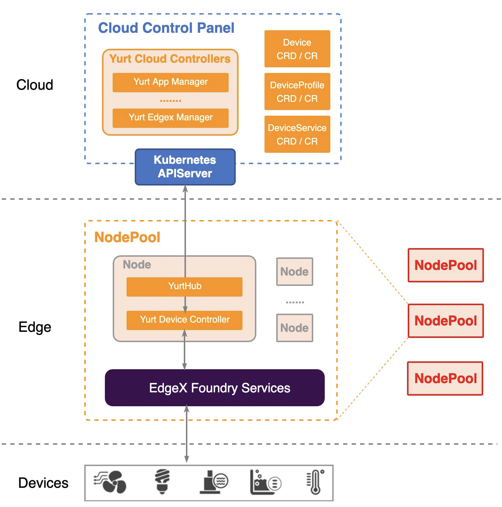

## Background

OpenYurt has been designed to meet various DevOps requirements against typical edge infrastructures. It provides the same user experience for managing the edge applications as if they were running in the cloud infrastructure.
However, when the related management capability is extended to the edge "device" layer, the following problems may occur:

- In order to support various edge devices, the existing framework must develop special adapters for each category of devices;
- When adapting Kubernetes to the edge computing environments, existing solutions either change the system architecture or modify core components (such as kubelet) significantly.

At the same time, we saw a lot of great edge device management platforms emerging in the community，such as EdgeX Foundry。inspiring by the Unix philosophy, "Do one thing and do it well", 
we believe that Kubernetes should focus on managing computing resources while edge devices management can be done by adopting existing edge computing platforms.

A overall architecture about cloud-edge-device depicted below

The communication range of edge devices is usually limited to a certain network area. Therefore, edge nodes in the same network area can be divided into a nodepool. So a device management platform and a yurt-device-controller
can be deployed in each nodepool.：

- When communicating with kube-apiserver on the cloud, Yurt-Device-Controller only watches the device objects in its nodepool and synchronizes the updated specs to the corresponding devices through the corresponding device management platform.
- When communicating with the device management platform，YurtHub, NodePool, and UnitedDeployment capabilities are reused. The device information in the node pool is abstracted into device, deviceService, and deviceProfile objects and synchronized to the cloud.

## Abstraction

### device management related CRDs

To manage devices in the real world, we should make some abstractions，Being a component connecting cloud and edge management platform, Yurt-device-controller proposed 3 CRDs: DeviceProfile、DeviceService and Device：

- **DeviceProfile**：defines a type of devices using same kind of protocol, which includes some generic information like the manufacturer's name, the device description, and the device model. DeviceProfile also defines what kind of resources (e.g., temperature, humidity) this type of device provided and how to read/write these resources.
- **DeviceService**：defines the way of how to connect a device to the OpenYurt, like the URL of the device. The DeviceService can not exist alone. Every DeviceService must associate with a DeviceProfile.
- **Device**：is used to refer to a sensor, actuator, or IoT "thing", it gives the detailed definition of a specific device, like which DeviceProfile it belongs to and which DeviceService it used to connect to the system.

### Architecture

The major Yurt-Device-Controller components consist of:

- **Device controller**: It can abstract device objects in the edge platform into device CRs and synchronize them to the cloud. With the support of device controller, users can influence the actual device on the edge platform through the operation of cloud device CR, such as creating a device, deleting a device, updating device attributes (such as setting the light on and off, etc.).
- **DeviceService controller**: It can abstract deviceService objects in the edge platform into deviceService CRs and synchronize them to the cloud. With the support of deviceService Controller, users can view deviceService information of edge platforms in the cloud, and create or delete deviceService CRs to affect the actual deviceService of edge platforms.
- **DeviceProfile controller**: It can abstract deviceProfile objects in the edge platform into deviceProfile CRs and synchronize them to the cloud. With the support of deviceProfile Controller, users can view deviceProfile information of edge platforms in the cloud, and create or delete deviceProfile CRs to affect the actual deviceService of edge platforms.

### Version

| Version | Image                                  | Release Date | Changes                   | Remark |
|---------|----------------------------------------|--------------|---------------------------|--------|
| v0.1.0  | openyurt/yurt-device-controller:v0.1.0 | 2021.09      | First Release             | -      |
| v0.2.0  | openyurt/yurt-device-controller:v0.1.0 | 2022.05      | Support EdgeX LTS Version | -      |

## EdgeX Foundry

EdgeX Foundry is a vendor-neutral open source project hosted by The Linux Foundation building a common open framework for IoT edge computing. It's a framework hosted within a full hardware and OS-agnostic 
reference software platform to enable an ecosystem of plug-and-play components that unifies the marketplace and accelerates the deployment of IoT solutions。In collaboration with the EdgeX Foundry community，
OpenYurt integrated EdgeX since 0.5.0. In addition to yurt-device-controller, A yurt-edgex-manager component is also provided to simplify the deployment of the EdgeX Foundry in edge scenarios.

Integration Architecture：

### yurt-edgex-manager

OpenYurt introduces a yurt-edgex-manager controller to manage the EdgeX Foundry instances. You can manipulate EdgeX CR to manage EdgeX deployment, update, delete.You just need to create a CR of EdgeX, 
then yurt-edgex-manager will automatically deploy EdgeX according to the spec defined. You can also deploy multiple EdgeX in a cluster based on the number of Nodepool. 
The version of each EdgeX and the included EdgeX service can be configured.

In OpenYurt Cluster, EdgeX uses Kubernetes Service to provide access.
### Version

| Version | Image                             | Release Date | Changes                   | Remark |
|---------|-----------------------------------|--------------|---------------------------|--------|
| v0.1.0  | openyurt/yurt-edgex-manager:0.1.0 | 2021.09      | First Release             |        |
| v0.2.0  | openyurt/yurt-edgex-manager:0.2.0 | 2022.05      | Support EdgeX LTS Version |        |

## References

- [Yurt-edgex-manager](https://github.com/openyurtio/yurt-edgex-manager)
- [Yurt-device-controller](https://github.com/openyurtio/yurt-device-controller)

- [OpenYurt](https://openyurt.io/)
- [EdgeX Foundry](https://www.edgexfoundry.org/)

