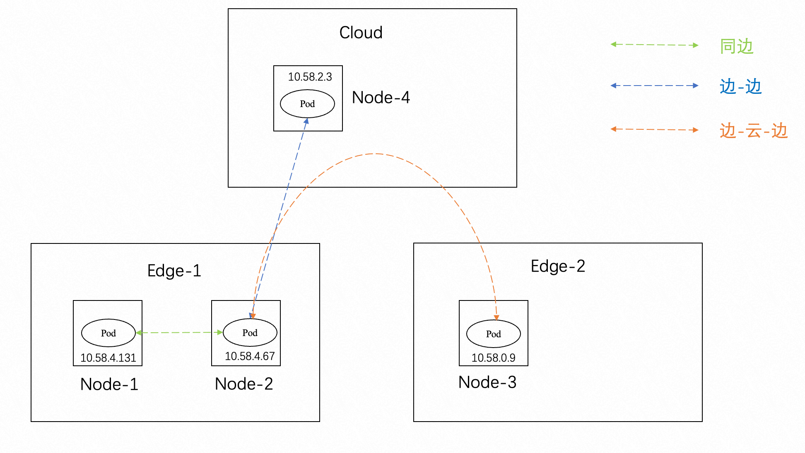

## 背景
Raven项目是OpenYurt项目中作为打通边-边、边-云的网络的组件，通过公网加密通道让不同的边缘的节点上的网络相互打通，从而实现跨边的业务或者管控流量的通信，Raven作为打通各边容器网络的重要组件，它的性能表现对OpenYurt集群有着很大影响。因此我们需要对Raven组件的性能有更深入的了解。
## 测试环境
### Kubernetes版本
`Major:"1", Minor:"20+", GitVersion:"v1.20.11-aliyunedge.1", GitCommit:"1403255", GitTreeState:"", BuildDate:"2021-12-27T08:07:37Z", GoVersion:"go1.15.15", Compiler:"gc", Platform:"linux/amd64"`
### OpenYurt 版本
`GitVersion:"v0.7.0", GitCommit:"d331a42", BuildDate:"2022-08-29T13:33:43Z", GoVersion:"go1.17.12", Compiler:"gc", Platform:"linux/amd64"`
### Raven版本
raven-agent: `GitVersion:"v0.1.0", GitCommit:"a8d13a52", BuildDate:"2022-05-09T10:30:42Z", GoVersion:"go1.15", Compiler:"gc", Platform:"linux/amd64"`

raven-controller-manager: `GitVersion:"v0.1.0", GitCommit:"1f65198", BuildDate:"2022-05-09T10:31:33Z", GoVersion:"go1.15", Compiler:"gc", Platform:"linux/amd64"`
### 实验配置
集群中包含1个北京的master节点、2个张家口的edge节点以及1个上海的edge节点，master节点和edge节点的配置均相同。
master

## 测试方法
通过iperf3和ping等工具测试在同一边缘节点池和跨边缘节点池的网络带宽和延迟

- 同边（基准）：容器网络带宽、延迟
- 云-边（对照1）：容器网络带宽、延迟
- 边-云-边（对照2）：容器网络带宽、延迟

整体的测试架构如下图所示


## 测试结果

### 同边Pod互访
本组测试Node-1与Node-2的Pod互访，Node-2的Pod作为客户端，Node-1的Pod作为服务端

- 带宽

```bash
$ iperf3 -c 10.58.4.131 -i 1 -t 100 -p 1314 # 正向：客户端发送，服务端接收
[ ID] Interval           Transfer     Bitrate         Retr
[  5]   0.00-100.00 sec  42.8 GBytes  3.67 Gbits/sec  12742             sender
[  5]   0.00-100.04 sec  42.8 GBytes  3.67 Gbits/sec                  receiver

$ iperf3 -c 10.58.4.131 -i 1 -R -t 100 -p 1314 # 反向：服务端发送，客户端接收
[ ID] Interval           Transfer     Bitrate         Retr
[  5]   0.00-100.04 sec  38.9 GBytes  3.34 Gbits/sec  11024             sender
[  5]   0.00-100.00 sec  38.8 GBytes  3.34 Gbits/sec                  receiver
```

| 正向                  | 反向              |
|---------------------|-----------------|
| 3.67 Gbits/sec      | 3.34 Gbits/sec  |

- 延迟
```bash
$ ping -A -c 10000 -q 10.58.4.131
--- 10.58.4.131 ping statistics ---
10000 packets transmitted, 10000 received, 0% packet loss, time 766ms
rtt min/avg/max/mdev = 0.061/0.065/0.355/0.008 ms, ipg/ewma 0.076/0.066 ms

$ ping -c 10 10.58.4.131
--- 10.58.4.131 ping statistics ---
10 packets transmitted, 10 received, 0% packet loss, time 9000ms
rtt min/avg/max/mdev = 0.130/0.190/0.347/0.065 ms
```

| Flooding                   | Non Flooding               |
|----------------------------|----------------------------|
| 0.061/0.065/0.355/0.008 ms | 0.130/0.190/0.347/0.065 ms |


### 云-边Pod互访

本组测试Node-2与Node-4的Pod互访，，Node-2的Pod作为客户端，Node-4的Pod作为服务端

- 带宽

```bash
$  iperf3 -c 10.58.2.3  -i 1 -t 100 -p 1314 # 正向：客户端发送，服务端接收
[ ID] Interval           Transfer     Bitrate         Retr
[  5]   0.00-100.00 sec  1.02 GBytes  87.8 Mbits/sec  5269             sender
[  5]   0.00-100.04 sec  1.02 GBytes  87.6 Mbits/sec                  receiver

$  iperf3 -c 10.58.2.3  -i 1 -R -t 100 -p 1314 # 反向：服务端发送，客户端接收
[ ID] Interval           Transfer     Bitrate         Retr
[  5]   0.00-100.04 sec  13.1 MBytes  1.10 Mbits/sec  1692             sender
[  5]   0.00-100.00 sec  10.1 MBytes   845 Kbits/sec                  receiver
```

| 正向                  | 反向              |
|---------------------|-----------------|
| 87.8 Mbits/sec       | 1.10 Mbits/sec  |

- 延迟
```bash
$ ping -A -c 10000 -q 10.58.2.3
--- 10.58.2.3 ping statistics ---
10000 packets transmitted, 10000 received, 0% packet loss, time 339961ms
rtt min/avg/max/mdev = 33.865/33.919/44.063/0.147 ms, pipe 2, ipg/ewma 33.999/33.909 ms

$ ping -c 10 10.58.2.3
--- 10.58.2.3 ping statistics ---
10 packets transmitted, 10 received, 0% packet loss, time 306ms
rtt min/avg/max/mdev = 33.902/33.938/34.036/0.037 ms, ipg/ewma 34.009/33.960 ms

```

| Flooding                   | Non Flooding               |
|----------------------------|----------------------------|
| 33.865/33.919/44.063/0.147 ms | 33.902/33.938/34.036/0.037 ms |

### 边-云-边Pod互访

本组测试Node-2与Node-3的Pod互访，，Node-2的Pod作为客户端，Node-3的Pod作为服务端

- 带宽

```bash
$ iperf3 -c 10.58.0.9 -i 1 -t 100 -p 1314 # 正向：客户端发送，服务端接收
[ ID] Interval           Transfer     Bitrate         Retr
[  5]   0.00-100.00 sec  12.3 MBytes  1.03 Mbits/sec  1345             sender
[  5]   0.00-100.06 sec  9.39 MBytes   787 Kbits/sec                  receiver

$ iperf3 -c 10.58.0.9 -i 1 -R -t 100 -p 1314 # 反向：服务端发送，客户端接收
[ ID] Interval           Transfer     Bitrate         Retr
[  5]   0.00-100.06 sec  17.5 MBytes  1.47 Mbits/sec  1234             sender
[  5]   0.00-100.00 sec  9.43 MBytes   791 Kbits/sec                  receiver

```

| 正向                  | 反向              |
|---------------------|-----------------|
| 1.03 Mbits/sec      | 1.47 Mbits/sec |

- 延迟
```bash
$ ping -A -c 10000 -q 10.58.0.9
--- 10.58.0.9 ping statistics ---
10000 packets transmitted, 10000 received, 0% packet loss, time 631991ms
rtt min/avg/max/mdev = 63.242/63.325/80.732/0.189 ms, pipe 2, ipg/ewma 63.205/63.364 ms

$ ping -c 10 10.58.0.9
--- 10.58.0.9 ping statistics ---
10 packets transmitted, 10 received, 0% packet loss, time 9010ms
rtt min/avg/max/mdev = 63.373/63.413/63.492/0.033 ms****

```

| Flooding                   | Non Flooding               |
|----------------------------|----------------------------|
| 0.061/0.065/0.355/0.008 ms | 63.373/63.413/63.492/0.033 |

## 结论及分析

- 相较于同边访问：云-边互访带宽比为42.37（同边带宽/云-边带宽），边-云-边互访带宽比为3579.02（同边带宽/边-云-边带宽）
- 相较于同边访问：云-边互访延迟比为0.02（同边延迟/云-边延迟），边-云-边互访延迟比为0.01（同边延迟/边-云-边延迟）
