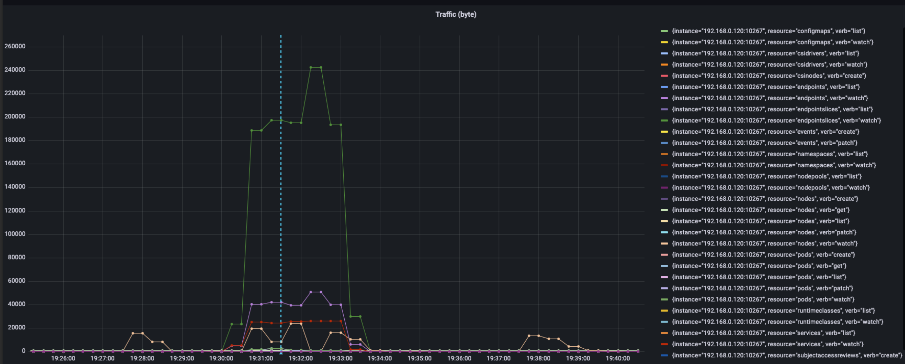
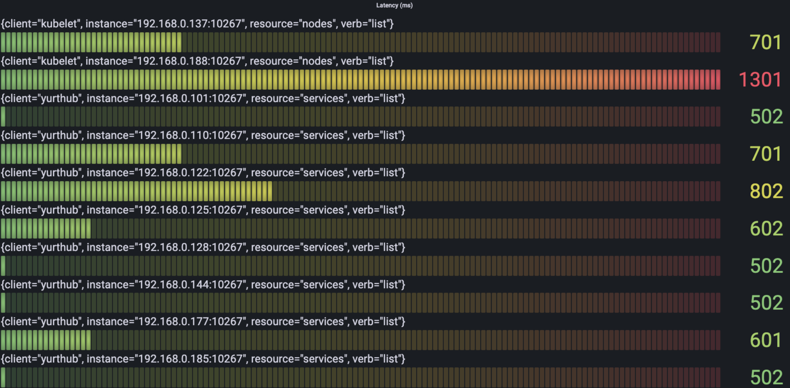
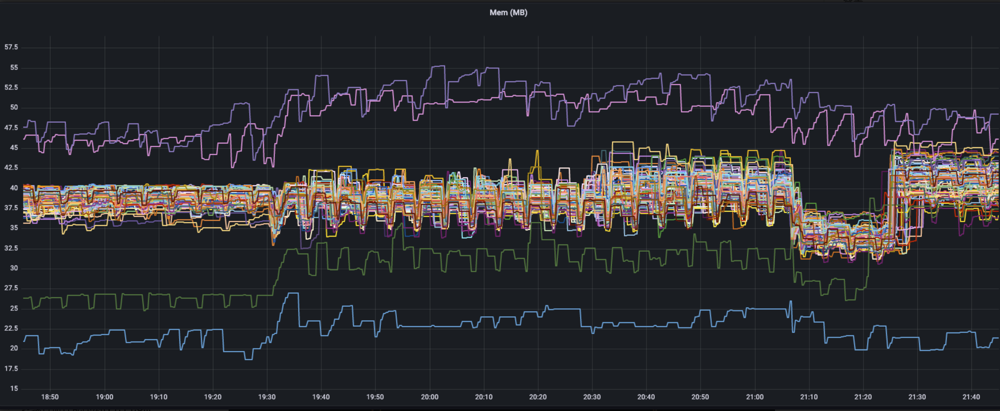

## 背景
YurtHub是OpenYurt的重要组件，它为APIServer提供了一层额外的抽象，接管了边缘到云的请求流量，支撑了OpenYurt的边缘自治，流量闭环等重要能力。另一方面，大量边缘云原生场景面临着边缘节点资源受限的问题，YurtHub作为边缘侧的重要组件，它在各种环境下的性能表现对OpenYurt集群都有着很大影响。因此我们需要对YurtHub组件的性能有更深入的了解。
## 测试环境
### Kubernetes版本
`Major:"1", Minor:"22", GitVersion:"v1.22.12", GitCommit:"b058e1760c79f46a834ba59bd7a3486ecf28237d", GitTreeState:"clean", BuildDate:"2022-07-13T14:53:39Z", GoVersion:"go1.16.15", Compiler:"gc", Platform:"linux/amd64"`
### OpenYurt 版本
`GitVersion:"v0.7.0", GitCommit:"d331a42", BuildDate:"2022-08-29T13:33:43Z", GoVersion:"go1.17.12", Compiler:"gc", Platform:"linux/amd64"`
### 节点配置
Master 节点与Node节点使用不同配置的ECS，集群中包含1个master节点和其他100个node节点。100个node节点均通过`yurtadm`以edge模式接入。
#### 操作系统
|  | Master  | Node  |
| --- | --- | --- |
| LSB Version  | :core-4.1-amd64:core-4.1-noarch | :core-4.1-amd64:core-4.1-noarch |
| Distributor ID  | CentOS | CentOS |
| Description | CentOS Linux release 7.9.2009 (Core) | CentOS Linux release 7.9.2009 (Core) |
| Release  | 7.9.2009 | 7.9.2009 |
| Codename | Core | Core |

#### CPU
|  | Master  | Node  |
| --- | --- | --- |
| Architecture  | x86_64 | x86_64 |
| CPU op-mode (s) | 32-bit, 64-bit | 32-bit, 64-bit |
| Byte Order  | Little Endian  | Little Endian  |
| CPU (s) | 8 | 2 |
| On-line CPU(s) list | 0-7 | 0,1 |
| Thread(s) per core | 2 | 2 |
| Core(s) per socket | 4 | 4 |
| Socket(s)  | 1 | 1 |
| NUMA node(s) | 1 | 1 |
| Vendor ID  | GenuineIntel | GenuineIntel |
| CPU family  | 6 | 6 |
| Model  | 106 | 106 |
| Model name  | Intel(R) Xeon(R) Platinum 8369B CPU @ 2.70GHz | Intel(R) Xeon(R) Platinum 8369B CPU @ 2.70GHz |
| Stepping  | 6 | 6 |
| CPU MHz | 2699.998 | 2699.998 |

#### Memory 
|  | Master  | Node  |
| --- | --- | --- |
| Total memory  | 32245896 K | 7862304 K |

#### Disk
|  | Master  | Node  |
| --- | --- | --- |
| Total Size   | 40GiB (3800 IOPS) | 40GiB (3800 IOPS) |
| Type  | ESSD云盘 PL0 | ESSD云盘 PL1 |

## 测试方法
通过Promethus收集OpenYurt集群中边缘侧yurthub的三类指标

- 资源占用：yurthub容器 CPU/Mem 使用情况 
- 数据流量：yurthub 转发请求流量
- 请求延迟：yurthub 转发请求的延迟

整体的测试架构如下图所示

## 测试结果
> 15:00-19:00 陆续接入100节点
> 19:30 创建2000 Pod， 1000 Service（以Daemonset形式部署，每个节点部署20个Pod，单个Service包含50个endpoints）
> 19:35 所有资源创建完成
> 21:06 删除所有资源

### Traffic 

上图是100个边缘节点的Yurthub在整个过程中的请求流量表现，可以观察到一下特征：

- 流量数据在正常情况下有一个5min周期性的波动，峰值大概在15-20 KB/s
- workload部署过程中流量有一个激增，峰值在350 KB/s
- workload卸载时流量也有一个激增，而且持续时间更短，峰值更高大概在780 KB/s

针对流量来源进一步探究，我们选取一台机器的流量情况分析

上图时workload部署时，该机器的流量情况，可以看到流量突变时从上到下的使用排名：

- endpointslices, watch, 240 KB/s
- endpoints, watch, 50 KB/s 
- services, watch, 25 KB/s
- nodes, watch, 24 KB/s
- pod, watch, 3 KB/s

该机器的峰值流量大约在320 KB/s，绝大多数来源于service相关的watch请求（endpointslice, endpoint, service），这可能也与service中endpoint较多（单个service50个endpoints）有关系。另外，正常情况下周期5min的流量变化也是由nodes资源的watch请求引起的。

上图是该机器在卸载时的流量表现，总的峰值流量大概在780k左右，按资源与动作划分，从大到小流量使用情况如下：

- endpointslices, watch, 540 KB/s
- service, watch, 140 KB/s
- endpoints, watch, 100 KB/s
### Latency
在latency采集时，我们区分了两类latency：

- full_latency： 记录从请求到达yurthub到请求从yurthub离开时总时长
- apiserver_latency：记录请求从yurthub转发到apiserver的时长
> 实际测试过程中发现这两类latency几乎没有区别，所以以full_latency为准

下图中我们根据verb查看每类请求中耗时最多的latency情况：

- Delete

- Create

- List

- Update

- Patch

- Get

可以看到最耗时的请求主要是node的create，get， list请求，以及service的list请求。
### Memory

在初始状态下，workload部署前，yurthub的内存占用集中在35-40MB，有两台机器因为Prometheus的监控套件部署在上面，所以使用内存较多。另外最下方那条曲线是master节点上以cloud模式部署的yurthub。在19:30每个节点部署了20Pod后，节点内存有约 2-5MB 的小幅提升，并且一直维持在这个水平，当workload删除后，内存占用先是10MB的明显下降，接着又回升到workload删除前的水平。
### CPU

CPU的单核占用率情况与流量使用情况类似，正常状态下呈周期性的波动但都维持在一个较低的水平（约0.02%），两个波峰分别出现在workload部署（22%）以及workload删除时（25%）。

## 结论及分析

- 无workload的压力下 yurthub 约占用30-40MB的内存以及极少的（< 0.02）的CPU资源。
   - CPU资源的使用主要是用于处理yurthub收到的请求，在资源创建时单核占用率的峰值可以达到25%左右。
   - 内存资源水平与节点上的workload分布情况有关，对着资源的创建和删除有5MB左右的变化。但是在所有测试workload都删除后, yurthub的内存占用先是大幅下降接着又回到了删除前的水平，具体原因有待进一步的分析。
- Yurthub的流量使用情况可以看出，在资源创建和销毁过程中，会在短时间会出现大量的请求（分别达到350 KB/s 和 780 KB/s），其中大部分流量都来源于Service相关资源(endpointslice, endpoint, service) 的watch请求。
- Yurthub的请求处理转发过程相比于请求本身的延迟可以忽略不计，请求延迟主要和请求资源的大小有关。
