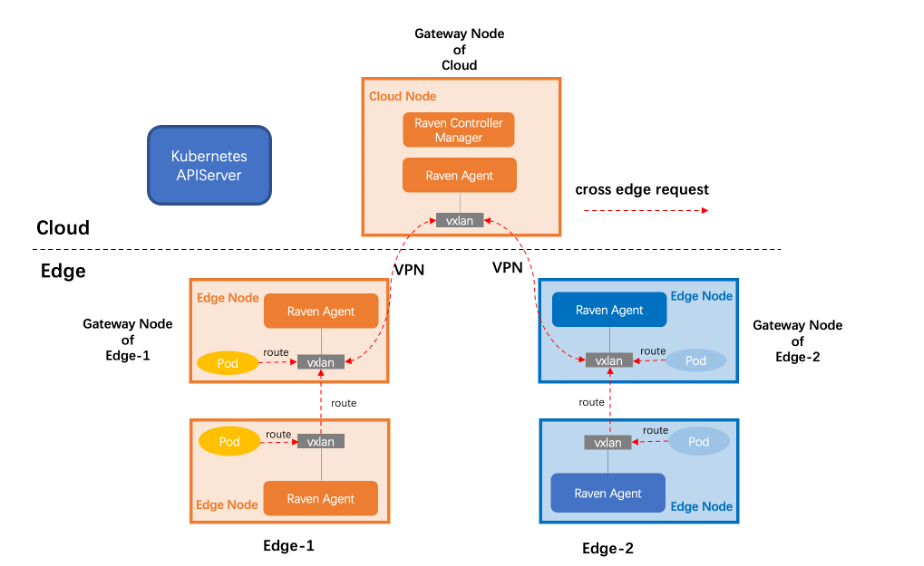

## 1. Background

In edge computing, edge-edge and edge-cloud are common network communication scenarios. In OpenYurt, we have introduced `YurtTunnel` to deal with the network problems of maintenance and monitoring in edge-cloud collaboration, providing the capibility of `kubectl exec/logs` on edge nodes and collecting monitoring indicators from edge nodes. But the problems solved by `YurtTunnel` are only a part of edge-cloud communication. We also need to provide solutions for edge-edge and edge-cloud container network communication.

In OpenYurt cluster, pods in different physical regions may need to use Pod IP, Service IP or Service name to communicate with other Pods. Although these pods are in a single K8s cluster, they are in different physical regions (network domains) and cannot communicate directly. So we create `Raven` project to solve this problem.

## 2. Architecture

As following picture, the architecture of `Raven` have two components:

- **Raven Controller Manager**：The native Kubernetes controller is deployed in some nodes on the cloud as a `Deployment`, monitoring the status of edge nodes, selecting an egress for cross-edge traffic as a gateway node for each edge node pool. When the current gateway node is dead and other node will be switched. All cross-edge traffic will be forwarded by the gateway node of each edge node pool;

- **Raven Agent**：It is deployed as a `DaemonSet` and runs on each node of the K8s cluster. It configures route or VPN tunnel on the node according to the role of each node (gateway or non-gateway);

The above two components are connected by a [Gateway CRD](https://github.com/openyurtio/raven-controller-manager/blob/main/pkg/ravencontroller/apis/raven/v1alpha1/gateway_types.go) to exchange routes and VPN tunnels, as shown in the following picture:

For more details, please refer to the code repository of the Raven project:

- [raven-controller-manager](https://github.com/openyurtio/raven-controller-manager)
- [raven](https://github.com/openyurtio/raven)

## 3. Features and Advantages

Features:

- No intrusion: No intrusion into the native K8s CNI network, only cross-edge traffic is hijacked for forwarding
- Security: Use stable `IPsec` to encrypt cross-edge traffic

Advantages:

- `Raven` will try to use the network capabilities of the edge itself, create edge-to-edge VPN tunnels as possible, and will not forward all cross-edge traffic through the cloud center
- `Raven` does not hijack the traffic in the same edge node pool, and keeps the CNI capabilities of the cluster itself

## 4. Version

`Raven Controller Manager`:

| version | image                                     | release    | content | comment                  |
| ------ |------------------------------------------|---------| -------- |---------------------|
| v0.1.0 | openyurt/raven-controller-manager:v0.1.0 | 2022.05 | first | support Gateway Node election |

`Raven Agent`：

| version | image                        | release    | content | comment                |
| ------ |-----------------------------|---------| -------- |-------------------|
| v0.1.0 | openyurt/raven-agent:v0.1.0 | 2022.05 | 首次发布 | 支持 IPSec 作为VPN 后端 |

## 5. 未来计划

- 云端支持LB的公网暴露方式 【[issue #22](https://github.com/openyurtio/raven/issues/22)】 
- 支持NAT穿越 【[issue #13](https://github.com/openyurtio/raven/issues/13)】 
- 支持分布式路由决策 【[issue #14](https://github.com/openyurtio/raven/issues/14)】
  - 路由路径的cost计算 
  - 根据cost计算最短路径 
  - 在路径更改期间保持网络连接处于active状态

欢迎感兴趣的同学加入我们，贡献代码！！！
