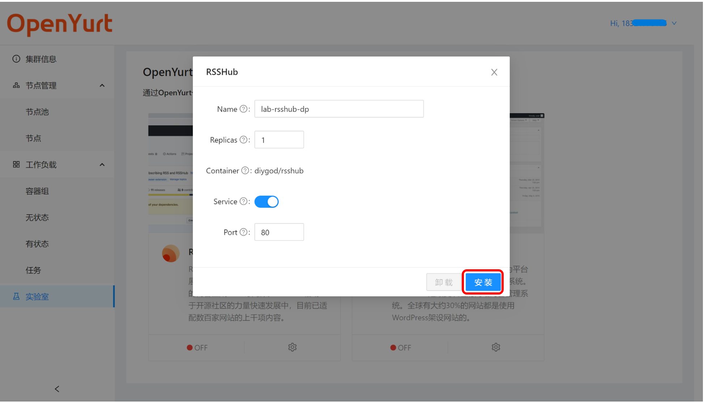

> This document will describe how to use the basic functions provided by the Experience Center Web Console.

## Web Console Overview

"Cluster Information" page includes application status, node status, dashboard connection status, and the namespaces assigned to users. (each user can only operate in their own namespace, please refer to the design documentation for details)

On the right side of the page is the navigation bar of the web console. In addition to displaying cluster information, the web console also provides functions such as node management, workload management, and labs.

## Join local nodes by Web Console

> Users can get the access script through the web console and join their nodes to the OpenYurt cluster to experience the features of OpenYurt.

1. Open the "Node Management/Node" page and click the Add Existing Node button.

2. Browser will pop up a dialog box showing the node access script, click Copy.

3. Execute the replicated script on your node. (Note: `yurtctl` is required on your node)

4. After successful execution, you can see the message `This node has joined the cluster` in the command line. In addition, if you refresh the node page in the web console, you can see the joined nodes.

## Quickly deploy applications by OpenYurt Labs

> To further lower the barrier to new users, the web console also provides a "Lab" module that allows users to quickly deploy applications to their OpenYurt clusters.

1. Currently OpenYurt provides two sample applications, and will gradually improve the lab features.

2. Click the settings button on an application card to customize the application settings (e.g. Deployment name, number of replicas, whether to create a corresponding Service, etc.) Once the settings are complete, click the Install button to automatically deploy the application.

3. After the successful creation, the page will pop up the message `install app xxx successfully`. And you can see the details of Deployment and Pod in the "Container Group" and "Stateless" pages.

4. Additionally, you can uninstall applications directly from the web console's "Labs" page.

