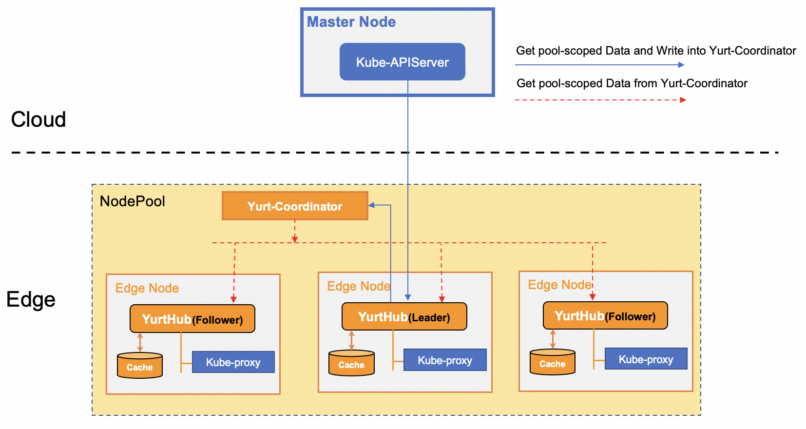

## Background introduction

[Performance test](https://openyurt.io/docs/test-report/yurthub-performance-test/#traffic) shows that in a large-scale OpenYurt cluster, if the pod is deleted and recreated, the Communication traffic will increase rapidly,
Because the kube-proxy component on the edge node will monitor all endpoints/endpointslices data changes in real time. Note that usually the same endpoints/endpointslices metadata will be transmitted to each edge node in the node pool, considering that the cloud edge network traffic will use the public network,
This will bring pressure on public network traffic costs to users. Therefore, the OpenYurt community has always had a strong demand for reducing cloud-side communication traffic.

## Architecture and principle of bandwidth-reduction

How to meet the demand without intruding the native Kubernetes, the first solution that is easier to consider is to add a sync component to the node pool to synchronize the metadata in the cloud in real time, and then distribute metadata to each component in the node pool. However, the implementation of this plan will face many challenges.
First of all, metadata access requests are initiated by the edge to the cloud, and sync needs to intercept these requests and return data to the clients. At the same time, if the sync component fails, edge requests will be interrupted, and it will be very difficult to ensure the high availability of the sync component.

The OpenYurt community pioneered the cloud-side traffic multiplexing mechanism based on pool-coordinator plus YurtHub component, which can not only seamlessly integrate with the native Kubernetes cloud-side communication link, but also elegantly guarantee the high availability of the communication link (YurtHub Leader election), realizing Cost reduction of cloud-side communication.

In the node pool, the metadata obtained by the nodes from the cloud can be divided into two types:
- pool-scoped metadata: The data obtained by the component from the cloud is exactly the same, such as the endpointslices obtained by the kube-proxy of each edge node
- node-scoped metadata: The data obtained by the component from the cloud is related to its own node, such as the pods obtained by the kubelet of each edge node

The performance test results also show that the metadata that mainly occupies the bandwidth of the cloud is pool-scoped metadata. Therefore, by reusing pool-scoped metadata in the node pool, the data communication traffic at the edge of the cloud can be greatly reduced. As shown in the below Figure:

- All YurtHub components in the node pool elect a Leader through the Pool-Coordinator in the node pool, and only the YurtHub that is properly connected to the cloud network will become the Leader. When the cloud edge network connection of the Leader node is abnormal, the Leader will be automatically replaced by other Followers.
- YurtHub Leader actively obtains pool-scoped metadata (such as Endpointslices) from the cloud in real time, and then stores them in the Pool-Coordinator component of the node pool
- When components on the node (such as Kube-Proxy) obtain pool-scoped metadata through YurtHub, YurtHub will return real-time data from Pool-Coordinator.

## How to use

The cloud-side traffic multiplexing capability is enabled by default in the OpenYurt cluster, and you need to pay attention to the following configurations.
- Make sure OpenYurt version is greater than 1.2.0
- Make sure there is a Pool-Coordinator instance running in each node pool
- YurtHub component startup parameters --enable-coordinator = true

