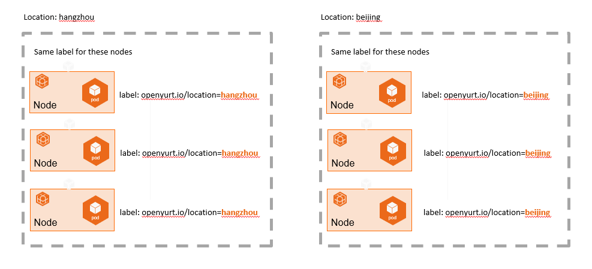
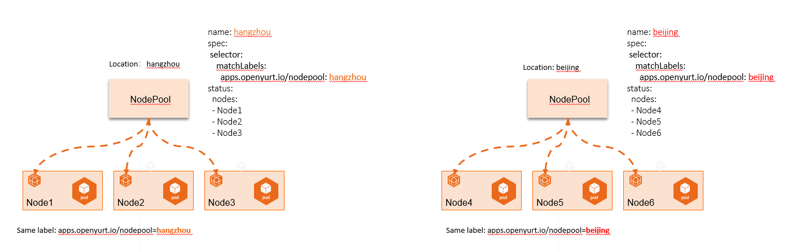
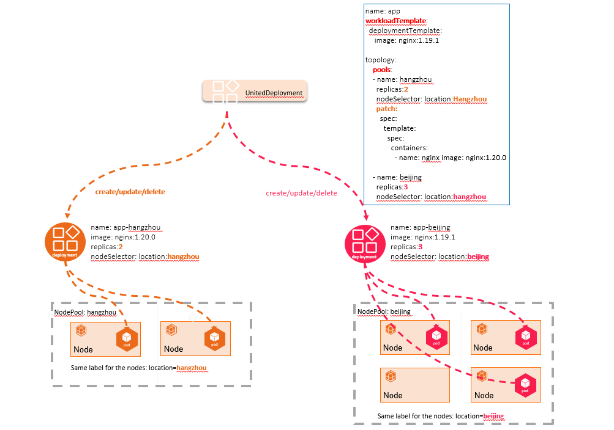

## 1.Introduction

The Yurt-Manager component consists of several controllers and webhooks, which are used to provide abilities to ensure that Kubernetes can work as it would in a normal data center
in a cloud-edge collaboration scenario. such as easily managing multi-regions workloads and providing AdvancedRollingUpdate and OTA upgrade capabilities for edge workloads(DaemonSet and static pods).

The Yurt-Manager component is recommended to co-located with Kubernetes control plane components such as Kube-Controller-Manager. and Yurt-Manager is deployed as a `Deployment`, usually consists of
two instances, one leader and one backup.

Each controller and webhook is described as follows.

### 1.1 `csrapprover` controller

Due to the stringent approval policy for CSR(Certificate Signing Request) in Kubernetes, 
the CSRs generated by OpenYurt components, such as YurtHub, are not automatically approved by theKube-Controller-Manager.
As a result, A controller named `csrapprover` within Yurt-Manager is responsible for approving the CSRs of OpenYurt components.

### 1.2 `daemonpodupdater` controller

The traditional RollingUpdate strategy for DaemonSet can become easily obstructed when NotReady nodes are present in a Cloud-Edge collaboration scenario. To address this issue, the `daemonpodupdater` controller employs two upgrade models: AdvancedRollingUpdate and OTA (Over-the-Air) upgrade.
The AdvancedRollingUpdate strategy initially upgrades pods on Ready nodes while skipping NotReady nodes. When a node transitions from NotReady to Ready, the daemon pod on that node is automatically upgraded.
The OTA strategy is utilized in scenarios where the decision to upgrade a workload falls under the purview of the edge node owner, rather than the cluster owner. This approach is particularly relevant in cases such as electric vehicles, where the edge node owner has greater control over the upgrade process.

### 1.3 `delegatelease` controller

The `delegatelease` controller is designed to work in conjunction with pool-coordinator component. When a node becomes disconnected from the cloud, the lease reported through
pool-coordinator component will have the `openyurt.io/delegate-heartbeat=true` annotation. Upon detecting a lease with this annotation, the `delegatelease` controller will apply the
`openyurt.io/unschedulable` taint to the node, ensuing that newly created pods cannot be scheduled on such nodes.

### 1.4  `podbinding` controller

Certain edge services require that Pods not be evicted in the event of node failure; instead, they demand a specific Pod to be bound to a particular node.
For instance, image processing applications need to be bound to the machine connected to a camera, while intelligent transportation applications must be fixed to a machine located at a specific intersection.
Users can add the `apps.openyurt.io/binding=true` annotation to nodes to enable the Pods Binding feature, ensuring that all Pods on that node are bound to it and remain unaffected by the cloud-edge network.

The podbinding controller oversees the management of pod tolerations when the `apps.openyurt.io/binding` annotation of a node is modified. If the `apps.openyurt.io/binding` node annotation is set to true,
the TolerationSeconds for `node.kubernetes.io/not-ready` and `node.kubernetes.io/unreachable` tolerations in pods will be set to 0, preventing the eviction of pods even when the cloud-edge network is offline.
Conversely, if the annotation is not set to true, the TolerationSeconds for `node.kubernetes.io/not-ready` and `node.kubernetes.io/unreachable` tolerations in pods will be set to 300 seconds.

### 1.5 `ravenl3` controller

The `ravenl3` controller serves as the controller for the Gateway Custom Resource Definition (CRD). This controller is intended to be used in conjunction with the Raven Agent component,
which facilitates Level3 network connectivity among pods located in different physical or network regions.

### 1.6 `nodepool` controller/webhook

NodePool abstracts out the concept of node pool according to specific node attributes, such as region, CPU architecture, cloud provider, etc., so that nodes can be managed unitedly at a pool level.

We are used to grouping and managing the nodes by different Kubernetes Labels, but with the increase of nodes and labels' quantity, the operation and maintenance of nodes (such as batch configuration about scheduling policies, taints, etc.) will become more and more complex, as shown in the following figure:

`nodepool` controller/webhook can manage the nodes in different edge regions from the perspective of node pool,  as shown in the following figure:

### 1.7 `poolcoordinatorcert` controller

The `poolcoordinatorcert` controller is responsible for preparing certificates and kubeconfig file for the pool-coordinator component. All certificates and kubeconfig files are stored as Secret resources within the system.

### 1.8 `servicetopology` controller

The servicetopology controller is used to assist [servicetopology filter](../user-manuals/resource-access-control/resource-access-control.md) in YurtHub to provide service topology routing capabilities for the cluster.
When topology annotation of service is modified, the servicetopology controller updates the corresponding endpoints and EndpointSlices, triggering a service topology update on the node side.

### 1.9 `yurtstaticset` controller/webhook

Owing to the vast number and distributed nature of edge devices, manually deploying and upgrading Static pods in cloud-edge collaboration scenarios can result in substantial operational challenges and increased risk of errors.
To address this issue, OpenYurt has introduced a new Custom Resource Definition (CRD) called YurtStaticSet to improve the management of Static pods. The yurtstaticset controller/webhook offers features such as AdvancedRollingUpdate and Over-The-Air (OTA) upgrade capabilities for static pods.

### 1.10 `yurtappset` controller/webhook

As edge applications become increasingly geographically distributed and their requirements diversify, managing their operation and maintenance grows more complex. For instance:

- Upgrading the image requires modifying each deployment individually.
- A naming rule for deployments must be defined to indicate the same application.
- Apart from names, node selectors, and replicas, other configuration differences for multiple deployments of the same application are relatively minor.

`YurtAppSet` CRD offers a template for defining applications and manages multiple workloads to support various regions. Workloads in YurtAppSet are deployed for a pool, with StatefulSet and Deployment being the currently supported types.
`yurtappset` controller/webhook creates child workloads based on the pool configurations in YurtAppSet, with each resource having a desired number of Pod replicas.
Using a single YurtAppSet instance, you can automatically maintain multiple Deployment or StatefulSet configurations while retaining differentiated configurations for different pools, such as replicas.

### 1.11 `yurtappdaemon` controller/webhook

In edge scenarios, edge nodes from the same region are typically assigned to the same NodePool. Some system components, like CoreDNS, usually need to be deployed at the NodePool level. When creating a NodePool, the goal is to automatically generate these system components without requiring manual operations.
The yurtappdaemon controller/webhook ensures that all or a subset of NodePools run replicas using a Deployment template (StatefulSet is not currently supported). As NodePools are created, these sub-Deployments are added to the cluster, with their creation and updates managed by the yurtappdaemon controller.

