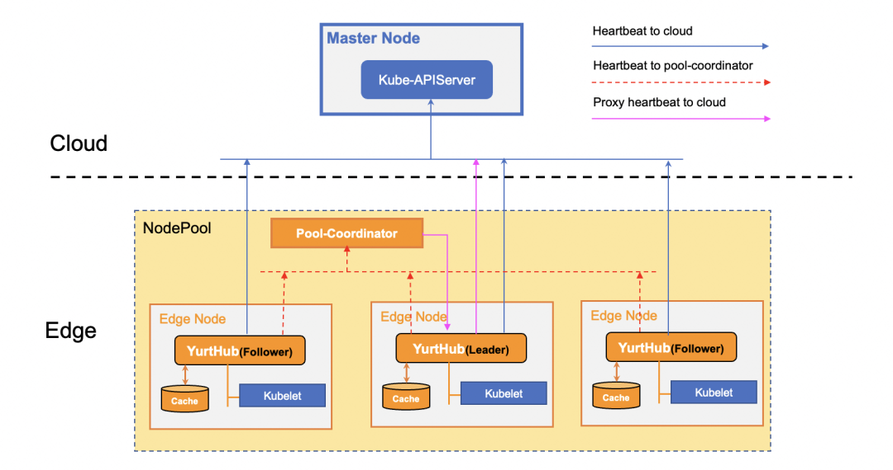
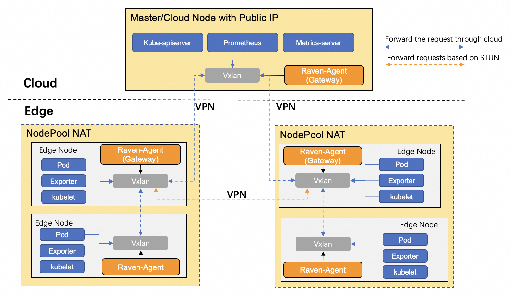
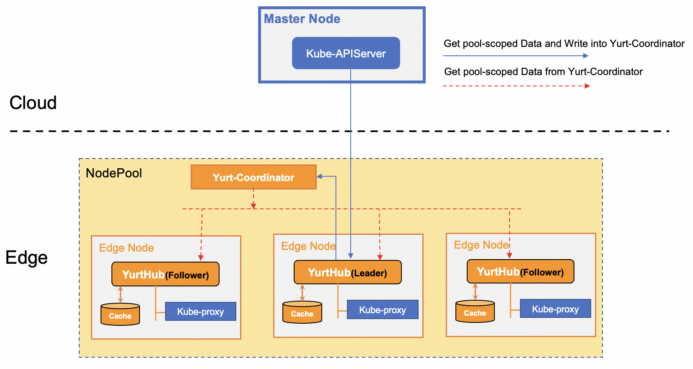
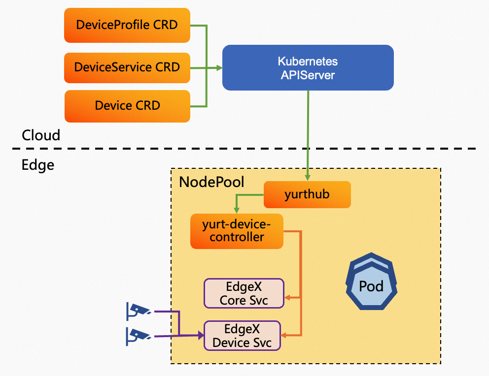

Welcome to the world of OpenYurt!

**OpenYurt is the first edge computing platform that is non-intrusive to cloud-native systems in the industry**. It unifies the management of scattered massive edge heterogeneous resources (such as CDN sites, IoT all-in-one machines and other edge computing power) from the control side (located in the cloud or central server room, etc.).
It helps users to easily complete large-scale application delivery, operation and maintenance, and control on massive edge resources.

OpenYurt will continue to work on exploring cloud-native edge computing platform standards for cloud-edge-device collaboration, and will also combine community mainstream computing, networking, storage, application orchestration, security, AI, IoT and other projects or solutions to build a complete upstream and downstream ecology.

## Key Features
**1. Powerful edge autonomy capability**

In Kubernetes, normally if a node is disconnected from the apiserver, the running Pods cannot be recovered when the node hits failures. Moreover, pods on edge nodes will be evicted by native controllers of the Kube-Controller-Manager component when node heartbeat is not reported for more than 5m.
This brings a significant challenge for the cloud-edge orchestration since the cloud-edge networking can be unreliable.  As described in below Figure, OpenYurt introduces a per node proxy (YurtHub) and a local storage to cache cloud apiserver states, hence the cached states can be used by Kubelet, KubeProxy or user Pods if the node is disconnected.
And with the help of the Pool-Coordinator component, Leader Yurthub in NodePool can be delegated to proxy node heartbeat for other edge nodes in this pool which are disconnected with cloud, so pods on edge nodes will not be evicted even if the network is disconnected.

**2. Cross NodePool network communication capability**

In the edge computing Kubernetes cluster, the nodes themselves may belong to different regions, so based on native CNI network solution, pods in different nodepools can not communicate with each other through Pod IP, Service IP, or Node IP if each nodepool is within an isolated LAN.
Raven is an elegant network solution for providing cross-nodepool network communication capability in an OpenYurt cluster. A node daemon is installed for every node, and only one daemon in each nodepool is picked as gateway that sets up the VPN tunnel between nodepools, the other daemons in the nodepool configure the cross-nodepool network routing rules to ensure the traffic will go through the gateway node.  Moreover, raven only hijacks cross nodepool traffic, and the traffic within nodepool still uses the native CNI network solution. Therefore, raven can work together with native CNI network solutions(such as flannel, calico, etc.) seamlessly. As described in below Figure, The cross-nodepool traffic is forwarded to gateway node and goes through VPN tunnel.

**3. Multi-NodePool management**

For better cloud-edge orchestration, OpenYurt pioneers the idea of managing a Pool, which encapsulates the management of node resources, applications, and workload traffic. The edge computing resources are usually classified and divided into nodepools according to their geographical distributions. In order to manage applications and traffic in multiple nodepools conveniently, There are several features are developed for nodepool as following:
  - A set of new workload models, such as YurtAppSet and YurtAppDaemon are introduced for managing workloads in multi-nodepool.
    - YurtAppSet provides an alternative to manage pods in specified nodepools by using multiple workloads, and pod distribution across nodepools is determined by the replica number of each workload.
    - YurtAppDaemon is used for ensuring that all(or some) nodepools run a copy of a workload(Deployment or StatefulSet). As nodepools are added to the cluster, workloads are added to them automatically. As nodepools are removed from the cluster, those workloads are garbage collected.
  - Service topology capability for routing traffic in nodepool. This feature can ensure any service that a Pod accesses is backed by endpoints within the same nodepool, which is quite useful when cross-nodepool networking is impractical or expensive.

**4. Advanced workload upgrade model**

In cloud-edge architecture, It is easy to get stuck during Daemonset upgrade progress if the number of NotReady nodes exceeds the maxUnavailable of RollingUpdate because cloud-edge network connection is unreliable. In another scenario, because edge nodes may belong to different users (such as new energy vehicles), end users expect that pods on nodes are not automatically upgraded, but that users themselves decide whether to start the pods upgrade on nodes. To address the above challenges, OpenYurt enhances the DaemonSet upgrade model and adds OTA(On-The-Air) and Auto Upgrade models.
  - Auto Upgrade Model: It is used for solving the upgrade block by notReady nodes. During the upgrade process, the workload upgrade on ready nodes will be completed firstly, while the notReady nodes are skipped. If the node status recovers to ready, the workload upgrade on the node also will be completed automatically.
  - OTA Upgrade Model: This model is more flexible. As described in below Figure, users can query whether there is a new version of the pod through the REST API on the edge node. Then users can trigger pod upgrade through the REST API on edge nodes if a new version exists, which is quite useful when the decision of workload upgrade belongs to the owner of edge nodes instead of the owner of the cluster. For example: application upgrade on new energy vehicles.

**5. Programmable resource access control**

As described in below Figure, The programmable data filtering framework is built into the YurtHub component, and the response data from cloud will go through a chain of filters and non-perception and on-demand transformation of the response data will be carried out, so as to meet the specific requirements in the cloud-edge collaboration scenario. Four filters are supported in the filters chain at present as follows, and new filters can be easily added into the framework.
  - Masterservice filter: it is used to mutate the ClusterIp and https port of master service(default/kubernetes) to address that Yurthub component is listening in order to make pods using InClusterConfig on edge nodes to access cloud kube-apiserver through Yurthub component without perception. 
  - Servicetoplogy filter: it is used to reassemble endpointslices according to the service topology setting of service in order to ensure the traffic accessing the service can only be forwarded to pods in the same nodepool. 
  - Discardcloudservice filter: it is used to discard LoadBalancer service for kube-proxy components on edge nodes because cloud service cannot be accessed through pod IP. 
  - Inclusterconfig filter: it is used to comment kubeconfig setting in kube-system/kube-proxy configmap in order to make kube-proxy components to use InClusterConfig to access cloud kube-apiserver on edge nodes.

**6. Cloud-edge network bandwidth reduction**

A [performance test](https://openyurt.io/docs/test-report/yurthub-performance-test#traffic) has shown that in a large-scale OpenYurt cluster, the cloud-edge traffic will increase rapidly if pods are deleted and recreated since the kube-proxy components on the edge nodes watch for all endpoints/endpointslices changes. Note that typically the same endpoints information will be transferred to edge nodes within a nodepool which can be less cost efficient considering that the cloud-edge networking traffic will use the public network.
Leveraging the Pool-Coordinator mentioned above, OpenYurt proposes to introduce a notion of pool-scoped metadata which are unique within a nodepool such as the endpoints/endpointslices data. As described in below Figure, the leader Yurthub will read the pool-scoped data from the cloud kube-apiserver and update the load to pool-coordinator. As a result, all other YurtHubs will retrieve the pool-scoped data from the pool-coordinator, eliminating the use of public network bandwidth for retrieving such data from the cloud kube-apiserver.

**7. Cloud-native edge device management**

OpenYurt defines a set of APIs for managing edge devices through cloud Kubernetes controlplane. The APIs abstract the device’s basic properties, main capabilities and the data that should be transmitted between the cloud and the edge. OpenYurt provides integration with mainstream OSS IoT device management solutions, such as EdgeXFoundry using the APIs. As described in below Figure, An instance of yurt-device-controller component and EdgeXFoundry service are deployed in each nodepool. Yurt-device-controller component can get the changes of Device CRD from cloud kube-apiserver and convert the desired spec of Device CRD to requests of EdgeXFoundry, then transmit the requests to EdgeXFoundry service in real-time. On the other hand, yurt-device-controller can subscribe to the device status from EdgeXFoundry service, and update the status of Device CRD when status is changed.

## What's Next
Here are some recommended next steps:
- Start to install [OpenYurt](./installation/summary.md).
- Learn OpenYurt's [Architecture](./core-concepts/architecture.md).
