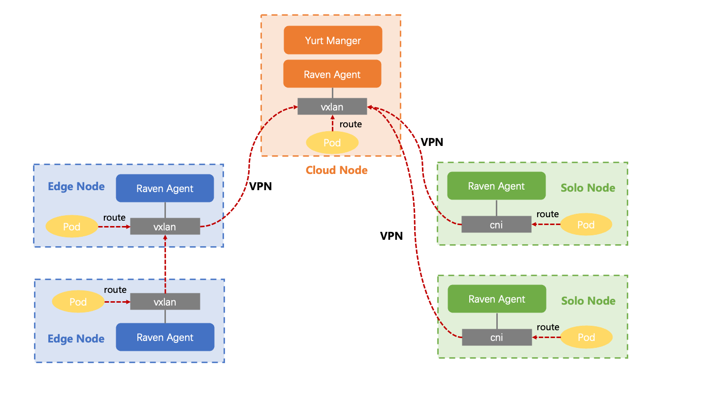
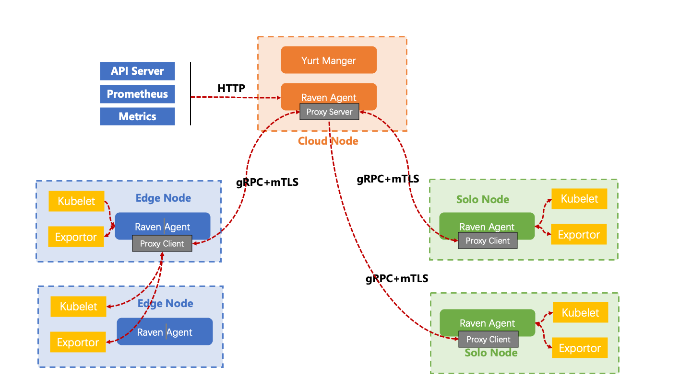

## 1. Background

In edge computing, edge-edge and edge-cloud communication are common network communication scenarios, and in OpenYurt, we developed the Raven project to provide a solution for edge-edge-cloud container network to communicate with host network In an OpenYurt cluster, Pods located in different physical areas may require the use of Pod IP The Service IP or Service name communicates with other Pods, and while these Pods are in a single K8s cluster, they are in different physical areas (network domains) and cannot communicate directly, so the Raven project was developed to address this

## 2. Architecture

As following picture, the architecture of `Raven` have two components:

- **Yurt Manager**：The native Kubernetes controller is deployed in some nodes on the cloud as a `Deployment`, monitoring the status of edge nodes, selecting an egress for cross-edge traffic as a gateway node for each edge node pool. When the current gateway node is dead and other node will be switched. All cross-edge traffic will be forwarded by the gateway node of each edge node pool;

- **Raven Agent**：It is deployed as a `DaemonSet` and runs on each node of the K8s cluster. It configures route or VPN tunnel on the node according to the role of each node (gateway or non-gateway);

### Tunnel Mode

### Proxy Mode

The above two components are connected by a [Gateway CRD](https://github.com/openyurtio/raven-controller-manager/blob/main/pkg/ravencontroller/apis/raven/v1alpha1/gateway_types.go) to exchange routes and VPN tunnels, as shown in the following picture:

For more details, please refer to the code repository of the Raven project:

- [yurt-manager](https://github.com/openyurtio/openyurt)
- [raven](https://github.com/openyurtio/raven)

## 3. Features and Advantages

Features:

- No intrusion: No intrusion into the native K8s CNI network, only cross-edge traffic is hijacked for forwarding
- Security: Use stable `IPsec` to encrypt cross-edge traffic

Advantages:

- `Raven` will try to use the network capabilities of the edge itself, create edge-to-edge VPN tunnels as possible, and will not forward all cross-edge traffic through the cloud center
- `Raven` does not hijack the traffic in the same edge node pool, and keeps the CNI capabilities of the cluster itself

## 4. Version

`Raven Controller Manager`:

| version | image                                    | release | content | comment                                      |
|---------|------------------------------------------|---------|---------|----------------------------------------------|
| v0.1.0  | openyurt/raven-controller-manager:v0.1.0 | 2022.05 | first   | support Gateway Node election                |
| v0.2.0  | openyurt/raven-controller-manager:v0.2.0 | 2022.12 | feature | support multi Pod CIDRs   support Calico |
| v0.3.0  | openyurt/raven-controller-manager:v0.3.0 | 2023.1  | feature | support node IP forwarding                   |

Note: The Raven Controller Manger required by the Raven component is refactured in YurtManager and includes the following Controller: GatewayDNSController GatewayPickupController GatewayInternalServiceController GatewayPublicServiceController. For details, see [yurt-manager](./yurt-manager.md).

`Raven Agent`：

| version | image                       | release | content | comment                                                            |
|---------|-----------------------------|---------|---------|--------------------------------------------------------------------|
| v0.1.0  | openyurt/raven-agent:v0.1.0 | 2022.05 | first   | Support IPsec as VPN backend, which implemented by using libreswan |
| v0.2.0  | openyurt/raven-agent:v0.2.0 | 2022.12 | feature | Support WireGuard as VPN backend Support Calico                |
| v0.3.0  | openyurt/raven-agent:v0.3.0 | 2023.1  | feature    | Support node IP forwarding                                         |
| v0.4.0  | openyurt/raven-agent:0.4.0  | 2023.11 | feature    | Support raven l7 proxy                                             |
| v0.4.1  | openyurt/raven-agent:0.4.1  | 2024.3  | feature    | Support raven l3 NAT traverse                                      |
## 5. future plan

- Support SLB as public network exporter for gateway  【[issue #22](https://github.com/openyurtio/raven/issues/22)】 
- Support NAT traversal 【[issue #13](https://github.com/openyurtio/raven/issues/13)】 
- Support distribute route path decision 【[issue #14](https://github.com/openyurtio/raven/issues/14)】
  - route path cost evaluation
  - shortest path decision 
  - keep networking connection alive during paths change

Welcome interested students to join us and contribute code!!
