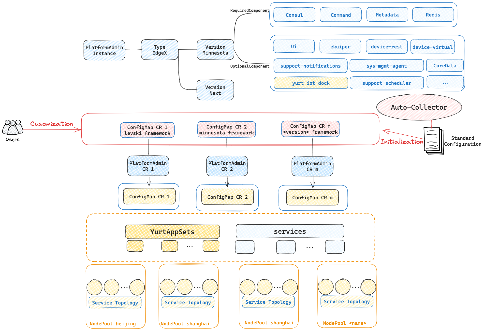

## 1.Introduction

The Yurt-Manager component is composed of multiple controllers and webhooks designed to ensure Kubernetes operates seamlessly in cloud-edge collaboration scenarios, similar to how it functions in regular data centers. For instance, it facilitates the easy management of multi-regional workloads and provides AdvancedRollingUpdate and OTA (Over-The-Air) upgrade features for edge workloads (DaemonSet and static Pods).

It is recommended that the Yurt-Manager component be deployed on the same machine as the Kubernetes control plane components (such as Kube-Controller-Manager). Yurt-Manager is typically deployed as a Deployment, usually consisting of two instances, a leader and a backup. Below is the architectural diagram of the component:

1. The --controllers parameter allows precise control over which controllers are activated or deactivated. The symbol `*` is used to enable all default active controllers; `foo` specifically starts the controller named `foo`; conversely, `-foo` is used to deactivate the controller named `foo`. Please note that controller names need to be separated by commas.
2. Controller Webhooks will be enabled or disabled along with their corresponding controllers. On the other hand, Independent Webhooks are enabled by default but can be disabled using the startup parameter `--disable-independent-webhooks`. The Independent Webhook `Node` mainly labels nodes with suitable labels based on the attributes of the NodePool to which they belong.

## Introduction to Controllers and Webhooks

### 2.1 Edge Autonomy Related Controllers

#### 2.1.1 nodelifecycle Controller

Before enabling the nodelifecycle controller, it is necessary to first disable the controller of the same name in the original Kube-Controller-Manager component.
The new nodelifecycle controller provides improved functionality compared to the native version: for nodes with the `apps.openyurt.io/binding=true` annotation, even if the node status becomes NotReady, the controller will not set the `Ready` condition in `Pod.Status` to false.

#### 2.1.2 podbinding Controller

Some edge computing services require that Pods not be evicted in case of node failure, allowing for persistent binding between Pods and nodes. For example, an image processing application connected to a specific camera, or a smart traffic system that needs to be deployed at a specific intersection.
By adding the `apps.openyurt.io/binding=true` annotation to nodes, the Pod binding feature can be enabled, ensuring that all Pods on the node are bound and unaffected by cloud and edge network status changes.
The podbinding controller is responsible for managing Pod toleration policies when the `apps.openyurt.io/binding` annotation is changed. When the node is marked as `apps.openyurt.io/binding=true`, the toleration seconds for `node.kubernetes.io/not-ready` and `node.kubernetes.io/unreachable` in Pods will be set to 0,
ensuring that Pods are not evicted from the node even when cloud-edge network connectivity is lost. Conversely, if the nodes are not set to true, these toleration seconds default to 300 seconds.

#### 2.1.3 delegatelease Controller

The delegatelease controller is designed to work in conjunction with the yurt-coordinator component.
When a node loses its connection to the cloud, the yurt-coordinator component reports a node Lease with the openyurt.io/delegate-heartbeat=true annotation.
Upon detecting a Lease with this annotation, the delegatelease controller will mark the node with the `openyurt.io/unschedulable` taint to ensure that newly created Pods are not scheduled to these nodes.

#### 2.1.4 yurtcoordinatorcert Controller

The yurtcoordinatorcert controller is responsible for generating certificates and kubeconfig files for the yurt-coordinator component.
It ensures that all certificates and kubeconfig files are securely stored in the system as Secret resources.

### 2.2 Raven Related Controllers

#### 2.2.1 gatewaypickup Controller
A new CRD Gateway is defined in project raven as the carrier of network information across network domains. 
In the OpenYurt cluster, a Gateway CR needs to be created for each network domain to record the available gateway endpoints and network configurations. 
The gatewaypickup controller reconcile the Gateway to elects the gateway endpoints from among alternative endpoints and node information for each network domain.

#### 2.2.2 gatewaydns Controller
Raven L7 Proxy need to forward all http requests of NodeName+Port to the gateway endpoints of the LAN.
The domain name resolution of the NodeName need deploy dedicated dns component [raven-proxy-dns](../installation/raven-l7-proxy-prepare.md) which uses the hosts plugin to mount a configmap named `kube-system/edge-tunnel-nodes`, this configmap record resolves all NodeName to the clusterIP of service `kube-system/x-raven-proxy-internal-svc`.
Gatewaydns controller dynamically manage the configmap entry.

#### 2.2.3 gatewayinternalservice Controller
Raven L7 Proxy need to forward all http requests of NodeName+Port to the gateway endpoints of the LAN.
Gatewayinternnalservice controller is responsible for maintaining the life cycle of the service `kube-system/x-raven-proxy-internal-svc`.
Note that the Http request port varies according to the actual service design. Therefore, you can configure Gateway Spec.ProxyConfig to configure the Http/Https port of the proxy. The gatewaypublicservice controller update the ports in `x-raven-proxy-internal-svc` for forwarding. All https/http requests are forwarded to port 10263/10264 of the raven agent

#### 2.2.4 gatewaypublicservice Controller
Gatewaypublicservice controller maintains the life cycle of a LoadBalancer service and endpoints if you choose th expose gateway with LoadBalancer type.

### 2.3 Workload Related Controllers

#### 2.3.1 daemonpodupdater Controller

In cloud-edge collaboration scenarios, the traditional RollingUpdate upgrade strategy of a DaemonSet can easily become blocked when there are NotReady nodes. To address this, the daemonpodupdater controller introduces two new upgrade models: AdvancedRollingUpdate and OTA (Over-The-Air) upgrade.
The AdvancedRollingUpdate strategy starts by upgrading the Daemon Pods on Ready nodes and skips the NotReady nodes. When a node transitions from NotReady to Ready, the Daemon Pod on that node will upgrade automatically.
The OTA strategy is for scenarios where the edge node owner (rather than the cluster owner) decides when to upgrade the workloads. This approach is particularly suitable for cases like electric vehicles where the edge node owner has full control over the upgrade process.

#### 2.3.2 yurtappset Controller/Webhook

In native Kubernetes environments, managing similar applications distributed across multiple node pools typically requires creating a separate Deployment for each node pool, which undoubtedly adds to the management burden and potential error rate.
To simplify the management process, the YurtAppSet CRD is designed to define an application template (compatible with Deployment and StatefulSet) and is responsible for managing workloads across multiple node pools.
YurtAppSet requires users to specify a nodepool selector in its `NodePoolSelector` field. It also maintains backward compatibility by supporting direct nodepool naming through the `Pools` field. This greatly simplifies the deployment and management of applications, making it more convenient to expand, upgrade, and maintain applications in a multi-node pool environment.
With YurtAppSet, users can centrally manage the application deployments of multiple node pools, effectively reducing management complexity and error rates.

#### 2.3.3 yurtappdaemon Controller/Webhook

In traditional Kubernetes, a DaemonSet is responsible for running replicated daemon Pods on every node in the cluster. The addition or removal of nodes triggers the creation or removal of the corresponding daemon Pods. However, DaemonSet does not apply in situations where the workload needs to be automatically adjusted based on the dynamic changes of node pools.
YurtAppDaemon is designed to ensure that specified workloads based on the Spec.WorkloadTemplate are automatically deployed across all node pools or those specified by the Spec.NodePoolSelector. As node pools are added or removed, the YurtAppDaemon controller and Webhook will create or remove workloads for the respective node pools, ensuring that the qualified node pools always have the intended Pods.

#### 2.3.4 yurtappoverrider Controller/Webhook

In the YurtAppDaemon and YurtAppSet schemes, workloads are distributed through a unified template. However, when workloads require specific personalized configuration for different node pools or geographic regions, a simple template may not fully meet the needs. Although YurtAppSet provides a degree of personalization through the Topology field, in order to further reduce inter-system coupling and maintain backward compatibility, we have introduced YurtAppOverrider as a specialized engine for personalized rendering of multi-regional workloads.
The primary role of YurtAppOverrider is to ensure that all bound YurtAppDaemon and YurtAppSet undergo specific Webhook rendering before distributing workloads. Whether the templates of YurtAppDaemon and YurtAppSet change, or the personalized configuration of YurtAppOverrider needs updating, the YurtAppOverrider controller will trigger re-calculation of the configuration to ensure precise personalization in a multi-regional deployment scenario.

#### 2.3.5 yurtstaticset Controller/Webhook

Given the vast number and wide distribution of edge devices, manually deploying and upgrading static Pods in a cloud-edge environment can pose significant operational challenges and risks. To overcome these challenges, OpenYurt has introduced a new type of Custom Resource Definition (CRD) called YurtStaticSet, aimed at improving the management of static Pods.
The yurtstaticset controller/webhook introduces two upgrade mechanisms for static Pods: AdvancedRollingUpdate and Over-The-Air (OTA), ensuring effective version control and seamless upgrades of static Pods in a cloud-edge collaborative environment.

### 2.4 Others

#### 2.4.1 nodepool Controller/Webhook

Users typically leverage various Kubernetes labels to group and manage nodes. However, as the number of nodes and labels grows, the operations and maintenance tasks for nodes—such as implementing scheduling policies and batch setting taints—become increasingly burdensome and complex.
To simplify this process, the NodePool abstracts a group of nodes with common characteristics (such as geographic location, CPU architecture, cloud service provider, etc.) into a node pool, allowing for unified management at a higher level.
This abstraction brings clear structure to the grouping of nodes within the cluster, greatly simplifying the overall node operations and maintenance workflow.
When creating a node pool, it automatically adds the nodepool.openyurt.io/type label based on the pool's type. By default, it's set to edge.

#### 2.4.2 csrapprover Controller

In Kubernetes, the approval policy for CSR (Certificate Signing Request) is very strict, meaning that CSRs generated by OpenYurt components (such as YurtHub) will not be automatically approved by the Kube-Controller-Manager.
To address this issue, the csrapprover controller within Yurt-Manager is designed to be responsible for approving CSR requests for OpenYurt components, ensuring normal operation.

#### 2.4.3 platformadmin Controller/Webhook

PlatformAdmin has evolved from the previous version of the EdgeX CRD and serves as an abstraction for the edge device management platform. Users simply input the platform settings, the name of the NodePool to be deployed, the version to be deployed, and so on, to deploy a complete edge device management platform within the node pool.
The platformadmin-controller, integrated within yurt-manager, is responsible for parsing the PlatformAdmin CR into the corresponding configmap, service, and yurtappset, thereby realizing the deployment of the edge device management platform.
It is also in charge of distributing yurt-iot-dock to the respective node pools to achieve synchronization of edge devices. Additionally, users can select the required EdgeX optional components to be deployed via the components field of the PlatformAdmin CR, for more information on this part, please refer to the [Cloud-Native Device Management Section]((../user-manuals/iot/edgex-foundry.md)).

#### 2.4.4 servicetopologyendpoints/servicetopologyendpointslices Controller

The servicetopology controller assists the [servicetopology filter](../user-manuals/resource-access-control/resource-access-control.md) in YurtHub to provide service topology routing functionality for the cluster.
When the topology Annotation of a Service is modified, the servicetopology controller updates the corresponding Endpoints and EndpointSlices, thereby triggering an update of the service topology in the node-side YurtHub.
